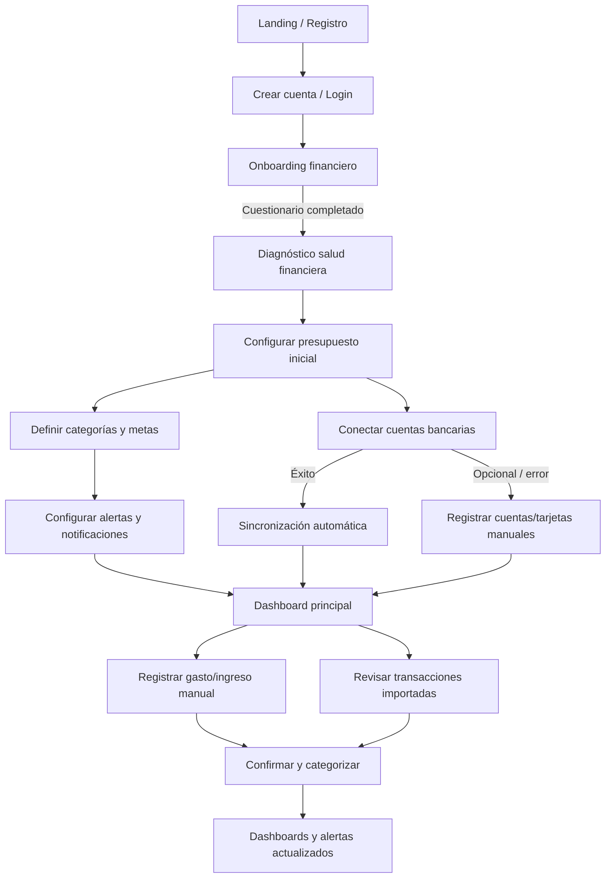

# BudgetApp

Aplicación web/móvil de presupuesto personal con monitoreo en tiempo real, alertas inteligentes e integración bancaria extensible; la primera fase de integraciones se enfocará en bancos colombianos, pero el producto no se limita a ese mercado. El proyecto se documenta bajo la metodología RUP para garantizar trazabilidad de decisiones y entregables por fase.

## Estado del repositorio
- **Código fuente**: carpeta `web-app/` con la plantilla principal a adaptar y `legacy-code/` con artefactos anteriores (referencias, experimentos).
- **Documentación**: carpeta `documentation/documents/` con los artefactos RUP que guían cada fase.
- **Histórico**: carpeta `historic/` en la raíz del workspace (fuera de este repo) donde se registran todas las conversaciones y decisiones.

## Documentación RUP
| Documento | Descripción |
|-----------|-------------|
| [Visión](documentation/documents/vision.md) | Objetivos estratégicos, métricas de negocio, usuarios meta y diferenciadores competitivos. |
| [Plan inicial](documentation/documents/plan_inicial.md) | Planeación por fases/iteraciones, matriz de riesgos, aprendizajes del Excel y benchmark de otras apps. |
| [Arquitectura](documentation/documents/arquitectura.md) | Vista técnica de referencia, componentes, integraciones bancarias y decisiones clave para un despliegue multi-país. |
| [Requisitos](documentation/documents/requisitos.md) | Detalle de requerimientos funcionales/no funcionales (en construcción). |
| [Casos de uso](documentation/documents/casos_de_uso.md) | Actores y flujos principales que cubren la experiencia de BudgetApp. |
| [OpenAPI](documentation/api/openapi.yaml) | Especificación 0.1.0 de los endpoints prioritarios (onboarding, presupuestos, transacciones, alertas, integraciones). |
| [Registro decisiones 2026-02-19](documentation/documents/acciones-2026-02-19.md) | Nuevas acciones de presupuesto, configuración de bancos, y UX actualizado para el sprint de febrero. |

> Cada iteración que avancemos agregará nuevos artefactos en este directorio (arquitectura, plan de pruebas, etc.) siguiendo la estructura RUP.

## Mock API y pruebas manuales
- El repositorio incluye un mock server basado en Prism para probar los contratos REST sin backend real.
- Ejecutar con `./scripts/mock-api.sh` (requiere `node` y descargará Prism vía `npx`); variables `PORT` y `HOST` son opcionales (`4010` y `0.0.0.0` por defecto). Ejemplo: `PORT=5000 ./scripts/mock-api.sh`.
- Los endpoints expuestos responden conforme a `documentation/api/openapi.yaml`, ideal para validar el flujo descrito en el documento de arquitectura.
- Para tests de UI, apuntar los servicios HTTP de `web-app/` al host/puerto del mock. Se recomienda crear scripts `npm run dev:mock` en `web-app` conforme integremos el frontend.
- **Pruebas rápidas vía cURL**:
  ```bash
  curl -X POST http://localhost:4010/api/onboarding \
    -H 'Content-Type: application/json' \
    -d '{"ingresosMensuales":5000000,"gastosFijos":2000000}'

  curl http://localhost:4010/api/budgets?period=2025-12

  curl -X POST http://localhost:4010/api/transactions \
    -H 'Content-Type: application/json' \
    -d '{"date":"2025-12-01T12:00:00Z","amount":125000,"categoryId":"gastos_fijos","method":"debit_card"}'
  ```
- Estos comandos permiten comprobar rápidamente que el mock responde conforme al OpenAPI antes de integrar el frontend; ajustar `localhost:4010` si se cambió el puerto.

## Flujo de usuarios (onboarding → registros)

- Este flujo debe guiar los prototipos de `web-app/` y los criterios de aceptación. Cada etapa corresponde a servicios disponibles en la especificación OpenAPI (onboarding, budgets, integrations, transactions).

## Flujos del sistema y notificaciones en tiempo real
- **Integraciones bancarias**: se consumen vía el servicio especializado descrito en `documentación/arquitectura`. Webhooks del proveedor (Belvo/Minka inicialmente) ingresan encolados (SQS/Rabbit) y disparan:
  1. Persistencia de transacción → actualización de dashboards.
  2. Emisión de eventos WebSocket/SSE para clientes activos.
  3. Evaluación de reglas de alertas (presupuesto excedido, cargos altos, metas en riesgo).
- **Canales en tiempo real**:
  - Web/Móvil usan WebSockets (o SSE) expuestos por el BFF para reflejar nuevas transacciones sin recargar.
  - Notificaciones push/email/WhatsApp se orquestan desde el servicio de notificaciones usando proveedores FCM/Twilio.
- **Triggers internos**: además de eventos bancarios, se planifican cron jobs (p. ej. cada hora) para recalcular proyecciones y detectar riesgos antes de que sucedan (alertas predictivas).

## Configuración por país (multi-mercado)
- El sistema mantiene un catálogo `countries` que define moneda por defecto, zona horaria, regulaciones aplicables, límites de bancos soportados, textos legales y proveedores preferidos.
- **Colombia (fase inicial)**:
  - Moneda: COP.
  - Proveedor bancario: Belvo/Minka (sandbox → producción).
  - Normativa: Habeas Data, Ley 1581/2012, lineamientos de la Superintendencia Financiera. Requiere consentimiento explícito para uso de datos financieros.
  - Reglas predeterminadas: categorías y metas alineadas con la plantilla Excel original; alertas activas por defecto para sobregiros y pagos de tarjetas.
- Al sumar otro país se agrega una entrada nueva con sus requisitos (PSD2 en la UE, LGPD en Brasil, etc.). Las pantallas deberán ofrecer selección de país durante el onboarding, y los servicios deben validar que la configuración corresponda a la región del usuario.

## Cómo colaborar
1. Revisar los documentos anteriores antes de proponer cambios.
2. Registrar toda conversación relevante en `historic/<fecha>.log` según el proceso acordado con el stakeholder.
3. Usar la llave SSH `~/.ssh/id_ed25519_microimpulso` para interactuar con `git@github.com:lerna-admin/BudgetApp.git`.

## Estructura de desarrollo compartido
- `backend/`: servicio MVC Express + PostgreSQL. Controladores, servicios y repositorios en esta carpeta exponen la API que consumen todos los clientes (web, móvil, scripts).
- `frontend/`: app Next.js (React 19) que sirve como vista de referencia. Está pensada para conectarse al backend y, eventualmente, reemplazarse por el producto final.
- `pm2.config.js`: permite levantar ambos servicios simultáneamente en desarrollo (`pm2 start pm2.config.js --watch`). Cada carpeta sigue pudiendo ejecutarse por separado (`npm run dev`).

### Pasos mínimos para correr todo
1. Ejecuta `npm install` dentro de `backend/` y `frontend/`.
2. Define el `.env` del backend con `DATABASE_URL` (PostgreSQL/otro), `DB_SSL` opcional y `PORT=4000`.
3. Corre `pm2 start pm2.config.js --watch` desde la raíz; el backend escucha en `4000` y el frontend en `3000`.
4. Mientras se estabiliza el MVP, puedes mantener los servicios unidos con PM2 y luego desplegarlos como servicios independientes (containers/hosting dedicado).
