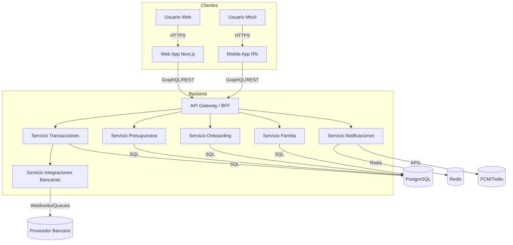
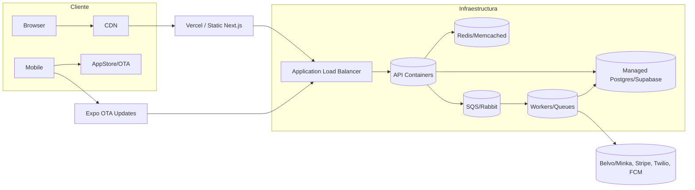
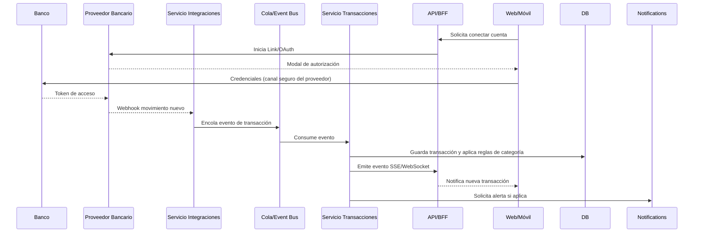

# BudgetApp - Documento de Arquitectura (RUP)

## 1. Propósito
Definir la arquitectura de referencia para BudgetApp (web/móvil) a fin de guiar el diseño detallado, las integraciones bancarias iniciales en Colombia y la futura expansión multi-país, alineado con la fase de Elaboración del proceso RUP.

## 2. Alcance y supuestos
- MVP contempla onboarding financiero, presupuestos, registro manual/automático de transacciones, alertas y capa familiar básica.
- Frontend web en Next.js (React) y app móvil en React Native/Expo reutilizando un design system común.
- Backend inicial en Node.js (NestJS/Express) desplegado en servicios containerizados (Render/Heroku/AWS Fargate) con base de datos Postgres (posible uso de Supabase para acelerar).
- Mensajería en tiempo real y notificaciones vía Firebase Cloud Messaging (push) + Twilio/WhatsApp para canales alternos.
- Integración bancaria: proveedor tipo Belvo/Minka (primer despliegue con bancos colombianos) con diseño multi-tenant para sumar nuevas regiones sin reescrituras.

## 3. Vista lógica (componentes principales)
| Capa | Componentes | Responsabilidades clave |
|------|-------------|-------------------------|
| Presentación | Web App Next.js, Mobile App React Native, Design System compartido | Experiencia omnicanal, localización, autenticación, invocación de APIs, almacenamiento offline básico. |
| API/Backend | API Gateway/BFF, Servicios de Dominio (Onboarding, Presupuestos, Transacciones, Finanzas Familiares, Notificaciones), Servicio de Integraciones | Exponer APIs REST/GraphQL, aplicar validaciones/reglas de negocio, orquestar flujos de integración bancaria y alertas. |
| Datos/Analítica | PostgreSQL (OLTP), Redis (cache/sesiones), almacén analítico futuro (BigQuery/Redshift) | Persistencia de usuarios, presupuestos, transacciones, auditorías; agregaciones para dashboards y métricas de salud financiera. |
| Integraciones | Conector Bancario (Belvo/Minka), Mensajería (FCM/Twilio), Pagos (Stripe), Observabilidad (Datadog/Sentry) | Sincronización de movimientos, envíos de notificaciones multi-canal, cobro de planes, monitoreo y trazabilidad. |

## 4. Flujo de alto nivel
1. **Autenticación**: usuario se registra/inicia sesión mediante proveedor (Supabase Auth / Clerk) con MFA opcional. Token JWT se usa contra el API Gateway.
2. **Onboarding**: Web/Móvil consume `/onboarding` para registrar ingresos, deudas y metas; el servicio calcula salud financiera y guarda snapshot en Postgres.
3. **Presupuestos**: Frontend invoca `/budgets` para CRUD de categorías/subcategorías; reglas se guardan y se comparten entre miembros familiares mediante ACLs.
4. **Integración bancaria**: usuario inicia flujo OAuth/Belvo Link; el Servicio de Integraciones suscribe webhooks y encola movimientos en una cola (p. ej. SQS). El Servicio de Transacciones procesa eventos, ejecuta reglas de categorización y actualiza dashboards.
5. **Alertas**: reglas configurables se evalúan (cron + eventos); se envían push/email/WhatsApp via Notificaciones.
6. **Planes de pago**: Stripe gestiona suscripciones; backend sincroniza beneficios (familia, alertas avanzadas) mediante webhooks.
7. A futuro incluir opciones de accesibilidad

## 5. Modelo de datos (alto nivel)
- `users`: perfil, preferencias, país/región, tipo de plan.
- `households`: agrupa usuarios para planes familiares; controla permisos.
- `budgets`: registros mensuales/anuales con moneda, `start_balance`, bandera `start_with_money` y metas por categoría/subcategoría.
- `categories` / `subcategories`: catálogo jerárquico configurable.
- `transactions`: origen (manual/bancario), estado, etiquetas, vínculo a cuentas.
- `accounts`: tarjetas/cuentas bancarias conectadas (proveedor, país, currency).
- `alerts` y `notifications`: reglas configuradas y bitácora de envíos.
- `integrations`: tokens/estados para proveedores bancarios, mensajería y pagos.
- `countries`: catálogo con moneda, zona horaria, normativas, proveedores y límites por país (ver sección Configuración por país).
- `country_settings`: preferencias del usuario por país (idioma, canales habilitados) enlazadas a `countries`.

## 6. Consideraciones de integración bancaria
- **Proveedor**: Belvo/Minka ofrece API única para bancos colombianos; se encapsula en el Servicio de Integraciones para poder cambiar de proveedor o agregar otro (Plaid, Tink) al entrar a nuevos países.
- **Multi-país**: se abstrae la lógica con entidades `financial_institution` y `country` para mapear endpoints, horarios y normativas.
- **Seguridad**: tokens almacenados cifrados (KMS) y rotados periódicamente; se implementa Webhook Signature Validation para evitar spoofing.
- **Latencia**: uso de colas/eventos para desacoplar ingestión; front recibe notificaciones de nuevas transacciones mediante WebSockets/Server-Sent Events.

## 7. Seguridad y cumplimiento
- Autenticación multifactor y gestión de sesiones con refresh tokens rotativos.
- Cifrado AES-256 para datos sensibles (tokens bancarios, documentos, PII) y TLS 1.2+ en tránsito.
- Segmentación de entornos (dev/stage/prod) con políticas IAM de mínimo privilegio.
- Auditoría: trail de cambios en budgets/transactions, logging estructurado (ELK/CloudWatch).
- Cumplimiento: regulación colombiana (Habeas Data, SFC) para fase inicial y compatibilidad con estándares internacionales (PCI DSS para Stripe, GDPR/LGPD cuando se expanda).

## 8. Disponibilidad, rendimiento y escalabilidad
- Despliegue en contenedores con auto-escalado horizontal; CDN (Vercel/CloudFront) para web.
- Uso de Feature Flags para habilitar mercados/regiones sin nuevos despliegues.
- Estrategia de caching (Redis) para dashboards y catálogos; colas para cargas pesadas (importaciones masivas, simuladores).
- Observabilidad: métricas (Prometheus), tracing distribuido (OpenTelemetry) y alertas automáticas.

## 9. Decisiones arquitectónicas clave
1. **Monorepo con packages compartidos** (design system, modelos TypeScript) para mantener paridad web/móvil.
2. **API Gateway + microservicios ligeros** para permitir escala por dominio y facilitar incorporación de equipos futuros.
3. **Proveedor bancario abstraído**: se encapsula en adaptadores para soportar múltiples países sin dependencias directas en el core.
4. **Infraestructura como código** (Terraform/Pulumi) para reproducibilidad y gestión de entornos.
5. **Uso inicial de Supabase/Managed Postgres** para acelerar MVP, con plan para migrar a infra dedicada cuando superemos 50k usuarios.

## 10. Riesgos técnicos y mitigación
| Riesgo | Impacto | Mitigación |
|--------|---------|-----------|
| Latencia/errores del proveedor bancario | Alto | Colas + reintentos exponenciales, almacenamiento temporal de movimientos, monitoreo dedicado y opción de failover manual. |
| Complejidad de mantener paridad web/móvil | Medio | Librería de componentes compartidos, pruebas visuales y automatización de builds móviles. |
| Cumplimiento multi-país | Alto | Asesoría legal temprana, configuración por país (feature flags) y cifrado adaptable. |
| Escalamiento de notificaciones en tiempo real | Medio | Arquitectura event-driven, uso de servicios manejados (FCM, SNS) y particionamiento por canal. |
| Dependencia de un único proveedor bancario | Alto | Contrato con al menos un proveedor alterno, diseño de adaptadores e indicadores que disparen la incorporación de otro servicio. |

## 11. Configuración por país
- Se define una estructura común `country_config` (persistida en base de datos o archivos de despliegue) con los siguientes campos:

| Campo | Descripción |
|-------|-------------|
| `code` | Código ISO (ej. `CO`, `BR`, `US`). |
| `name` | Nombre visible del país. |
| `currency` | Código y número de decimales (ej. COP / 0). |
| `timezone` | Zona horaria base (ej. `America/Bogota`). |
| `legal.requirements` | Normativas aplicables (Habeas Data, PSD2, etc.) y enlaces a textos legales. |
| `banking.provider` | Proveedor principal (Belvo, Plaid…) y modo (`sandbox`/`prod`). |
| `banking.supportedBanks` | Lista de instituciones habilitadas (IDs del proveedor). |
| `notifications.channels` | Canales permitidos (push, email, WhatsApp) según legislación local. |
| `defaults.categories` | Categorías y metas sugeridas para el onboarding. |
| `plans.constraints` | Límites por plan (número de cuentas conectadas, miembros familiares, etc.). |

- **Colombia (configuración inicial)**:
  ```json
  {
    "code": "CO",
    "name": "Colombia",
    "currency": { "code": "COP", "decimals": 0 },
    "timezone": "America/Bogota",
    "legal": {
      "requirements": [
        { "name": "Habeas Data", "ref": "Ley 1581/2012" },
        { "name": "Superintendencia Financiera", "ref": "Circular Básica Jurídica" }
      ],
      "consentText": "Autorizo el uso de mi información financiera para la prestación de los servicios de BudgetApp."
    },
    "banking": {
      "provider": "Belvo",
      "mode": "sandbox",
      "supportedBanks": ["bancolombia", "davivienda", "bbogota", "nequi"]
    },
    "notifications": { "channels": ["push", "email", "whatsapp"] },
    "defaults": { "categories": ["Ingresos", "Gastos fijos", "Gastos variables", "Ahorros"] },
    "plans": {
      "free": { "maxAccounts": 2, "familyMembers": 1 },
      "premium": { "maxAccounts": 10, "familyMembers": 5 }
    }
  }
  ```
- Cada nuevo país agregará su propia entrada con moneda, normativa y proveedor bancario (ej. Plaid en EE. UU., Open Banking UK en Reino Unido). Las UI deben solicitar el país durante el onboarding y bloquear funcionalidades no permitidas por región.
- Se recomienda exponer este catálogo vía `GET /api/countries` (con cache busting y versión) para que el frontend se hidrate al cargar la sesión en lugar de depender de constantes internas. El mock server debe derivar sus respuestas de este catálogo para mantener coherencia en moneda, textos legales y proveedores.
- Para entornos locales se usa `sql.js` + SQLite embebido (`var/data/budgetapp.sqlite`). Esta base de datos liviana se inicializa con `pnpm db:init` y persiste las configuraciones administradas desde `/dashboard/admin/countries`.

## 12. Roles y administración
- **Roles base**:
  - `user`: accede a las funcionalidades estándar (onboarding, presupuestos, transacciones, integraciones).
  - `family_admin`: gestiona miembros de un hogar y límites asociados, heredando permisos de `user`.
  - `admin`: configura catálogos globales (`country_config`, planes, integraciones), revisa auditorías y habilita/deshabilita países.
  - `compliance`: similar a `admin` pero enfocado en revisión/regulatorio (solo lectura + aprobación).
- **Panel administrativo**:
  - `/dashboard/admin/countries` (web) sirve como interfaz de referencia para roles `admin/compliance`. Utiliza el contexto compartido de país y depende de los endpoints definidos en el OpenAPI (`GET/POST/PUT/DELETE /api/countries`).
  - Se deben registrar acciones en un log de auditoría (quién creó/actualizó un país, valores anteriores vs nuevos).
- **Autorización**:
  - BFF valida el rol antes de permitir operaciones sobre `/api/countries` y otros catálogos sensibles.
  - Se recomienda implementar un `policy engine` simple basado en claims JWT (`roles: ["admin"]`) o un servicio ABAC si aumenta la complejidad.
- **Autenticación**:
  - MVP implementa sesiones HTTP simples (`session_token`) gestionadas desde `/api/auth/login|register|logout`, persistidas en SQLite (`users`, `sessions`).
  - El layout del dashboard verifica la sesión en cada request y redirige a `/login` si no existe cookie válida.
- **Front-end multi-país**:
  - `web-app/` cuenta con un `CountryProvider` (contexto React) que persiste el país seleccionado y lo propaga a onboarding, presupuestos, integraciones, registro de transacciones y dashboard (ver `src/components/country/`).
  - Todas las llamadas al mock/API deben incluir el parámetro o campo `country` para obtener datos consistentes (ej. `GET /api/budgets?period=2025-12&country=CO`).
  - El backend deberá exponer el catálogo `country_config` vía REST (`GET /api/countries`) o inyectarlo en build para mantener sincronizada la configuración sin hardcode.
  - Mocks y ambientes reales deberán respetar `currency` y `locale` definidos en el catálogo, devolviendo los montos en la moneda correspondiente.

## 11. Diagramas de referencia

### 11.1 Componentes (vista lógica)


### 11.2 Despliegue


### 11.3 Secuencia – Importación de transacción bancaria


## 12. Contratos de API iniciales
| Recurso | Método/Endpoint | Request (resumen) | Response | Notas |
|---------|-----------------|-------------------|----------|-------|
| Onboarding | `POST /api/onboarding` | `{ ingresos, gastosMensuales, deudas[], metas[] }` | `201 Created` + `{ scoreSalud, recomendaciones[] }` | Restringir a usuarios autenticados; guarda snapshot inicial. |
| Presupuestos | `GET /api/budgets?period=2025-12` | Headers `Authorization` | `{ period, currency, categories: [{id, asignado, gastado}] }` | Soporta filtros por periodo y household. |
| Presupuestos | `POST /api/budgets` | `{ period, currency, categories[] }` | `201 Created` + presupuesto completo | Valida límites según plan (individual/familiar). |
| Transacciones | `POST /api/transactions` | `{ date, amount, categoryId, method, notes, attachments[] }` | `201` + `{ id, status }` | Método manual; attachments almacenados en storage seguro. |
| Transacciones (importadas) | `GET /api/transactions?source=bank&status=pending` | — | Lista de movimientos pendientes de confirmar | Permite reconciliar manualmente. |
| Integraciones bancarias | `POST /api/integrations/banks/link-token` | `{ institutionId, country }` | `{ linkToken }` | Token efímero para iniciar flujo con proveedor. |
| Alertas | `POST /api/alerts` | `{ type, threshold, channels[] }` | `201` | Reglas guardadas y asociadas al usuario/household. |

> Todas las APIs devolverán errores estructurados (`code`, `message`, `details`) y se documentarán en OpenAPI v3 para facilitar SDKs.

## 13. Próximos pasos
1. Validar los diagramas anteriores con el stakeholder y convertirlos a versiones finales (UML) para los entregables oficiales de Elaboración.
2. Publicar el contrato OpenAPI/GraphQL completo (incluyendo esquemas de error y webhooks) y generar SDKs automáticos.
3. Prototipar el BFF/API Gateway y probar la integración bancaria en sandbox (Belvo/Minka) para ajustar latencias y colas.
4. Establecer infraestructura base (monorepo, pipelines CI/CD, Supabase/Postgres administrado) y definir políticas de backup/DR.
5. Completar el plan de seguridad y respuesta a incidentes antes de permitir el piloto con datos reales.
## 14. Estrategia backend + arquitectura MVC

1. **Separación explícita del backend:** El servicio que atiende los endpoints REST/GraphQL se implementará como una unidad independiente de la UI. Cada ruta actual (`web-app/src/app/api/*`) evolucionará hacia controladores (`controllers/`) que validan request/response (Zod/OpenAPI), delegan la lógica de dominio a servicios (`services/`) y persisten en repositorios/daos (`repositories/`). Los consumido-res (Next.js web, futura app móvil, scripts internos) solo interactúan con estos controladores a través de HTTP(s).
2. **Base de datos gestionada:** Migramos la persistencia de SQLite a un motor relacional (PostgreSQL preferido por JSONB y roles, o MySQL si la infraestructura lo exige). El `db.js` actual o la nueva capa `backend/db` deberá instanciar un pool, ejecutar migraciones y semillas (`countryCatalog`, usuarios, presupuestos, etc.) antes de levantar los servicios. La capa de repositorios usará queries parametrizadas/ORM y expondrá métodos de lectura/escritura para usuarios, budgets, transacciones, alertas, bancos y configuraciones por país.
3. **MVC bien documentado:** El MVC se formaliza en la repo: `controllers/` (entrada HTTP), `services/` (reglas de negocio y orquestación de flujos), `repositories/` (acceso a la DB). El frontend (`web-app/`) actúa como `View` y permanece desacoplado gracias a un contrato OpenAPI versionado. Documentaremos esta convención en nuevos artefactos (ver `documentation/documents/acciones-2026-02-19.md`).
4. **Casos recientes añadidos:** El backlog inmediato incluye acciones para un presupuesto terminado: agregar gasto, inversión, transferencias (p. ej. Bancolombia → Lulo, Bancolombia → Bolsillo), seguimiento de movimientos por cuenta, opciones de ahorro. Los simulacros de presupuesto deben guardarse como borradores y permitir guardado manual; el cierre ya no solo muestra un label sino un toast; la metadata (nombre de banco, tarjeta, moneda) se mantiene tanto en presupuestos como en gastos; se agrega una sección administrativa para crear bancos y seleccionar moneda; el cierre también debe bloquear ediciones posteriores en ese mes. El diseño referenciado en `documentation/assets/mindful_budget_ux.html` acompaña estos requerimientos visuales.
5. **Apps móviles y otros clientes:** El backend debe exponer todos los recursos que las apps (web, móvil, otros) requieran sin suposiciones del canal. Los flujos de onboarding, presupuestos, transacciones y alertas se diseñan desde esta API común y se mantienen sincronizados con el mock Prism y el OpenAPI documentado, de modo que cualquier cliente pueda integrarse rápidamente.
