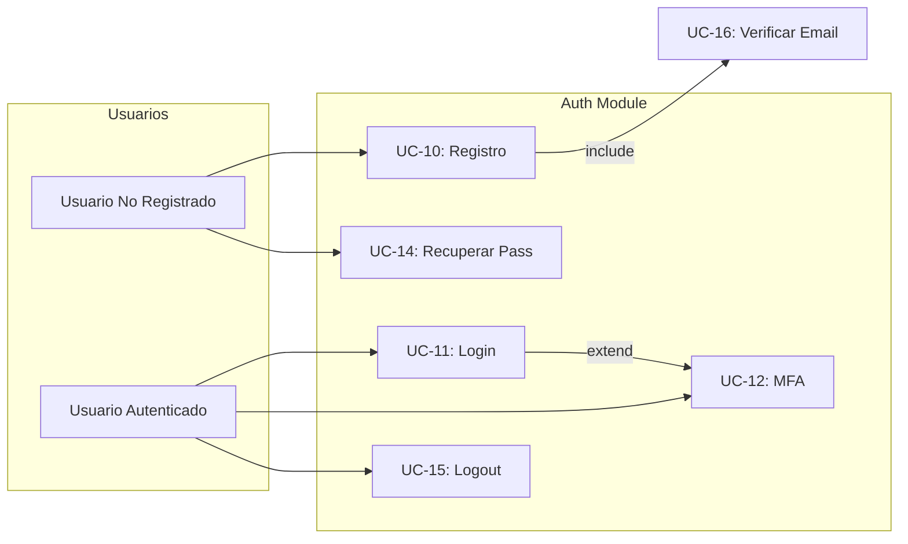

# BudgetApp - Casos de Uso (RUP)

## Convenciones
- Actores: Usuario Individual (UI), Usuario Familiar (UF), Integración Bancaria (IB), Administrador (ADM).
- Prioridad basada en requisitos RF.

---

## UC-01: Realizar Diagnóstico de Salud Financiera
- **Actor primario**: UI/UF (nuevo usuario)
- **Prioridad**: Alta (RF-01)
- **Descripción**: Durante el onboarding el sistema recopila ingresos, gastos, deudas y metas para calcular un índice de salud financiera y recomendar próximos pasos.
- **Precondiciones**: El usuario creó una cuenta y confirmó su correo/teléfono.
- **Flujo básico**:
  1. Usuario inicia el wizard de diagnóstico.
  2. Sistema solicita información (ingresos fijos/variables, gastos promedio, deudas activas, ahorros, metas).
  3. Usuario ingresa datos y confirma.
  4. Sistema calcula puntaje, clasifica (ej. crítico, en riesgo, saludable) y muestra recomendaciones + CTA para configurar presupuesto.
- **Flujos alternos**:
  - 2a. Usuario omite algún dato → sistema estimará valores basados en promedios nacionales y marcará datos faltantes.
- **Postcondiciones**: Se registra el perfil financiero inicial y se generan metas sugeridas.

## UC-02: Configurar Presupuesto Mensual
- **Actor primario**: UI/UF
- **Prioridad**: Alta (RF-02)
- **Descripción**: El usuario define montos por categorías/subcategorías para un mes específico usando la plantilla base.
- **Precondiciones**: Diagnóstico completado o datos de ingresos/gastos disponibles.
- **Flujo básico**:
  1. Usuario selecciona mes/año.
  0.1. Si es la primera vez o no ha guardado la plantilla Start Here, el sistema muestra dicha configuración antes de continuar.
  2. Sistema carga la plantilla Start Here (moneda, Start Balance, bandera “¿Inicias con dinero?” y las subcategorías base) y muestra montos sugeridos.
  3. Usuario ajusta valores, crea nuevas subcategorías si es necesario.
  4. Sistema valida suma total vs ingresos, muestra “Left to Budget”.
  5. Usuario guarda presupuesto.
- **Flujos alternos**:
  - 3a. Usuario importa configuración desde Excel/CSV → sistema mapea columnas y confirma.
- **Postcondiciones**: Presupuesto del mes queda activo y alimenta dashboards y alertas.

## UC-03: Registrar Transacción Manual
- **Actor primario**: UI/UF
- **Prioridad**: Alta (RF-03)
- **Descripción**: El usuario ingresa manualmente un gasto/ingreso, lo clasifica y opcionalmente adjunta comprobantes.
- **Precondiciones**: Presupuesto activo para el periodo.
- **Flujo básico**:
  1. Usuario abre “Agregar transacción”.
  2. Ingresa fecha, monto, categoría, subcategoría, método de pago (tarjeta, efectivo, cuenta), notas y adjuntos.
  3. Sistema valida que la categoría exista y actualiza los totales.
  4. Sistema evalúa si se superó un límite y, de ser así, prepara una alerta.
- **Postcondiciones**: La transacción queda en el log, disponible para dashboards y alertas.

## UC-04: Sincronizar Movimientos Bancarios
- **Actor primario**: IB (via webhooks) / Usuario
- **Prioridad**: Alta (RF-04)
- **Descripción**: El usuario conecta su banco y el sistema importa movimientos nuevos automáticamente.
- **Precondiciones**: Proveedor bancario configurado; usuario otorga consentimiento OAuth.
- **Flujo básico**:
  1. Usuario selecciona “Conectar banco”.
  2. Sistema redirige al proveedor (Plaid/Belvo) para autenticación.
  3. Usuario autoriza cuentas y vuelve a BudgetApp.
  4. Sistema obtiene token, descarga movimientos recientes y los presenta para revisión.
  5. Usuario confirma/corrige categorías; el sistema aprende las reglas.
- **Flujos alternos**:
  - 4a. Movimientos duplicados → sistema los marca y solicita confirmación.
  - 4b. Falla de integración → usuario recibe mensaje y se registra incidente.
- **Postcondiciones**: Cuentas quedan enlazadas y se programan sincronizaciones periódicas/webhooks.

## UC-05: Recibir Alertas en Tiempo Real
- **Actor primario**: UI/UF
- **Prioridad**: Alta (RF-06)
- **Descripción**: El sistema envía notificaciones cuando se superan límites o se detectan eventos críticos.
- **Precondiciones**: Presupuesto configurado y canales de notificación habilitados.
- **Flujo básico**:
  1. Motor de reglas monitorea presupuesto vs gastos.
  2. Al detectar desviación (ej. 90 % del presupuesto de “Comida”), genera evento.
  3. Sistema envía notificación push/email/WhatsApp con detalle y sugerencias.
  4. Usuario abre la alerta y puede ajustar presupuesto o registrar una acción.
- **Postcondiciones**: Se registra el historial de alertas y la respuesta del usuario.

## UC-06: Simular Compra (“¿Puedo permitírmelo?”)
- **Actor primario**: UI/UF
- **Prioridad**: Media (RF-07)
- **Descripción**: Antes de un gasto, el usuario ingresa monto/categoría y el sistema evalúa impacto en metas mensuales/anuales.
- **Flujo básico**:
  1. Usuario abre simulador e ingresa monto, fecha, categoría y método de pago.
  2. Sistema proyecta impacto en presupuesto actual, metas y flujo de caja.
  3. Devuelve recomendación (permitido, riesgo moderado, no recomendado) con argumentos.
  4. Usuario decide registrar la transacción simulada o descartar.

## UC-07: Gestionar Tarjetas y Cuentas
- **Actor primario**: UI/UF
- **Prioridad**: Media (RF-08)
- **Descripción**: Registrar tarjetas/créditos, ver tasas de interés, límites y sugerencias.
- **Flujo básico**:
  1. Usuario agrega una tarjeta con datos (emisor, tasa, cupo, fecha corte/pago).
  2. Sistema consolida gastos por tarjeta e identifica intereses proyectados.
  3. Cuando un pago se registra, actualiza saldo y recomienda acciones si la tasa es alta.

## UC-08: Administrar Planes y Suscripciones
- **Actor primario**: ADM / Usuario
- **Prioridad**: Media (RF-09, RF-10)
- **Descripción**: Controlar upgrades a plan familiar y monitorear suscripciones detectadas en gastos.
- **Flujo básico (usuario)**:
  1. Usuario revisa panel de suscripciones detectadas automáticamente.
  2. Marca cada una como “mantener”, “renegociar” o “cancelar”.
  3. Sistema programa recordatorios y calcula impacto en presupuesto.
  - **Flujo ADM**: define beneficios y precios por plan, habilita facturación recurrente.

## UC-09: Exportar / Respaldar Información
- **Actor primario**: UI/UF
- **Prioridad**: Baja (RF-12)
- **Descripción**: Permite descargar datos (CSV/XLSX) para respaldo o importación externa.

---

---

## Módulo: Gestión de Usuarios y Autenticación

> Documentación detallada disponible en: [casos_de_uso/](./casos_de_uso/)

| ID | Nombre | Prioridad | Actor Primario | Enlace |
|----|--------|-----------|----------------|--------|
| UC-10 | Registrar Cuenta de Usuario | Alta | Usuario No Registrado | [Ver detalle](./casos_de_uso/UC-10_registro_usuario/README.md) |
| UC-11 | Iniciar Sesión | Alta | Usuario Registrado | [Ver detalle](./casos_de_uso/UC-11_inicio_sesion/README.md) |
| UC-12 | Configurar MFA | Alta | Usuario Autenticado | [Ver detalle](./casos_de_uso/UC-12_configurar_mfa/README.md) |
| UC-13 | Gestionar Perfil de Usuario | Media | Usuario Autenticado | [Ver detalle](./casos_de_uso/UC-13_perfil_usuario/README.md) |
| UC-14 | Recuperar Contraseña | Alta | Usuario No Autenticado | [Ver detalle](./casos_de_uso/UC-14_recuperar_contrasena/README.md) |
| UC-15 | Cerrar Sesión | Alta | Usuario Autenticado | [Ver detalle](./casos_de_uso/UC-15_cerrar_sesion/README.md) |
| UC-16 | Verificar Email/Teléfono | Alta | Usuario | [Ver detalle](./casos_de_uso/UC-16_verificar_email/README.md) |
| UC-17 | Cambiar Contraseña | Alta | Usuario Autenticado | [Ver detalle](./casos_de_uso/UC-17_cambiar_contrasena/README.md) |
| UC-18 | Gestionar Dispositivos Confiables | Media | Usuario con MFA | [Ver detalle](./casos_de_uso/UC-18_dispositivos_confiables/README.md) |
| UC-19 | Eliminar Cuenta | Baja | Usuario Autenticado | [Ver detalle](./casos_de_uso/UC-19_eliminar_cuenta/README.md) |

### Diagrama de Casos de Uso - Usuarios y Auth

---

## Próximos pasos
1. Refinar casos de uso detallados (diagramas UML) para UC-01 a UC-05.
2. Definir criterios de aceptación y escenarios BDD por caso de uso.
3. Mapear requerimientos no funcionales a cada caso crítico (seguridad, rendimiento, disponibilidad).
4. ✅ **Completado:** Casos de uso UC-10 a UC-19 (Gestión de Usuarios y MFA).
