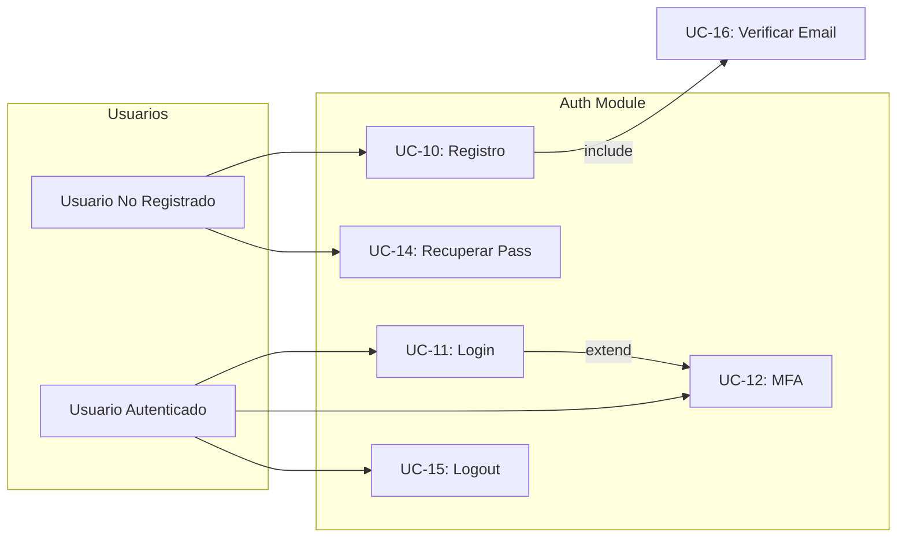

# BudgetApp - Casos de Uso (RUP)

## Convenciones
- Actores: Usuario Individual (UI), Usuario Familiar (UF), Integración Bancaria (IB), Administrador (ADM).
- Prioridad basada en requisitos RF.

---

## UC-01: Registrar Realidad Financiera Inicial
- **Actor primario**: UI/UF (nuevo usuario)
- **Prioridad**: Alta (RF-01, RF-21, RF-22, RF-23)
- **Descripción**: Antes de crear presupuesto, el sistema propone registrar la realidad financiera del usuario para partir de datos reales y reducir omisiones.
- **Precondiciones**: El usuario creó una cuenta y confirmó su correo/teléfono.
- **Flujo básico**:
  1. Usuario inicia onboarding.
  2. Sistema valida si existen cuentas, deudas, metas y gastos recurrentes registrados.
  3. Si faltan datos, sistema pregunta: "Para un presupuesto más limpio, ¿quieres registrar tu realidad financiera ahora?".
  4. Usuario acepta y registra cuentas bancarias (nombre y saldo actual).
  5. Usuario registra deudas (origen, saldo actual, tasa EA opcional).
  6. Si falta tasa en una deuda, sistema aplica 23 % EA por defecto (configurable), estima interés y sugiere cuota mensual de salida.
  7. Usuario registra gastos recurrentes/bills (casa, carro, servicios, celular, administración, etc.).
  8. Usuario registra metas de ahorro base.
  9. Sistema calcula diagnóstico de salud financiera y muestra recomendaciones para el presupuesto.
- **Flujos alternos**:
  - 3a. Usuario responde "ahora no" → sistema permite continuar a creación de presupuesto y deja recordatorio para completar la realidad financiera luego.
  - 4a. Datos incompletos → sistema guarda borrador y marca campos faltantes para completar después.
- **Postcondiciones**: Queda guardado un snapshot inicial de realidad financiera y se generan sugerencias de priorización (deuda, ahorro, pagos fijos).

## UC-02: Configurar Presupuesto Mensual
- **Actor primario**: UI/UF
- **Prioridad**: Alta (RF-02, RF-24, RF-25)
- **Descripción**: El usuario define montos por categorías/subcategorías para un mes específico usando la plantilla base y, cuando exista información previa, aprovecha precargas automáticas de obligaciones.
- **Precondiciones**: El usuario tiene sesión activa; puede tener o no la realidad financiera completada.
- **Flujo básico**:
  1. Usuario selecciona mes/año.
  2. Si es la primera vez o no ha guardado la plantilla Start Here, el sistema muestra dicha configuración antes de continuar.
  3. Sistema carga la plantilla Start Here (moneda, Start Balance, bandera "¿Inicias con dinero?" y subcategorías base).
  4. Si existe realidad financiera, sistema precarga automáticamente:
     - cuotas de deudas (casa, carro, tarjetas y otras obligaciones),
     - gastos recurrentes (servicios, celular, administración, suscripciones).
  5. Usuario ajusta valores y crea nuevas subcategorías si es necesario.
  6. Usuario puede crear una nueva meta de ahorro, deuda o cuenta bancaria sin salir del flujo.
  7. Sistema valida suma total vs ingresos y muestra "Left to Budget".
  8. Usuario guarda presupuesto.
- **Flujos alternos**:
  - 4a. No existe realidad financiera → sistema no precarga obligaciones y muestra CTA para completar datos después.
  - 5a. Usuario importa configuración desde Excel/CSV → sistema mapea columnas y confirma.
- **Postcondiciones**: Presupuesto del mes queda activo, con compromisos fijos visibles desde el inicio, y alimenta dashboards y alertas.

## UC-03: Registrar Transacción Manual
- **Actor primario**: UI/UF
- **Prioridad**: Alta (RF-03)
- **Descripción**: El usuario ingresa manualmente un gasto/ingreso, lo clasifica y opcionalmente adjunta comprobantes.
- **Precondiciones**: Presupuesto activo para el periodo.
- **Flujo básico**:
  1. Usuario abre “Agregar transacción”.
  2. Ingresa fecha, monto, categoría, subcategoría, método de pago (tarjeta, efectivo, cuenta), notas y adjuntos.
  3. Sistema valida que la categoría exista y actualiza los totales.
  4. Sistema evalúa si se superó un límite y, de ser así, prepara una alerta.
- **Postcondiciones**: La transacción queda en el log, disponible para dashboards y alertas.

## UC-04: Sincronizar Movimientos Bancarios
- **Actor primario**: IB (via webhooks) / Usuario
- **Prioridad**: Alta (RF-04)
- **Descripción**: El usuario conecta su banco y el sistema importa movimientos nuevos automáticamente.
- **Precondiciones**: Proveedor bancario configurado; usuario otorga consentimiento OAuth.
- **Flujo básico**:
  1. Usuario selecciona “Conectar banco”.
  2. Sistema redirige al proveedor (Plaid/Belvo) para autenticación.
  3. Usuario autoriza cuentas y vuelve a BudgetApp.
  4. Sistema obtiene token, descarga movimientos recientes y los presenta para revisión.
  5. Usuario confirma/corrige categorías; el sistema aprende las reglas.
- **Flujos alternos**:
  - 4a. Movimientos duplicados → sistema los marca y solicita confirmación.
  - 4b. Falla de integración → usuario recibe mensaje y se registra incidente.
- **Postcondiciones**: Cuentas quedan enlazadas y se programan sincronizaciones periódicas/webhooks.

## UC-05: Recibir Alertas en Tiempo Real
- **Actor primario**: UI/UF
- **Prioridad**: Alta (RF-06)
- **Descripción**: El sistema envía notificaciones cuando se superan límites o se detectan eventos críticos.
- **Precondiciones**: Presupuesto configurado y canales de notificación habilitados.
- **Flujo básico**:
  1. Motor de reglas monitorea presupuesto vs gastos.
  2. Al detectar desviación (ej. 90 % del presupuesto de “Comida”), genera evento.
  3. Sistema envía notificación push/email/WhatsApp con detalle y sugerencias.
  4. Usuario abre la alerta y puede ajustar presupuesto o registrar una acción.
- **Postcondiciones**: Se registra el historial de alertas y la respuesta del usuario.

## UC-06: Simular Compra (“¿Puedo permitírmelo?”)
- **Actor primario**: UI/UF
- **Prioridad**: Media (RF-07)
- **Descripción**: Antes de un gasto, el usuario ingresa monto/categoría y el sistema evalúa impacto en metas mensuales/anuales.
- **Flujo básico**:
  1. Usuario abre simulador e ingresa monto, fecha, categoría y método de pago.
  2. Sistema proyecta impacto en presupuesto actual, metas y flujo de caja.
  3. Devuelve recomendación (permitido, riesgo moderado, no recomendado) con argumentos.
  4. Usuario decide registrar la transacción simulada o descartar.

## UC-07: Gestionar Tarjetas y Cuentas
- **Actor primario**: UI/UF
- **Prioridad**: Media (RF-08)
- **Descripción**: Registrar tarjetas/créditos, ver tasas de interés, límites y sugerencias.
- **Flujo básico**:
  1. Usuario agrega una tarjeta con datos (emisor, tasa, cupo, fecha corte/pago).
  2. Sistema consolida gastos por tarjeta e identifica intereses proyectados.
  3. Cuando un pago se registra, actualiza saldo y recomienda acciones si la tasa es alta.

## UC-08: Administrar Planes y Suscripciones
- **Actor primario**: ADM / Usuario
- **Prioridad**: Media (RF-09, RF-10)
- **Descripción**: Controlar upgrades a plan familiar y monitorear suscripciones detectadas en gastos.
- **Flujo básico (usuario)**:
  1. Usuario revisa panel de suscripciones detectadas automáticamente.
  2. Marca cada una como “mantener”, “renegociar” o “cancelar”.
  3. Sistema programa recordatorios y calcula impacto en presupuesto.
  - **Flujo ADM**: define beneficios y precios por plan, habilita facturación recurrente.

## UC-09: Exportar / Respaldar Información
- **Actor primario**: UI/UF
- **Prioridad**: Baja (RF-12)
- **Descripción**: Permite descargar datos (CSV/XLSX) para respaldo o importación externa.

---

## Módulo: División de cuentas compartidas

| ID | Nombre | Prioridad | Actor Primario | Enlace |
|----|--------|-----------|----------------|--------|
| UC-DC-01 | Dividir cuenta de compras compartidas | Media | Usuario | [Ver detalle](./casos_de_uso/division_de_cuentas/division_de_cuentas.md) |

---

## Módulo: Gestión de Usuarios y Autenticación

> Documentación detallada disponible en: [casos_de_uso/](./casos_de_uso/)

| ID | Nombre | Prioridad | Actor Primario | Enlace |
|----|--------|-----------|----------------|--------|
| UC-10 | Registrar Cuenta de Usuario | Alta | Usuario No Registrado | [Ver detalle](./casos_de_uso/UC-10_registro_usuario/README.md) |
| UC-11 | Iniciar Sesión | Alta | Usuario Registrado | [Ver detalle](./casos_de_uso/UC-11_inicio_sesion/README.md) |
| UC-12 | Configurar MFA | Alta | Usuario Autenticado | [Ver detalle](./casos_de_uso/UC-12_configurar_mfa/README.md) |
| UC-13 | Gestionar Perfil de Usuario | Media | Usuario Autenticado | [Ver detalle](./casos_de_uso/UC-13_perfil_usuario/README.md) |
| UC-14 | Recuperar Contraseña | Alta | Usuario No Autenticado | [Ver detalle](./casos_de_uso/UC-14_recuperar_contrasena/README.md) |
| UC-15 | Cerrar Sesión | Alta | Usuario Autenticado | [Ver detalle](./casos_de_uso/UC-15_cerrar_sesion/README.md) |
| UC-16 | Verificar Email/Teléfono | Alta | Usuario | [Ver detalle](./casos_de_uso/UC-16_verificar_email/README.md) |
| UC-17 | Cambiar Contraseña | Alta | Usuario Autenticado | [Ver detalle](./casos_de_uso/UC-17_cambiar_contrasena/README.md) |
| UC-18 | Gestionar Dispositivos Confiables | Media | Usuario con MFA | [Ver detalle](./casos_de_uso/UC-18_dispositivos_confiables/README.md) |
| UC-19 | Eliminar Cuenta | Baja | Usuario Autenticado | [Ver detalle](./casos_de_uso/UC-19_eliminar_cuenta/README.md) |

### Diagrama de Casos de Uso - Usuarios y Auth

```mermaid
graph LR
    subgraph Usuarios
        U1[Usuario No Registrado]
        U2[Usuario Autenticado]
    end

    subgraph "Auth Module"
        UC10[UC-10: Registro]
        UC11[UC-11: Login]
        UC12[UC-12: MFA]
        UC14[UC-14: Recuperar Pass]
        UC15[UC-15: Logout]
    end

    U1 --> UC10
    U1 --> UC14
    U2 --> UC11
    U2 --> UC12
    U2 --> UC15
    UC10 -->|include| UC16[UC-16: Verificar Email]
    UC11 -->|extend| UC12
```

---

## Próximos pasos
1. Refinar casos de uso detallados (diagramas UML) para UC-01 a UC-05.
2. Definir criterios de aceptación y escenarios BDD por caso de uso.
3. Mapear requerimientos no funcionales a cada caso crítico (seguridad, rendimiento, disponibilidad).
4. ✅ **Completado:** Casos de uso UC-10 a UC-19 (Gestión de Usuarios y MFA).
