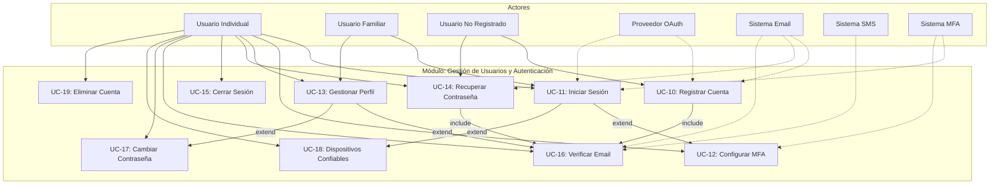

# Módulo: Gestión de Usuarios y Autenticación

## Diagrama de Casos de Uso

## Casos de Uso del Módulo

| ID | Nombre | Prioridad | Estado | Enlace |
|----|--------|-----------|--------|--------|
| UC-10 | Registrar Cuenta de Usuario | Alta | En desarrollo | [Ver detalle](./UC-10_registro_usuario/README.md) |
| UC-11 | Iniciar Sesión | Alta | En desarrollo | [Ver detalle](./UC-11_inicio_sesion/README.md) |
| UC-12 | Configurar MFA | Alta | En desarrollo | [Ver detalle](./UC-12_configurar_mfa/README.md) |
| UC-13 | Gestionar Perfil de Usuario | Media | En desarrollo | [Ver detalle](./UC-13_perfil_usuario/README.md) |
| UC-14 | Recuperar Contraseña | Alta | En desarrollo | [Ver detalle](./UC-14_recuperar_contrasena/README.md) |
| UC-15 | Cerrar Sesión | Alta | En desarrollo | [Ver detalle](./UC-15_cerrar_sesion/README.md) |
| UC-16 | Verificar Email/Teléfono | Alta | En desarrollo | [Ver detalle](./UC-16_verificar_email/README.md) |
| UC-17 | Cambiar Contraseña | Alta | En desarrollo | [Ver detalle](./UC-17_cambiar_contrasena/README.md) |
| UC-18 | Gestionar Dispositivos Confiables | Media | En desarrollo | [Ver detalle](./UC-18_dispositivos_confiables/README.md) |
| UC-19 | Eliminar Cuenta | Baja | En desarrollo | [Ver detalle](./UC-19_eliminar_cuenta/README.md) |

## Matriz de Trazabilidad

| Caso de Uso | Requisitos Funcionales | Requisitos No Funcionales |
|-------------|----------------------|--------------------------|
| UC-10 | RF-14 | RNF-Seguridad, RNF-Cumplimiento |
| UC-11 | RF-14 | RNF-Seguridad, RNF-Disponibilidad |
| UC-12 | RF-14 | RNF-Seguridad (MFA) |
| UC-13 | RF-14 | RNF-Usabilidad, RNF-Cumplimiento |
| UC-14 | RF-14 | RNF-Seguridad |
| UC-15 | RF-14 | RNF-Seguridad |
| UC-16 | RF-14 | RNF-Seguridad |
| UC-17 | RF-14 | RNF-Seguridad |
| UC-18 | RF-14 | RNF-Seguridad (MFA) |
| UC-19 | RF-14 | RNF-Cumplimiento (GDPR, Habeas Data) |

## Relaciones entre Casos de Uso

### Include (obligatorio)
- UC-10 → UC-16: El registro siempre incluye verificación de email
- UC-14 → UC-16: La recuperación usa el mismo mecanismo de verificación

### Extend (opcional)
- UC-11 ← UC-12: El login puede extenderse con verificación MFA
- UC-11 ← UC-18: El login puede verificar dispositivo confiable
- UC-13 ← UC-16: Cambiar email extiende con verificación
- UC-13 ← UC-17: Desde perfil se puede cambiar contraseña

## Actores

| Actor | Tipo | Descripción |
|-------|------|-------------|
| Usuario No Registrado | Primario | Persona sin cuenta que desea registrarse |
| Usuario Individual | Primario | Usuario con cuenta personal |
| Usuario Familiar | Primario | Usuario parte de un hogar compartido |
| Proveedor OAuth | Secundario | Google, Apple para autenticación social |
| Sistema de Email | Secundario | Servicio de envío de correos |
| Sistema de SMS | Secundario | Servicio de mensajes de texto |
| Sistema MFA | Secundario | Servicio TOTP para autenticación |

## Estándares Aplicados

- **RFC 6238**: TOTP (Time-Based One-Time Password)
- **OAuth 2.0**: Autenticación con proveedores externos
- **GDPR Art. 17**: Derecho al olvido
- **Ley 1581/2012**: Habeas Data (Colombia)

---

**Última actualización:** 2026-02-02
**Autor:** Henry Gomez
**Versión:** 1.0
