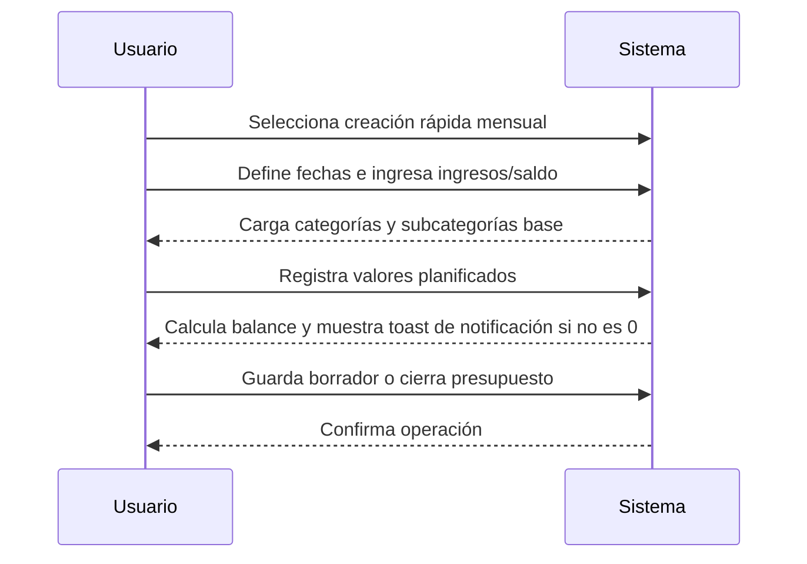
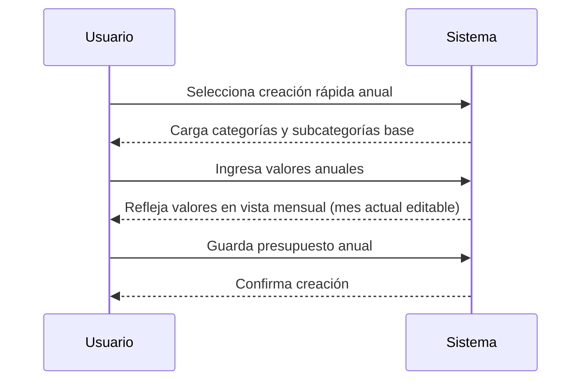
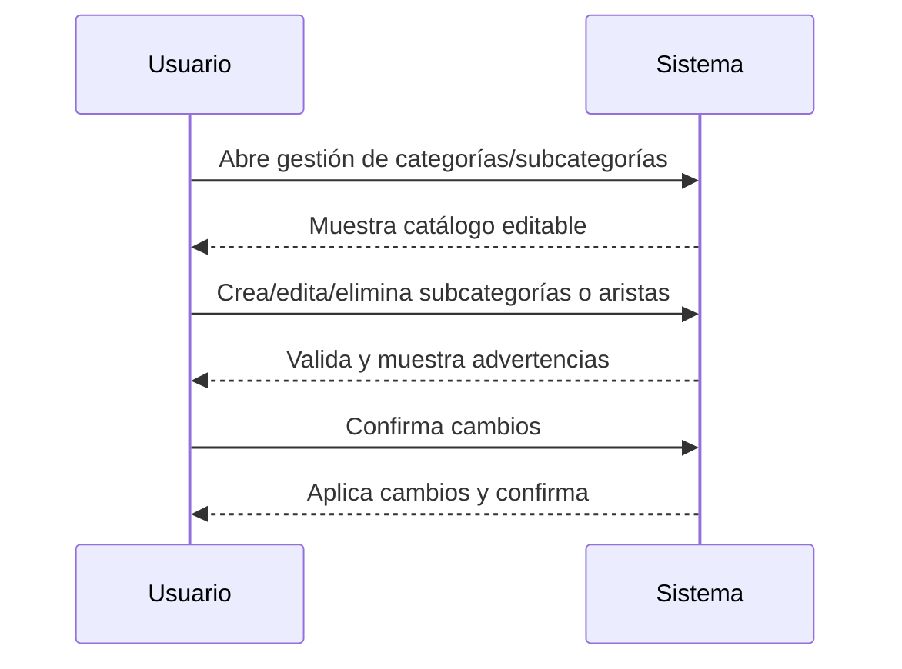
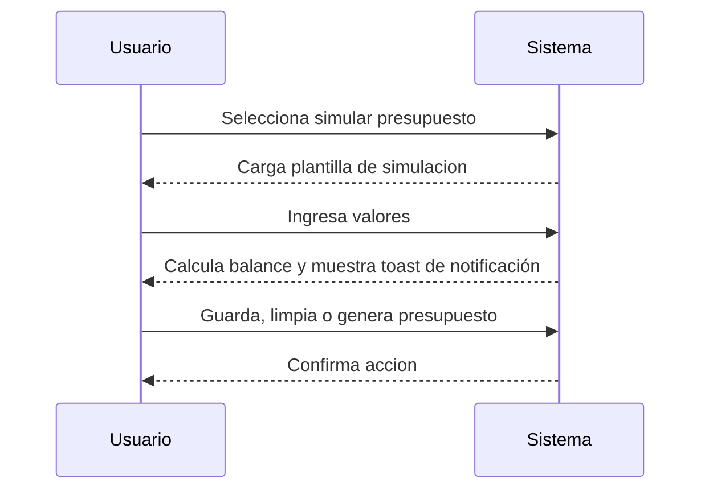
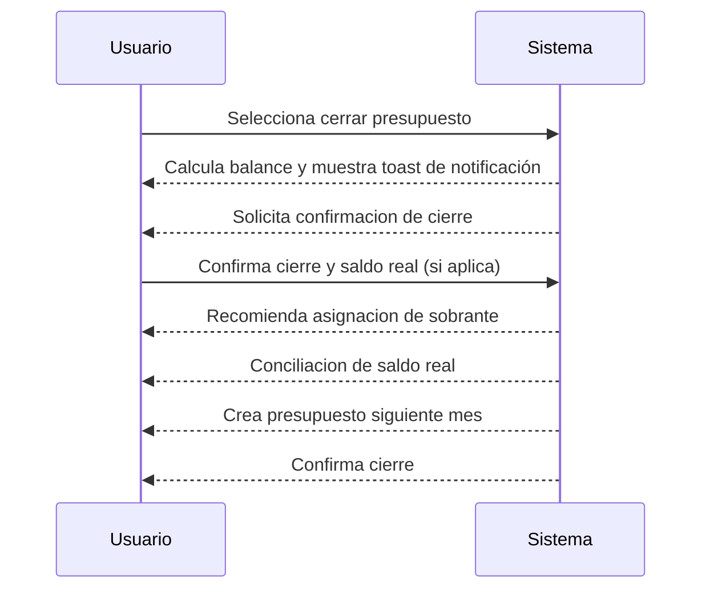
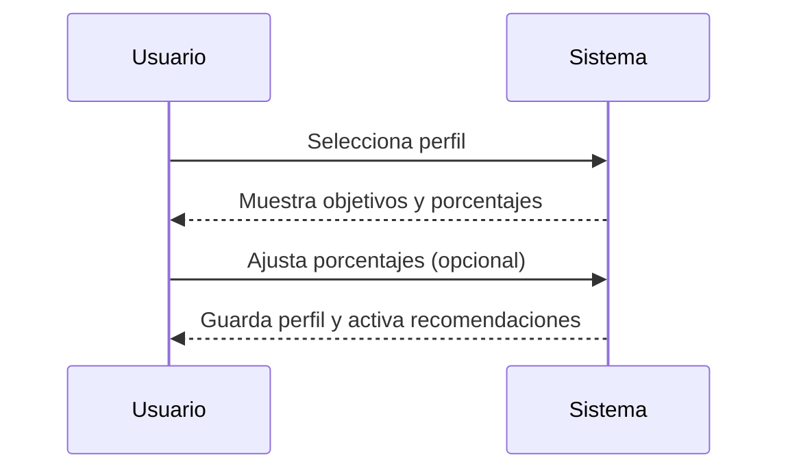
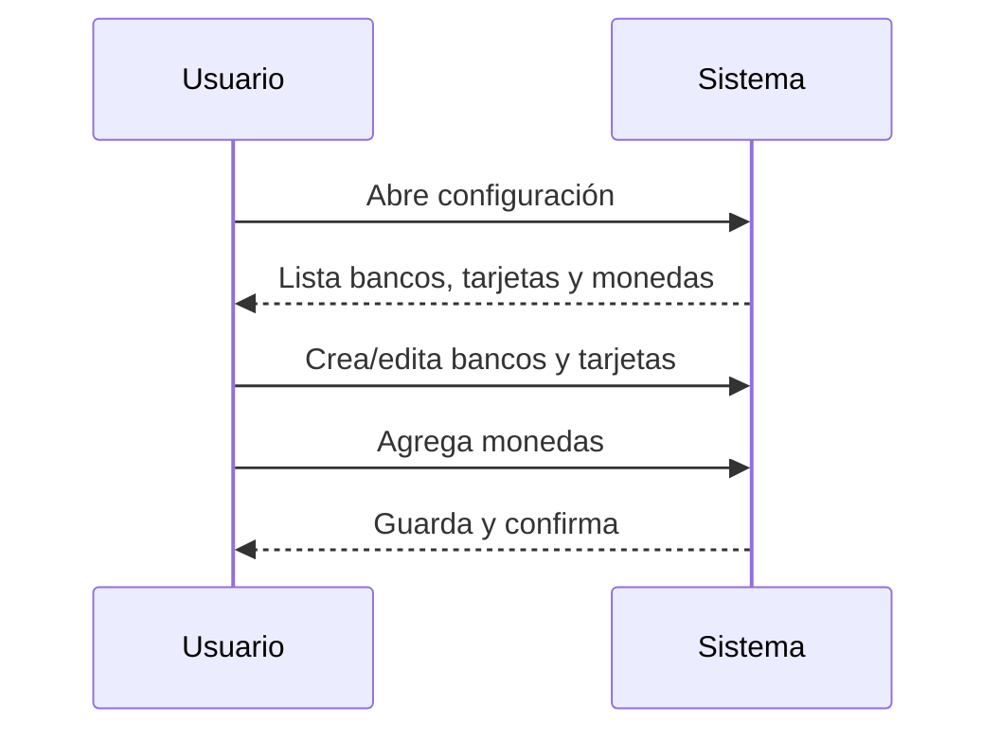

# Casos de Uso - Gestion de Presupuestos (RF02)

## UC-01: Crear presupuesto mensual

### Información General

| Campo | Valor |
|-------|-------|
| **ID** | UC-01 |
| **Nombre** | Crear presupuesto mensual |
| **Versión** | 1.0 |
| **Fecha** | 2026-02-02 |
| **Autor** | Alexandra Castano |
| **Prioridad** | Alta |
| **Frecuencia de uso** | Alta (cada usuario) |
| **Estado** | En desarrollo |

### Descripción Breve

Permite al usuario crear un presupuesto para un mes especifico.

### Actores

| Actor | Tipo | Descripción |
|-------|------|-------------|
| Usuario | Primario | Persona que crea o actualiza su presupuesto mensual. |

### Precondiciones

1. El usuario tiene acceso a la aplicacion (web o movil)
2. El usuario esta autenticado
3. El sistema esta disponible y operativo

### Postcondiciones

#### Exito
1. Se crea el presupuesto mensual
2. Se muestra mensaje exitoso

#### Fallo
1. No se crea el presupuesto mensual
2. Se muestra mensaje de error apropiado al usuario
3. Se registra el intento fallido en logs de auditoria

### Flujo Básico

| Paso | Actor | Sistema |
|------|-------|---------|
| 1 | Usuario selecciona creacion rapida mensual. | - |
| 2 | Usuario define fecha inicio y fin (dd-mm-yyyy). | - |
| 3 | Usuario selecciona plantilla base: vacia. | - |
| 4 | - | Carga categorias fijas (Gastos, Ingresos, Ahorro) y subcategorias base de Mindful Budget. |
| 5 | Usuario registra ingreso estimado y saldo del mes anterior. | - |
| 5.1 | - | Preasigna valores planificados por subcategoria según los porcentajes del perfil activo (editable). |
| 6 | Usuario registra valores planificados por subcategoria (Gastos/Ahorro) y sus detalles (aristas); en Ingresos registra rubro/detalle directamente, incluyendo medio de pago (tarjeta, efectivo, transferencia, prestamo), banco/tarjeta y moneda cuando aplique. | - |
| 6.1 | - | Calcula balance ingreso vs presupuesto y muestra un toast de notificación si no es 0 (no bloquea). |
| 7 | Usuario guarda como borrador. | - |
| 8 | Usuario cierra el presupuesto (si aplica). | - |

### Flujos Alternativos

#### FA-1: Flujo secundario

| Paso | Descripcion |
|------|-------------|
| 1a | Usuario selecciona creacion rapida mensual. |
| 2a | Define fecha inicio y fin (dd-mm-yyyy). |
| 3a | Selecciona plantilla base: vacia. |
| 4a | El sistema carga categorias y subcategorias por defecto. |
| 5a | El usuario ajusta subcategorias y detalles (aristas) permitidas (no modifica categorias). |
| 6a | El usuario registra los ingresos iniciales para el presupuesto. |
| 7a | Usuario registra los valores estimados a gastar y a ahorrar en las subcategorias en la columna "Plan" y sus detalles (aristas) en "Descripcion", incluyendo medio de pago, banco/tarjeta y moneda cuando aplique. |
| 8a | El sistema calcula balance dinamicamente. |
| 9a | Usuario guarda como borrador o cierra el presupuesto. |

### Flujos de Excepción

No hay.

### Requisitos Especiales

#### Datos / Persistencia
- La interfaz muestra un log mensual por mes.
- La base de datos almacena todas las transacciones en una sola tabla; el log mensual se obtiene por filtro de fechas.
- Campos mínimos: id, user_id/household_id, fecha, monto, moneda, categoria (Gastos/Ingresos/Ahorro), subcategoria_id, rubro, subclasificacion, medio_pago (tarjeta/efectivo/transferencia/prestamo), banco_id, tarjeta_id, origen (manual/importado), notas, created_at.
- Catálogos: subcategorías editables ligadas a categoría; detalles (aristas) editables por subcategoría; Ingresos usa rubro/detalle (arista) directamente (sin subcategoría).
- Si medio de pago es tarjeta o transferencia, se selecciona banco; si es tarjeta, se selecciona tarjeta; siempre se selecciona moneda.
- En presupuesto mensual solo se permite presupuestar el mes actual.
- Si un rubro corresponde a ahorro programado anual, en la vista mensual se muestra el valor mensual y un indicador de "ahorro programado"; la definición de fecha fin y valor objetivo se registra en el presupuesto anual (UC-02).

#### Seguridad
- Solo usuarios autenticados pueden crear presupuestos.

#### Rendimiento
- Sin requerimientos especiales.

#### Usabilidad
- Si el balance no es 0, se muestra un toast de notificación informativo sin bloquear al usuario.
- En el paso 3, la jerarquia se visualiza como arbol: Categoria > Subcategoria > Detalle (arista).
- Las subcategorias pueden expandirse/colapsarse para mostrar u ocultar detalles.
- El boton para agregar detalle aparece al pasar el mouse o en modo edicion.
- Si el usuario cambia el valor total de una subcategoria y la suma de sus detalles no coincide, los detalles se resaltan en rojo y se muestra un error indicando la diferencia.

#### Cumplimiento
- No aplica.

### Puntos de Extensión

| Punto | Descripción |
|---|---|
| Importación de presupuesto | Extiende UC-01 con carga CSV/XLS (RF-18) |
| Simulación | Extiende UC-BP-04 con escenario de simulación (US-BP-09) |
| Ajuste de cierre de ahorro | Extiende UC-BP-10 cuando se cierra presupuesto (US-BP-11) |

### Reglas de Negocio

| ID | Regla |
|----|-------|
| RN-BP-01 | Las categorias son: Gastos, Ingresos y Ahorro. |
| RN-BP-02 | Las categorias no son modificables. |
| RN-BP-03 | Las subcategorias existen para Gastos y Ahorro; Ingresos usa rubro/arista directamente (sin subcategoria). |
| RN-BP-04 | Cada subcategoria tiene aristas (rubro, subclasificacion) editables. |
| RN-BP-05 | Subcategorias base de Gastos (Mindful Budget): Necesidades Basicas, Deudas, Casa, Alimentacion, Salud, Entretenimiento, Mascota, Regalos/Caridad, Transporte, Seguros, Cuidado Personal, Hijos, Otros. |
| RN-BP-06 | Subcategoria base de Ahorro: Ahorros. |
| RN-BP-07 | Aristas base por subcategoria se derivan de Mindful Budget (ver catalogo base). |
| RN-BP-08 | En presupuesto mensual solo se presupuestan valores del mes actual. |
| RN-BP-09 | Rubros marcados como ahorro programado se reflejan con indicador en el mes; cuando llega el mes de gasto real, el usuario puede desmarcar el ahorro y registrar el valor real, y el saldo restante queda como ahorro. |
| RN-BP-10 | Si el usuario modifica un valor desde la vista mensual un rubro marcado como ahorro programado, se mostrar un mensaje diciendo "Se está modificando un ahorro programado y se ajustarán los demás valores para cumple el objetivo en la fecha indicada". |
| RN-BP-11 | El valor de cada subcategoria es la sumatoria de sus detalles (aristas). |
| RN-BP-12 | Si el usuario modifica el valor de una subcategoria, el sistema valida que la suma de detalles coincida; si no coincide, marca detalles en rojo y muestra un error. |
| RN-BP-13 | Al ingresar ingresos, el sistema preasigna valores de subcategorias segun los porcentajes definidos en el perfil activo (valores editables). |
| RN-BP-14 | Eliminar una subcategoria requiere confirmacion y elimina todos sus detalles asociados. |

#### Catalogo base de aristas

**Gastos**
 Estructura de Categorías, Subcategorías y Aristas

| Categoría | Subcategoría | Aristas base (rubro/subclasificación) |
|---|---|---|
| Gastos | Necesidades Básicas | Arriendo; Telefono/ Celular; Servicios publicos; Gas; Cable/Internet; Mercado; Gasolina; Transporte diario |
| Gastos | Deudas | Deuda Carro; Deuda tarjeta 1; Deuda familiar; Deuda Estudio; Carro |
| Gastos | Casa | Limpieza; Mantenimiento; Muebles; Impuestos |
| Gastos | Alimentación | Restaurantes; Domicilios |
| Gastos | Salud | Medicinas; Tratamientos; Deporte |
| Gastos | Entretenimiento | Vacaciones; Citas; Cine; Plataformas de series 1; Plataformas de musica 1|
| Gastos | Mascota | Comida; Veterinario; Juguetes; Medicinas |
| Gastos | Regalos/ Caridad | Regalos Navidad; Regalos cumpleaños; Caridad |
| Gastos | Transporte | app taxis/taxi; Estacionamiento; Mantenimiento; Impuestos; colpass/Peaje |
| Gastos | Seguros | Carro; Vida; Casa; Salud |
| Gastos | Cuidado Personal | Ropa; Belleza; Peluquería; Sastre; Tintorería |
| Gastos | Hijos | Ropa; Estudio; Útiles Escolares; Niñera |
| Gastos | Otros | (sin aristas base definidas) |

**Ahorro**
| Categoría | Subcategoría | Aristas base (rubro/subclasificación) |
|---|---|---|
| Ahorro | Ahorros | Fondo de Emergencia; Fondo de Pensión; Fondo de Educación; Cuota Inicial Casa; Aporte a Capital |

**Ingresos (rubros/aristas base)**
| Categoría | Subcategoría | Aristas base (rubro/subclasificación) |
|---|---|---|
| Ingresos | (sin subcategoría) | Salario; saldo mes anterior; Efectivo |

### Trazabilidad

| Tipo | ID | Descripción |
|---|---|---|
| Requisito funcional | RF-02 | Presupuestos mensuales/anuales |

### Diagrama de Secuencia

### Mockups / Wireframes

Pendiente por validar con el usuario.

### Historial de Cambios

| Versión | Fecha | Autor | Descripción |
|---------|-------|-------|-------------|
| 1.0 | 2026-02-02 | Alexandra Castano | Creación inicial |

---

## UC-02: Crear presupuesto anual

### Información General

| Campo | Valor |
|-------|-------|
| **ID** | UC-02 |
| **Nombre** | Crear presupuesto anual |
| **Versión** | 1.0 |
| **Fecha** | 2026-02-02 |
| **Autor** | Alexandra Castano |
| **Prioridad** | Alta |
| **Frecuencia de uso** | Alta (cada usuario) |
| **Estado** | En desarrollo |

### Descripción Breve

Permite crear un presupuesto anual con vista consolidada y mensual.

### Actores

| Actor | Tipo | Descripción |
|-------|------|-------------|
| Usuario | Primario | Persona que crea o actualiza su presupuesto anual. |

### Precondiciones

1. El usuario tiene acceso a la aplicacion (web o movil)
2. El usuario esta autenticado
3. El sistema esta disponible y operativo

### Postcondiciones

#### Exito
1. Se crea el presupuesto anual.
2. Los valores se reflejan en la vista mensual (mes actual editable).

#### Fallo
1. No se crea el presupuesto anual.
2. Se muestra mensaje de error apropiado al usuario.
3. Se registra el intento fallido en logs de auditoria.

### Flujo Básico

| Paso | Actor | Sistema |
|------|-------|---------|
| 1 | Usuario selecciona creacion rapida anual. | - |
| 2 | - | Replica categorias y subcategorias para todos los meses. |
| 3 | - | Se visualiza sumatoria anual por categoria y subcategoria. |
| 4 | Usuario puede alternar entre vista anual y mensual sin perdida de datos. | - |

### Flujos Alternativos

#### FA-1: Creación anual como primer presupuesto

| Paso | Descripción |
|------|-------------|
| 1a | Usuario selecciona creación anual como primer presupuesto. |
| 2a | Sistema carga categorías fijas (Gastos, Ingresos, Ahorro) y subcategorías base de Mindful Budget. |
| 3a | Usuario ajusta subcategorías y aristas permitidas (categorías no editables). |
| 4a | Usuario ingresa valores anuales por subcategoría (Gastos/Ahorro) y rubro/arista (Ingresos). |
| 5a | Sistema guarda el presupuesto anual y refleja los valores en la vista mensual. |
| 6a | En vista mensual, solo el mes actual queda editable; los demás meses son de solo lectura. |

### Flujos de Excepción

No hay.

### Requisitos Especiales

#### Datos / Persistencia
- El presupuesto anual permite ingresar valores presupuestados para aristas durante todo el año.
- Para rubros de ahorro programado, el usuario define fecha fin y valor objetivo de ahorro.
- Los valores guardados en el presupuesto anual se reflejan en la vista mensual; solo el mes actual es editable.

#### Seguridad
- Solo usuarios autenticados pueden crear presupuestos.

#### Rendimiento
- Sin requerimientos especiales.

#### Usabilidad
- El usuario puede alternar entre vista anual y mensual sin perdida de informacion.

#### Cumplimiento
- No aplica.

### Puntos de Extensión

| Punto | Descripción |
|---|---|
| Visualización mensual | Extiende UC-02 con vista mensual y edición del mes actual (US-BP-06). |

### Reglas de Negocio

| ID | Regla |
|----|-------|
| RN-BP-AN-01 | El presupuesto anual puede ser el primer presupuesto creado por el usuario. |
| RN-BP-AN-02 | Las categorías son fijas (Gastos, Ingresos, Ahorro) y no son editables. |
| RN-BP-AN-03 | El usuario puede ajustar subcategorías y aristas; Ingresos usa rubro/arista directamente. |
| RN-BP-AN-04 | Los valores guardados en el presupuesto anual se reflejan en la vista mensual. |
| RN-BP-AN-05 | En la vista mensual, solo el mes actual es editable; los demás meses son de solo lectura. |
| RN-BP-AN-06 | Las reglas de balance y ahorro aplican igual en presupuesto anual y mensual. |
| RN-BP-AN-07 | Cambios en el presupuesto anual se reflejan en el mensual y viceversa. |

### Trazabilidad

| Tipo | ID | Descripción |
|---|---|---|
| Requisito funcional | RF-02 | Presupuestos mensuales/anuales |

### Diagrama de Secuencia

### Mockups / Wireframes

Pendiente por validar con el usuario.

### Historial de Cambios

| Versión | Fecha | Autor | Descripción |
|---------|-------|-------|-------------|
| 1.0 | 2026-02-02 | Alexandra Castano | Creación inicial |

---

## UC-BP-03: Editar categorias y subcategorias

### Información General

| Campo | Valor |
|-------|-------|
| **ID** | UC-BP-03 |
| **Nombre** | Editar categorias y subcategorias |
| **Versión** | 1.0 |
| **Fecha** | 2026-02-02 |
| **Autor** | Alexandra Castano |
| **Prioridad** | Alta |
| **Frecuencia de uso** | Media |
| **Estado** | En desarrollo |

### Descripción Breve

Permite gestionar subcategorias y aristas asociadas al presupuesto sin modificar las categorias fijas.

### Actores

| Actor | Tipo | Descripción |
|-------|------|-------------|
| Usuario | Primario | Persona que administra su catalogo de subcategorias y aristas. |

### Precondiciones

1. El usuario tiene acceso a la aplicacion (web o movil)
2. El usuario esta autenticado
3. El sistema esta disponible y operativo

### Postcondiciones

#### Exito
1. Se actualizan subcategorias y aristas.
2. Los cambios se reflejan en presupuestos, transacciones y graficos relacionados.
3. Se muestra confirmacion al usuario.

#### Fallo
1. No se aplican cambios.
2. Se muestra mensaje de error apropiado al usuario.
3. Se registra el intento fallido en logs de auditoria.

### Flujo Básico

| Paso | Actor | Sistema |
|------|-------|---------|
| 1 | Usuario abre la gestion de categorias y subcategorias. | - |
| 2 | - | Muestra categorias fijas y subcategorias/aristas editables. |
| 3 | Usuario crea, edita o elimina subcategorias o aristas. | - |
| 4 | - | Valida cambios y muestra advertencia si existen transacciones asociadas. |
| 5 | Usuario confirma cambios. | - |
| 6 | - | Aplica cambios y actualiza presupuestos, transacciones y graficos. |

### Flujos Alternativos

#### FA-1: Subcategoria/arista con transacciones asociadas

| Paso | Descripción |
|------|-------------|
| 4a | El sistema alerta que el cambio impacta transacciones y presupuestos relacionados. |
| 5a | El usuario confirma la aplicacion global del cambio. |
| 6a | El sistema aplica el cambio en todos los registros asociados. |

### Flujos de Excepción

No hay.

### Requisitos Especiales

#### Seguridad
- Solo usuarios autenticados pueden editar catalogos.

#### Rendimiento
- Los cambios deben reflejarse de forma inmediata en la vista.

#### Usabilidad
- El sistema debe advertir claramente el impacto en transacciones existentes.

#### Cumplimiento
- No aplica.

### Puntos de Extensión

| Punto | Descripción |
|---|---|
| No aplica | - |

### Reglas de Negocio

| ID | Regla |
|----|-------|
| - | Si una categoria tiene transacciones asociadas, el sistema alerta y aplica el cambio global. |

### Trazabilidad

| Tipo | ID | Descripción |
|---|---|---|
| Requisito funcional | RF-02 | Gestión de presupuestos y catálogos |

### Diagrama de Secuencia

### Mockups / Wireframes

Pendiente por validar con el usuario.

### Historial de Cambios

| Versión | Fecha | Autor | Descripción |
|---------|-------|-------|-------------|
| 1.0 | 2026-02-02 | Alexandra Castano | Creación inicial |

---

## UC-BP-04: Simular presupuesto

### Información General

| Campo | Valor |
|-------|-------|
| **ID** | UC-BP-04 |
| **Nombre** | Simular presupuesto |
| **Versión** | 1.0 |
| **Fecha** | 2026-02-02 |
| **Autor** | Alexandra Castano |
| **Prioridad** | Media |
| **Frecuencia de uso** | Media |
| **Estado** | En desarrollo |

### Descripción Breve

Permite crear simulaciones fuera del presupuesto activo sin afectar datos reales.

### Actores

| Actor | Tipo | Descripción |
|-------|------|-------------|
| Usuario | Primario | Persona que quiere simular un presupuesto sin afectar el real. |

### Precondiciones

1. El usuario tiene acceso a la aplicacion (web o movil)
2. El usuario esta autenticado
3. El sistema esta disponible y operativo

### Postcondiciones

#### Exito
1. El simulacro queda creado o actualizado.
2. Los datos reales no se alteran hasta generar presupuesto.
3. Se muestra confirmacion al usuario.

#### Fallo
1. No se aplican cambios.
2. Se muestra mensaje de error apropiado al usuario.
3. Se registra el intento fallido en logs de auditoria.

### Flujo Básico

| Paso | Actor | Sistema |
|------|-------|---------|
| 1 | Usuario selecciona simular presupuesto. | - |
| 2 | - | Carga la misma plantilla del presupuesto mensual/anual. |
| 3 | Usuario ingresa valores del simulacro. | - |
| 4 | - | Calcula balance y muestra toast de notificación si no es 0. |
| 5 | Usuario decide guardar, limpiar o generar presupuesto. | - |

### Flujos Alternativos

#### FA-1: Guardar simulacro

| Paso | Descripción |
|------|-------------|
| 5a | El usuario selecciona "Guardar simulacro". |
| 6a | El sistema guarda el simulacro y confirma la operacion. |

#### FA-2: Limpiar simulacro

| Paso | Descripción |
|------|-------------|
| 5b | El usuario selecciona "Limpiar simulacro". |
| 6b | El sistema elimina los valores ingresados y deja la plantilla en blanco. |

#### FA-3: Generar presupuesto

| Paso | Descripción |
|------|-------------|
| 5c | El usuario selecciona "Generar presupuesto". |
| 6c | El sistema crea el presupuesto mensual en borrador (draft) con los valores del simulacro. |
| 7c | El usuario guarda manualmente el presupuesto cuando lo considere. |
| 8c | El sistema confirma el guardado del presupuesto. |

### Flujos de Excepción

No hay.

### Requisitos Especiales

#### Seguridad
- Solo usuarios autenticados pueden simular presupuestos.

#### Rendimiento
- El calculo de balance debe ser inmediato.

#### Usabilidad
- La simulacion usa la misma plantilla que el presupuesto real y no permite cierre.

#### Cumplimiento
- No aplica.

### Puntos de Extensión

| Punto | Descripción |
|---|---|
| No aplica | - |

### Reglas de Negocio

| ID | Regla |
|----|-------|
| RN-BP-SIM-01 | La simulacion usa la misma plantilla que el presupuesto real. |
| RN-BP-SIM-02 | La simulacion no afecta presupuestos activos. |
| RN-BP-SIM-03 | El usuario puede guardar, limpiar o generar un presupuesto a partir del simulacro. |
| RN-BP-SIM-05 | Si se genera presupuesto mensual desde un simulacro, queda en borrador (draft) y requiere guardado manual. |
| RN-BP-SIM-04 | La simulacion no permite cierre. |

### Trazabilidad

| Tipo | ID | Descripción |
|---|---|---|
| Requisito funcional | RF-07 | Simulador “¿puedo permitírmelo?” |

### Diagrama de Secuencia

### Mockups / Wireframes

Pendiente por validar con el usuario.

### Historial de Cambios

| Versión | Fecha | Autor | Descripción |
|---------|-------|-------|-------------|
| 1.0 | 2026-02-02 | Alexandra Castano | Creación inicial |

---

## UC-BP-05: Cerrar presupuesto

### Información General

| Campo | Valor |
|-------|-------|
| **ID** | UC-BP-05 |
| **Nombre** | Cerrar presupuesto |
| **Versión** | 1.0 |
| **Fecha** | 2026-02-02 |
| **Autor** | Alexandra Castano |
| **Prioridad** | Alta |
| **Frecuencia de uso** | Alta (cada cierre de mes) |
| **Estado** | En desarrollo |

### Descripción Breve

Permite cerrar un presupuesto del mes y habilitar el presupuesto del siguiente mes.

### Actores

| Actor | Tipo | Descripción |
|-------|------|-------------|
| Usuario | Primario | Persona que cierra el presupuesto del mes. |

### Precondiciones

1. El usuario tiene acceso a la aplicacion (web o movil)
2. El usuario esta autenticado
3. El sistema esta disponible y operativo

### Postcondiciones

#### Exito
1. El presupuesto queda marcado como cerrado para habilitar el siguiente mes, sin bloquear la edición durante el mes activo.
2. Se crea el presupuesto del siguiente mes y queda disponible para dashboard y registro de gastos.
3. Se registra la conciliacion de saldo real (si aplica).
4. Se muestra confirmacion al usuario.

#### Fallo
1. El presupuesto no se cierra.
2. Se muestra mensaje de error apropiado al usuario.
3. Se registra el intento fallido en logs de auditoria.

### Flujo Básico

| Paso | Actor | Sistema |
|------|-------|---------|
| 1 | Usuario selecciona cerrar presupuesto del mes. | - |
| 2 | - | Calcula balance y muestra toast de notificación si no es 0. |
| 3 | - | Solicita confirmacion de cierre. |
| 4 | - | Si hay sobrante, recomienda asignarlo a Ahorro o como rubro/arista en una subcategoria. |
| 5 | Usuario confirma cierre e ingresa saldo real de ahorro (si aplica). | - |
| 6 | - | Realiza conciliacion de saldo real vs ahorro en app y registra el ajuste. |
| 7 | - | Marca presupuesto como cerrado y crea el presupuesto del siguiente mes. |
| 8 | - | Confirma el cierre y habilita dashboard y registro de gastos. |

### Flujos Alternativos

No hay.

### Flujos de Excepción

No hay.

### Requisitos Especiales

#### Seguridad
- Solo usuarios autenticados pueden cerrar presupuestos.

#### Rendimiento
- El cierre debe completarse en una sola operacion.

#### Usabilidad
- El sistema debe explicar la conciliacion de saldo real antes de confirmar el cierre.

#### Cumplimiento
- No aplica.

### Puntos de Extensión

| Punto | Descripción |
|---|---|
| Conciliación de saldo real | Extiende el cierre con el ajuste de ahorro real (US-BP-11). |

### Reglas de Negocio

| ID | Regla |
|----|-------|
| RN-BP-CI-01 | Si el balance no es 0, el sistema muestra un toast de notificación informativo sin bloquear. |
| RN-BP-CI-02 | Si existe sobrante y el usuario confirma el cierre, el sistema recomienda agregarlo a Ahorro o como rubro/arista en una subcategoria. |
| RN-BP-CI-03 | El cierre genera el presupuesto del siguiente mes y habilita dashboard y registro de gastos. |
| RN-BP-CI-05 | El cierre no bloquea la edición del presupuesto durante el mes activo. |
| RN-BP-CI-04 | La conciliacion de saldo real no modifica transacciones historicas. |

### Trazabilidad

| Tipo | ID | Descripción |
|---|---|---|
| Requisito funcional | RF-17 | Cierre de mes y limpieza |

### Diagrama de Secuencia

### Mockups / Wireframes

Pendiente por validar con el usuario.

### Historial de Cambios

| Versión | Fecha | Autor | Descripción |
|---------|-------|-------|-------------|
| 1.0 | 2026-02-02 | Alexandra Castano | Creación inicial |

---

## UC-BP-07: Seleccionar perfil de presupuesto

### Información General

| Campo | Valor |
|-------|-------|
| **ID** | UC-BP-07 |
| **Nombre** | Seleccionar perfil de presupuesto |
| **Versión** | 1.0 |
| **Fecha** | 2026-02-20 |
| **Autor** | Alexandra Castano |
| **Prioridad** | Alta |
| **Frecuencia de uso** | Media |
| **Estado** | En desarrollo |

### Descripción Breve

Permite seleccionar un perfil financiero antes de crear el presupuesto para activar alertas y recomendaciones sin modificar la estructura de la plantilla. El usuario puede cambiar el perfil durante el año sin afectar información histórica. En el primer inicio de sesión, el sistema propone Tilbury (1%) por defecto e informa que los porcentajes son editables y solo una guía.

### Actores

| Actor | Tipo | Descripción |
|-------|------|-------------|
| Usuario | Primario | Persona que selecciona o ajusta el perfil de presupuesto. |

### Precondiciones

1. El usuario tiene acceso a la aplicación (web o móvil).
2. El usuario está autenticado.
3. El sistema está disponible y operativo.

### Postcondiciones

#### Éxito
1. Se guarda el perfil seleccionado con porcentajes por defecto o editados.
2. Se activan alertas y recomendaciones según el perfil.
3. Los cambios de perfil aplican desde la fecha seleccionada sin modificar histórico.
4. Si es primer ingreso, se muestra la pantalla inicial con botón "Crear presupuesto" y acceso a "Dividir cuentas" en el menú lateral (Herramientas).

#### Fallo
1. No se guarda el perfil.
2. Se muestra mensaje de error apropiado al usuario.
3. Se registra el intento fallido en logs de auditoría.

### Flujo Básico

| Paso | Actor | Sistema |
|------|-------|---------|
| 1 | - | Si es primer inicio de sesión, muestra la pantalla de registro con selector de perfil (Tilbury 1% preseleccionado) y punto de información sobre los perfiles. |
| 2 | Usuario abre “Seleccionar perfil” antes de crear el presupuesto (cuando no es primer ingreso). | - |
| 3 | - | Muestra perfiles con objetivo, conceptos y porcentajes por defecto. |
| 4 | Usuario selecciona un perfil y (opcional) ajusta porcentajes. | - |
| 5 | - | Valida que la suma sea 100% y guarda la configuración. |
| 6 | - | Activa alertas y recomendaciones y, si es primer ingreso, muestra la pantalla inicial con botón "Crear presupuesto" y acceso a "Dividir cuentas" desde el menú lateral (Herramientas). |

### Flujos Alternativos

#### FA-1: Cambiar perfil durante el año

| Paso | Descripción |
|------|-------------|
| 1a | El usuario cambia de perfil desde el presupuesto anual activo. |
| 2a | El sistema aplica el nuevo perfil desde la fecha de cambio. |
| 3a | La información histórica previa no se modifica. |

#### FA-2: Ajustar porcentajes

| Paso | Descripción |
|------|-------------|
| 3b | El usuario modifica los porcentajes por defecto. |
| 4b | El sistema valida la suma total y solicita ajustes si no es 100%. |

### Flujos de Excepción

No hay.

### Requisitos Especiales

#### Datos / Persistencia
- Se guarda el perfil seleccionado, porcentajes configurados y fecha efectiva del cambio.
- El perfil no altera la estructura de la plantilla.

#### Seguridad
- Solo usuarios autenticados pueden seleccionar o cambiar perfil.

#### Rendimiento
- La activación del perfil debe ser inmediata.

#### Usabilidad
- Cada perfil muestra su objetivo y el significado de cada concepto.
- El campo de perfil incluye un punto informativo con lenguaje amistoso que explique los perfiles y aclare que los porcentajes son editables y una guía.
- Las recomendaciones se basan en el perfil activo.

#### Cumplimiento
- No aplica.

### Puntos de Extensión

| Punto | Descripción |
|---|---|
| Alertas y recomendaciones | Extiende el perfil con reglas de alerta (RF-06). |

### Reglas de Negocio

| ID | Regla |
|----|-------|
| RN-BP-PR-01 | La selección de perfil no modifica la estructura de la plantilla. |
| RN-BP-PR-02 | Cada perfil define porcentajes por defecto editables por el usuario. |
| RN-BP-PR-03 | El mapeo de subcategorías a conceptos varía por perfil. |
| RN-BP-PR-04 | El cambio de perfil no modifica información histórica previa. |
| RN-BP-PR-05 | El perfil solo genera alertas y recomendaciones. |
| RN-BP-PR-06 | En el primer inicio de sesión, el perfil Tilbury (1%) se propone por defecto. |

#### Conceptos del perfil

| Concepto | Descripción |
|---|---|
| Esenciales | Gastos básicos para vivir (vivienda, alimentación, transporte, salud, seguros). |
| Ahorro/Estabilidad | Reserva para emergencias y estabilidad financiera. |
| Crecimiento/Inversión | Recursos destinados a inversión y crecimiento patrimonial. |
| Deuda | Pagos para reducir obligaciones financieras. |
| Recompensas | Gastos no esenciales o de estilo de vida. |

#### Tabla de perfiles (por defecto editable)

| Perfil | Objetivo | Distribución por defecto |
|---|---|---|
| Perfil Tilbury (1%) | Priorizar crecimiento con equilibrio entre estabilidad y recompensas. | Crecimiento 25% / Esenciales 50% / Estabilidad 15% / Recompensas 10% |
| Perfil Ahorro Acelerado | Maximizar ahorro mensual sin alterar la plantilla. | Ahorro 30% / Esenciales 55% / Deuda 10% / Recompensas 5% |
| Perfil Inversión Prioritaria | Priorizar inversión sistemática. | Inversión 30% / Esenciales 50% / Deuda 10% / Recompensas 10% |
| Perfil Pago de Deudas | Acelerar el pago de obligaciones. | Deuda 25% / Esenciales 55% / Ahorro 15% / Recompensas 5% |

#### Mapeo por perfil (subcategorías → concepto)

**Perfil Tilbury (1%)**
| Subcategoría | Concepto |
|---|---|
| Necesidades Básicas, Alimentación, Casa, Salud, Transporte, Seguros, Hijos | Esenciales |
| Deudas | Estabilidad |
| Ahorros | Crecimiento/Inversión |
| Entretenimiento, Mascota, Cuidado Personal, Regalos/Caridad, Otros | Recompensas |

**Perfil Ahorro Acelerado**
| Subcategoría | Concepto |
|---|---|
| Necesidades Básicas, Alimentación, Casa, Salud, Transporte, Seguros, Hijos | Esenciales |
| Deudas | Deuda |
| Ahorros | Ahorro/Estabilidad |
| Entretenimiento, Mascota, Cuidado Personal, Regalos/Caridad, Otros | Recompensas |

**Perfil Inversión Prioritaria**
| Subcategoría | Concepto |
|---|---|
| Necesidades Básicas, Alimentación, Casa, Salud, Transporte, Seguros, Hijos | Esenciales |
| Deudas | Deuda |
| Ahorros | Crecimiento/Inversión |
| Entretenimiento, Mascota, Cuidado Personal, Regalos/Caridad, Otros | Recompensas |

**Perfil Pago de Deudas**
| Subcategoría | Concepto |
|---|---|
| Necesidades Básicas, Alimentación, Casa, Salud, Transporte, Seguros, Hijos | Esenciales |
| Deudas | Deuda |
| Ahorros | Ahorro/Estabilidad |
| Entretenimiento, Mascota, Cuidado Personal, Regalos/Caridad, Otros | Recompensas |

### Trazabilidad

| Tipo | ID | Descripción |
|---|---|---|
| Requisito funcional | RF-02 | Gestión de presupuestos |

### Diagrama de Secuencia

### Mockups / Wireframes

Pendiente por validar con el usuario.

### Historial de Cambios

| Versión | Fecha | Autor | Descripción |
|---------|-------|-------|-------------|
| 1.0 | 2026-02-20 | Alexandra Castano | Creación inicial |

---

## UC-BP-08: Gestionar bancos y monedas

### Información General

| Campo | Valor |
|-------|-------|
| **ID** | UC-BP-08 |
| **Nombre** | Gestionar bancos y monedas |
| **Versión** | 1.0 |
| **Fecha** | 2026-02-21 |
| **Autor** | Alexandra Castano |
| **Prioridad** | Media |
| **Frecuencia de uso** | Media |
| **Estado** | En desarrollo |

### Descripción Breve

Permite crear y administrar bancos, tarjetas y monedas para su uso en presupuesto y registro de gastos.

### Actores

| Actor | Tipo | Descripción |
|-------|------|-------------|
| Usuario | Primario | Persona que configura bancos, tarjetas y monedas. |

### Precondiciones

1. El usuario tiene acceso a la aplicación (web o móvil).
2. El usuario está autenticado.
3. El sistema está disponible y operativo.

### Postcondiciones

#### Éxito
1. Se crean o actualizan bancos, tarjetas y monedas.
2. La configuración queda disponible para presupuesto y registro de gastos.

#### Fallo
1. No se guardan los cambios.
2. Se muestra mensaje de error apropiado al usuario.
3. Se registra el intento fallido en logs de auditoría.

### Flujo Básico

| Paso | Actor | Sistema |
|------|-------|---------|
| 1 | Usuario abre Configuración de bancos y monedas. | - |
| 2 | - | Muestra listado de bancos, tarjetas y monedas existentes. |
| 3 | Usuario crea o edita un banco. | - |
| 4 | Usuario agrega tarjetas asociadas al banco (si aplica). | - |
| 5 | Usuario selecciona o agrega monedas disponibles. | - |
| 6 | - | Guarda la configuración y confirma. |

### Flujos Alternativos

No hay.

### Flujos de Excepción

No hay.

### Requisitos Especiales

#### Datos / Persistencia
- Se almacenan catálogos de bancos, tarjetas y monedas para reutilización.

#### Seguridad
- Solo usuarios autenticados pueden configurar bancos y monedas.

#### Rendimiento
- La carga de catálogos debe ser inmediata.

#### Usabilidad
- Permite buscar y reutilizar bancos, tarjetas y monedas existentes.

#### Cumplimiento
- No aplica.

### Puntos de Extensión

| Punto | Descripción |
|---|---|
| Presupuesto y registro | Extiende UC-01 y UC-BP-06 con selección de banco/tarjeta/moneda. |

### Reglas de Negocio

| ID | Regla |
|----|-------|
| RN-BP-BM-01 | Si el medio de pago es tarjeta o transferencia, se debe seleccionar banco. |
| RN-BP-BM-02 | Si el medio de pago es tarjeta, se debe seleccionar tarjeta. |
| RN-BP-BM-03 | Toda transacción o rubro presupuestado debe tener moneda. |

### Trazabilidad

| Tipo | ID | Descripción |
|---|---|---|
| Requisito funcional | RF-03 | Registro manual de transacciones |

### Diagrama de Secuencia

### Mockups / Wireframes

Pendiente por validar con el usuario.

### Historial de Cambios

| Versión | Fecha | Autor | Descripción |
|---------|-------|-------|-------------|
| 1.0 | 2026-02-21 | Alexandra Castano | Creación inicial |

---
## 2. Features e Historias de Usuario

### Epica: Gestion de presupuestos mensuales/anuales

#### Feature: Creacion de presupuesto
- **US-BP-01**: Como usuario, quiero crear un presupuesto mensual con ingreso estimado y saldo del mes anterior para planificar mis gastos.
- **US-BP-02**: Como usuario, quiero crear un presupuesto anual y que sus valores se reflejen en la vista mensual (solo el mes actual editable).

#### Feature: Registro mensual y validacion
- **US-BP-03**: Como usuario, quiero registrar mis movimientos en un log mensual con validacion de categoria/subcategoria/rubro, incluyendo metodo de pago, banco/tarjeta y moneda cuando aplique.

#### Feature: Balance dinamico
- **US-BP-04**: Como usuario, quiero que el balance se actualice automaticamente y me avise si no suma cero sin bloquearme; al cerrar recibo recomendacion si hay sobrante.

#### Feature: Catalogos y reglas
- **US-BP-05**: Como usuario, quiero gestionar subcategorias y aristas segun el catalogo base sin modificar las categorias fijas.

#### Feature: Perfiles y recomendaciones
- **US-BP-12**: Como usuario, quiero seleccionar un perfil de presupuesto con porcentajes editables para recibir alertas y recomendaciones enfocadas en ahorro, inversión o deuda sin modificar la plantilla, y poder cambiarlo durante el año sin afectar histórico.

#### Feature: Configuracion financiera
- **US-BP-13**: Como usuario, quiero crear y gestionar bancos, tarjetas y monedas para usarlas en presupuesto y registro de gastos.

#### Feature: Multiplataforma
- **US-BP-06**: Como usuario, quiero que los cambios en web y mobile esten siempre sincronizados.

#### Feature: Tags y simulaciones
- **US-BP-07**: Como usuario, quiero asignar tags personalizadas para futuros graficos.
- **US-BP-08**: Como usuario, quiero crear simulaciones sin afectar mi presupuesto real.
- **US-BP-09**: Como usuario, quiero crear simulaciones con opcion de guardar, limpiar o generar presupuesto real.

#### Feature: Cierre y conciliacion
- **US-BP-10**: Como usuario, quiero cerrar un presupuesto, generar el siguiente mes para dashboard y recibir recomendaciones si existe sobrante.
- **US-BP-11**: Como usuario, quiero hacer un ajuste de cierre de ahorro para iniciar el nuevo mes con el ahorro real.

---

# README2.md

## Gestion de Presupuesto – Historias de Usuario

### Epica: Gestion de presupuestos mensuales/anuales
Replicar y digitalizar la logica de una plantilla Excel de presupuesto, permitiendo planificacion, control y simulacion de presupuestos mensuales y anuales sincronizados entre web y mobile.

---

## US-BP-01: Crear presupuesto mensual

**Descripcion**  
Como usuario, quiero crear un presupuesto mensual con ingreso estimado y saldo del mes anterior para planificar mis ingresos y gastos del mes.

**Criterios de aceptacion**
- El usuario puede elegir entre plantilla vacia o plantilla con datos de ejemplo.
- El presupuesto incluye fecha inicio y fin en formato dd-mm-yyyy.
- Las categorias fijas son: Gastos, Ingresos y Ahorro (no editables).
- Las subcategorias base corresponden a Mindful Budget y pueden ajustarse junto con sus aristas.
- El usuario registra ingreso estimado y saldo del mes anterior.
- El presupuesto permite indicar medio de pago (tarjeta, efectivo, transferencia, prestamo), banco/tarjeta cuando aplique y moneda.
- Se muestra un toast de notificación si el balance no es 0, sin bloquear el ingreso de informacion.
- El presupuesto se guarda inicialmente como borrador.

---

## US-BP-02: Crear presupuesto anual

**Descripcion**  
Como usuario, quiero crear un presupuesto anual para visualizar y planificar mis finanzas de todo el ano y verlo reflejado en la vista mensual.

**Criterios de aceptacion**
- El presupuesto anual puede ser el primer presupuesto creado por el usuario.
- Las categorias fijas son: Gastos, Ingresos y Ahorro (no editables).
- El usuario puede ajustar subcategorias y aristas; Ingresos usa rubro/arista directamente.
- El presupuesto anual replica las mismas categorias y subcategorias en todos los meses.
- El sistema muestra un consolidado anual con totales por mes.
- El usuario puede alternar entre vista anual y mensual sin perdida de informacion.
- El usuario puede ingresar valores presupuestados para aristas durante todo el ano.
- Para rubros de ahorro programado se define fecha fin y valor objetivo de ahorro.
- Los valores anuales se reflejan en la vista mensual; solo el mes actual es editable.
- Las reglas de balance y ahorro aplican igual en presupuesto anual y mensual.
- Cambios en presupuesto anual y mensual se reflejan en ambos sentidos.

---

## US-BP-03: Registro mensual de transacciones

**Descripcion**  
Como usuario, quiero registrar mis movimientos en un log mensual para controlar mis gastos e ingresos del mes.

**Criterios de aceptacion**
- El log mensual permite registrar: fecha, monto, categoria (Gastos/Ingresos/Ahorro), subcategoria (para Gastos/Ahorro), rubro/arista (para Ingresos), metodo de pago, banco/tarjeta (si aplica), moneda y descripcion.
- El sistema valida categoria y subcategoria; si no corresponden, muestra un label de advertencia sin bloquear el registro.
- Los movimientos registrados actualizan automaticamente el balance y los totales del presupuesto.

---

## US-BP-04: Calculo dinamico de balance

**Descripcion**  
Como usuario, quiero que el balance del presupuesto se calcule automaticamente para conocer mi disponibilidad.

**Criterios de aceptacion**
- El balance se calcula como: total ingresos – total cantidades presupuestadas.
- El balance se actualiza en tiempo real ante cualquier cambio.
- Si el balance no es 0, el sistema muestra un toast de notificación informativo sin bloquear al usuario.
- La recomendacion de asignar sobrante solo se muestra cuando el usuario intenta cerrar presupuesto.

---

## US-BP-05: Gestion de categorias y subcategorias

**Descripcion**  
Como usuario, quiero gestionar subcategorias y aristas para adaptar el presupuesto a mis necesidades sin modificar las categorias fijas.

**Criterios de aceptacion**
- Las categorias fijas son: Gastos, Ingresos y Ahorro (no editables).
- Las subcategorias base se derivan de Mindful Budget (Necesidades Basicas, Entretenimiento, Salud, etc.).
- Las subcategorias y aristas pueden editarse.
- Ingresos usa rubro/arista directamente (sin subcategoria).
- El sistema advierte al usuario si la subcategoria tiene transacciones asociadas.
- El cambio impacta transacciones, presupuestos y graficos relacionados.

---

## US-BP-06: Visualizacion mensual ↔ anual

**Descripcion**  
Como usuario, quiero poder visualizar mi presupuesto en formato mensual o anual indistintamente.

**Criterios de aceptacion**
- Un presupuesto mensual puede visualizarse en vista anual.
- Un presupuesto anual puede visualizarse por mes.
- Los valores ingresados se mantienen consistentes entre vistas.

---

## US-BP-07: Gestion de idioma

**Descripcion**  
Como usuario, quiero que los titulos y categorias por defecto se adapten al idioma seleccionado.

**Criterios de aceptacion**
- El sistema soporta al menos espanol e ingles.
- El cambio de idioma afecta titulos, categorias y subcategorias por defecto.
- Los datos personalizados del usuario no se traducen automaticamente.

---

## US-BP-08: Tags personalizadas

**Descripcion**  
Como usuario, quiero asignar tags personalizadas a mi presupuesto para analisis y graficos futuros.

**Criterios de aceptacion**
- El usuario puede crear, editar y eliminar tags.
- Las tags pueden asociarse a categorias y subcategorias.
- Las tags se almacenan para uso analitico posterior.

---

## US-BP-09: Simulacion de presupuesto

**Descripcion**  
Como usuario, quiero crear simulaciones de presupuesto para evaluar escenarios sin afectar mi presupuesto real.

**Criterios de aceptacion**
- La simulacion usa exactamente la misma plantilla que el presupuesto real.
- Las simulaciones no afectan presupuestos activos.
- El usuario puede guardar un simulacro para continuarlo despues.
- El usuario puede limpiar un simulacro y dejar la plantilla en blanco.
- Si el usuario genera un presupuesto mensual a partir del simulacro, queda en borrador (draft) y debe guardarlo manualmente.
- La simulacion no permite cierre de presupuesto.

---

## US-BP-10: Cierre de presupuesto

**Descripcion**  
Como usuario, quiero cerrar un presupuesto para dejarlo como historico y habilitar el presupuesto del siguiente mes.

**Criterios de aceptacion**
- El cierre no bloquea la edición del presupuesto durante el mes activo.
- Un presupuesto cerrado no puede eliminarse.
- El estado de cerrado es visible claramente para el usuario.
- Si el balance no es 0, el sistema muestra un toast de notificación informativo (no bloquea).
- Si existe sobrante y el usuario da clic en cerrar, el sistema recomienda agregarlo a Ahorro o como rubro/arista en alguna subcategoria.
- Al cerrar, el sistema crea el presupuesto del siguiente mes para el dashboard y el registro de gastos.
- Aplica las mismas reglas de balanceo y alertas de ingresos vs gastos + ahorro.

---

## US-BP-11: Ajuste de cierre de ahorro

**Descripcion**  
Como usuario, quiero ajustar mi ahorro real al cierre del mes para iniciar el nuevo mes con el saldo correcto (conciliacion de saldo real).

**Criterios de aceptacion**
- El usuario registra el saldo real de ahorro al cierre del mes.
- El sistema compara el saldo real con el ahorro registrado en la aplicacion y calcula la diferencia.
- El ajuste se registra sin modificar transacciones historicas.
- El nuevo mes inicia con el ahorro real ajustado.

---

## US-BP-12: Seleccionar perfil de presupuesto

**Descripcion**  
Como usuario, quiero seleccionar un perfil de presupuesto para recibir alertas y recomendaciones de ahorro, inversión o pago de deudas sin modificar la plantilla, y poder cambiarlo durante el año sin afectar la información histórica.

**Criterios de aceptacion**
- Se muestran perfiles con objetivo y porcentajes por defecto (editables).
- En el primer inicio de sesión, Tilbury (1%) aparece seleccionado por defecto y se muestra un mensaje informativo sobre perfiles y porcentajes editables.
- El usuario puede ajustar porcentajes y el sistema valida que sumen 100%.
- La selección de perfil no modifica la estructura de categorías/subcategorías.
- El perfil activa alertas y recomendaciones según su mapeo.
- El usuario puede cambiar de perfil durante el año; el histórico no se modifica.

---

## US-BP-13: Gestion de bancos y monedas

**Descripcion**  
Como usuario, quiero crear y gestionar bancos, tarjetas y monedas para usarlas en presupuesto y registro de gastos.

**Criterios de aceptacion**
- El usuario puede crear, editar y eliminar bancos.
- El usuario puede asociar tarjetas a un banco.
- El usuario puede seleccionar o agregar monedas disponibles.
- Los catálogos quedan disponibles para presupuesto y gastos.
