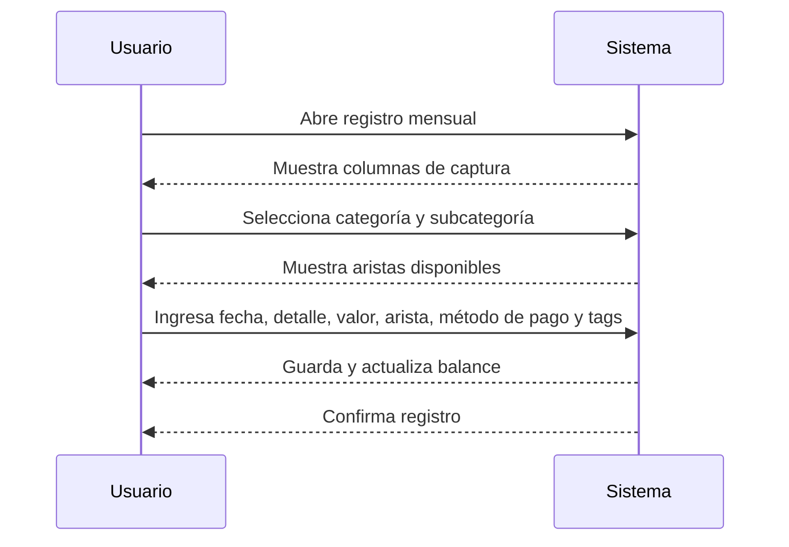

# Casos de Uso - Registro de Gastos (RF-03)

## UC-BP-06: Registrar gasto manual

### Información General

| Campo | Valor |
|-------|-------|
| **ID** | UC-BP-06 |
| **Nombre** | Registrar gasto manual |
| **Versión** | 1.0 |
| **Fecha** | 2026-02-18 |
| **Autor** | Alexandra Castano |
| **Prioridad** | Alta |
| **Frecuencia de uso** | Alta (diaria) |
| **Estado** | En desarrollo |

### Descripción Breve

Permite al usuario registrar movimientos de **gastos y ahorros** en el log mensual con selección guiada por categoría, subcategoría y aristas. **No incluye ingresos**. Esta funcionalidad es crítica en móvil.

### Actores

| Actor | Tipo | Descripción |
|-------|------|-------------|
| Usuario | Primario | Persona que registra movimientos financieros en el log mensual. |

### Precondiciones

1. El usuario tiene acceso a la aplicación (web o móvil).
2. El usuario está autenticado.
3. El sistema está disponible y operativo.

### Postcondiciones

#### Éxito
1. Se registra el movimiento en el log mensual.
2. Se actualiza el balance y los totales del presupuesto.
3. Se muestra confirmación al usuario.

#### Fallo
1. No se registra el movimiento.
2. Se muestra mensaje de error apropiado al usuario.
3. Se registra el intento fallido en logs de auditoría.

### Flujo Básico

| Paso | Actor | Sistema |
|------|-------|---------|
| 1 | Usuario abre el registro de gastos del mes activo. | - |
| 2 | - | Muestra la tabla con columnas de captura. |
| 3 | Usuario selecciona Categoría (Gastos/Ahorro). | - |
| 4 | - | Muestra subcategorías asociadas a la categoría seleccionada. |
| 5 | Usuario selecciona Subcategoría. | - |
| 6 | - | Muestra aristas disponibles según la subcategoría (tomadas del presupuesto). |
| 7 | Usuario registra Fecha, Compra/Detalle, Valor, Arista, Método de pago y Tags. | - |
| 8 | - | Guarda el movimiento y actualiza el balance. |
| 9 | - | Muestra confirmación. |

### Flujos Alternativos

#### FA-1: Registro de ahorro
| Paso | Descripción |
|------|-------------|
| 3a | El usuario selecciona categoría “Ahorro”. |
| 8a | El sistema resta el valor del disponible y lo suma al ahorro del mes. |

#### FA-2: Registro sin internet (móvil)
| Paso | Descripción |
|------|-------------|
| 1a | El usuario no tiene conexión. |
| 2a | El sistema permite registrar el gasto y lo guarda localmente como “pendiente de sincronización”. |
| 3a | Al recuperar conexión, el sistema sincroniza los registros y confirma al usuario. |

### Flujos de Excepción

No hay.

### Requisitos Especiales

#### Datos / Persistencia
- Se usa **solo** la estructura de `Presupuesto plantilla 1.xlsx`:
  - Date, Amount, Category, Subcategory, Details.
- `Método de pago` y `Tags` se guardan como metadatos en `Details` y se seleccionan desde un catálogo reutilizable de la app.
- La información del log se filtra por mes activo.

#### Seguridad
- Solo usuarios autenticados pueden registrar movimientos.

#### Rendimiento
- El registro debe ser inmediato (sin recargar la vista).

#### Usabilidad
- Si no hay categoría seleccionada, no se muestran subcategorías.
- Las aristas solo aparecen después de elegir subcategoría.
- En móvil, el registro funciona también sin conexión.

#### Cumplimiento
- No aplica.

### Puntos de Extensión

| Punto | Descripción |
|---|---|
| Importación de movimientos | Extiende con carga masiva CSV/XLS (si aplica). |

### Reglas de Negocio

| ID | Regla |
|----|-------|
| RN-RG-01 | Este UC solo permite registrar **Gastos y Ahorro** (no ingresos). |
| RN-RG-02 | Las subcategorías solo se muestran cuando hay categoría seleccionada. |
| RN-RG-03 | Las aristas disponibles dependen de la subcategoría y son las definidas en el presupuesto. |
| RN-RG-04 | Al registrar Ahorro, se resta del disponible y se suma al ahorro del mes. |
| RN-RG-05 | El movimiento registrado afecta balance y totales del presupuesto. |
| RN-RG-06 | Método de pago y tags se reutilizan desde catálogo de la app. |

### Trazabilidad

| Tipo | ID | Descripción |
|---|---|---|
| Requisito funcional | RF-03 | Registro manual de transacciones |

### Diagrama de Secuencia

### Mockups / Wireframes

Pendiente por validar con el usuario.

### Historial de Cambios

| Versión | Fecha | Autor | Descripción |
|---------|-------|-------|-------------|
| 1.0 | 2026-02-18 | Alexandra Castano | Creación inicial |
