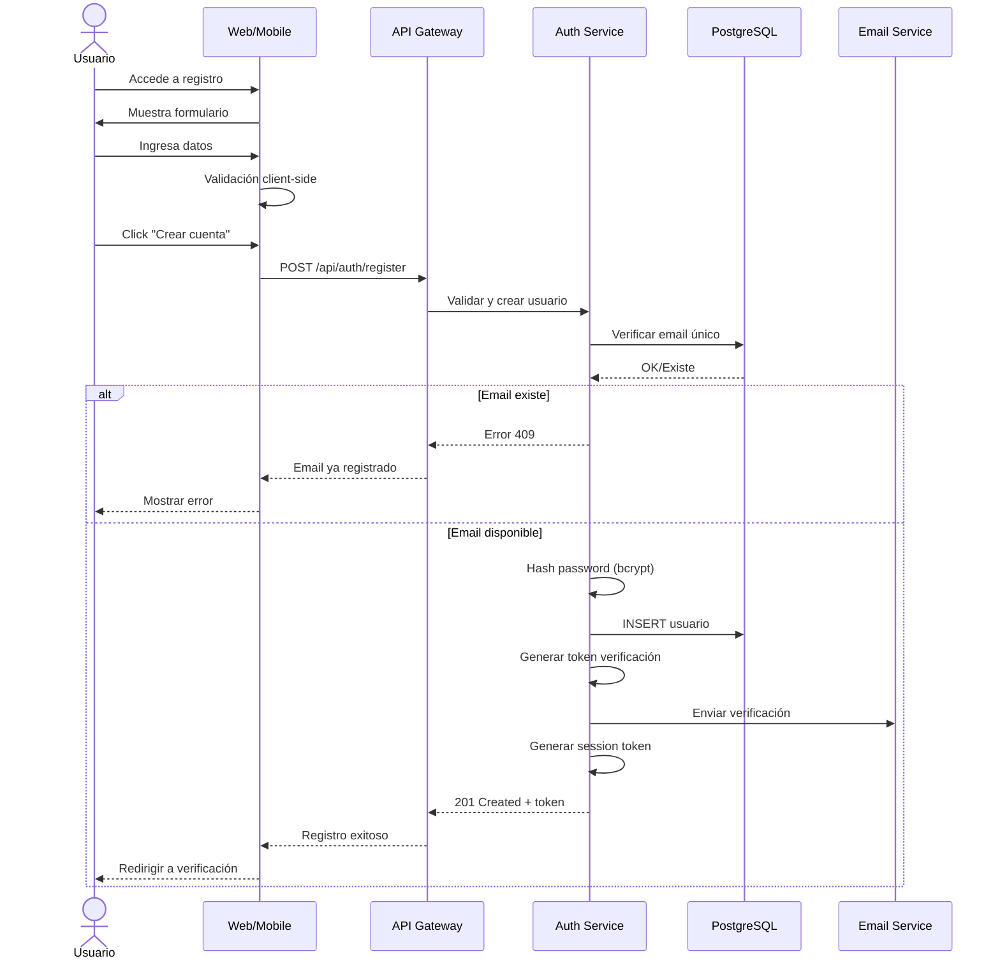

# UC-10: Registrar Cuenta de Usuario

## Información General

| Campo | Valor |
|-------|-------|
| **ID** | UC-10 |
| **Nombre** | Registrar Cuenta de Usuario |
| **Versión** | 1.0 |
| **Fecha** | 2026-02-02 |
| **Autor** | Henry Gomez |
| **Prioridad** | Alta |
| **Frecuencia de uso** | Alta (cada nuevo usuario) |
| **Estado** | En desarrollo |

## Descripción Breve

Permite a un nuevo usuario crear una cuenta en BudgetApp proporcionando sus datos básicos (email, contraseña, nombre) para acceder a las funcionalidades del sistema.

## Actores

| Actor | Tipo | Descripción |
|-------|------|-------------|
| Usuario No Registrado | Primario | Persona que desea crear una cuenta |
| Sistema de Email | Secundario | Servicio que envía correo de verificación |
| Proveedor OAuth | Secundario | Google/Apple para registro social (opcional) |

## Precondiciones

1. El usuario tiene acceso a la aplicación (web o móvil)
2. El usuario tiene una dirección de email válida
3. El sistema está disponible y operativo

## Postcondiciones

### Éxito
1. Se crea un registro de usuario en la base de datos con estado "pendiente verificación"
2. Se envía un correo de verificación al email proporcionado
3. Se genera un token de sesión temporal
4. El usuario es redirigido al flujo de verificación de email (UC-16)

### Fallo
1. No se crea ningún registro en la base de datos
2. Se muestra mensaje de error apropiado al usuario
3. Se registra el intento fallido en logs de auditoría

## Flujo Básico

| Paso | Actor | Sistema |
|------|-------|---------|
| 1 | Usuario accede a la pantalla de registro | Muestra formulario de registro |
| 2 | Usuario ingresa email | Valida formato de email en tiempo real |
| 3 | Usuario ingresa contraseña | Valida fortaleza (mín. 8 caracteres, mayúscula, número, especial) |
| 4 | Usuario confirma contraseña | Valida que coincidan |
| 5 | Usuario ingresa nombre completo | Valida longitud mínima |
| 6 | Usuario selecciona país | Carga configuración del país (moneda, zona horaria) |
| 7 | Usuario acepta términos y condiciones | Habilita botón de registro |
| 8 | Usuario presiona "Crear cuenta" | - |
| 9 | - | Verifica que email no exista en BD |
| 10 | - | Hashea contraseña con bcrypt (cost 12) |
| 11 | - | Crea registro de usuario con rol `user` |
| 12 | - | Genera token de verificación (24h expiración) |
| 13 | - | Envía email de verificación |
| 14 | - | Genera token de sesión temporal |
| 15 | - | Redirige a pantalla de verificación pendiente |

## Flujos Alternativos

### FA-1: Registro con Google OAuth

| Paso | Descripción |
|------|-------------|
| 1a | Usuario selecciona "Continuar con Google" |
| 2a | Sistema redirige a Google OAuth |
| 3a | Usuario autoriza acceso |
| 4a | Google retorna token y datos del perfil |
| 5a | Sistema verifica que email no exista |
| 6a | Sistema crea usuario con email verificado automáticamente |
| 7a | Sistema solicita país y aceptación de términos |
| 8a | Continúa desde paso 14 del flujo básico |

### FA-2: Registro con Apple ID

| Paso | Descripción |
|------|-------------|
| 1b | Usuario selecciona "Continuar con Apple" |
| 2b | Sistema redirige a Apple Sign In |
| 3b | Usuario autoriza (puede ocultar email) |
| 4b | Apple retorna token y datos |
| 5b | Si email oculto, sistema genera relay email |
| 6b | Continúa similar a FA-1 |

## Flujos de Excepción

### FE-1: Email ya registrado

| Paso | Descripción |
|------|-------------|
| 9a | Sistema detecta email existente |
| 9b | Muestra mensaje: "Este email ya está registrado" |
| 9c | Ofrece opciones: "Iniciar sesión" o "Recuperar contraseña" |
| 9d | Registra intento en log de seguridad |

### FE-2: Contraseña débil

| Paso | Descripción |
|------|-------------|
| 3a | Sistema detecta contraseña que no cumple requisitos |
| 3b | Muestra indicador visual de fortaleza |
| 3c | Lista requisitos faltantes |
| 3d | No permite continuar hasta cumplir requisitos |

### FE-3: Error de envío de email

| Paso | Descripción |
|------|-------------|
| 13a | Falla el envío del correo de verificación |
| 13b | Sistema crea usuario de todas formas |
| 13c | Muestra mensaje: "Cuenta creada. Hubo un problema enviando el correo." |
| 13d | Ofrece botón "Reenviar correo de verificación" |
| 13e | Registra incidente para revisión |

### FE-4: País no soportado

| Paso | Descripción |
|------|-------------|
| 6a | Usuario selecciona país no disponible |
| 6b | Sistema muestra lista de países soportados |
| 6c | Ofrece opción de notificación cuando esté disponible |

## Requisitos Especiales

### Seguridad
- Contraseña hasheada con bcrypt (cost factor 12)
- Token de verificación con expiración de 24 horas
- Rate limiting: máximo 5 intentos de registro por IP/hora
- Protección CSRF en formulario
- Validación server-side de todos los campos

### Rendimiento
- Tiempo de respuesta < 3 segundos
- Email de verificación enviado < 30 segundos

### Usabilidad
- Validación en tiempo real de campos
- Indicador de fortaleza de contraseña
- Autocompletado de país basado en IP (sugerencia)

### Cumplimiento
- Consentimiento explícito para términos y política de privacidad
- Registro de timestamp de aceptación
- Cumplimiento Habeas Data (Colombia) / GDPR (si aplica)

## Puntos de Extensión

| Punto | Caso de uso extendido |
|-------|----------------------|
| Después de paso 15 | UC-16: Verificar Email |
| FA-1 paso 7a | UC-13: Gestionar Perfil (completar datos) |

## Reglas de Negocio

| ID | Regla |
|----|-------|
| RN-10.1 | Email debe ser único en el sistema |
| RN-10.2 | Contraseña mínimo 8 caracteres, 1 mayúscula, 1 número, 1 especial |
| RN-10.3 | Usuario debe aceptar términos para completar registro |
| RN-10.4 | País determina moneda y configuración por defecto |
| RN-10.5 | Usuarios OAuth tienen email verificado automáticamente |

## Trazabilidad

| Tipo | ID | Descripción |
|------|-----|-------------|
| Requisito funcional | RF-14 | Gestión básica de usuarios |
| Requisito no funcional | RNF-Seguridad | Autenticación y cifrado |
| Requisito no funcional | RNF-Cumplimiento | Habeas Data, GDPR |

## Diagrama de Secuencia

## Mockups / Wireframes

> Pendiente: Enlazar mockups de Figma cuando estén disponibles.

## Historial de Cambios

| Versión | Fecha | Autor | Descripción |
|---------|-------|-------|-------------|
| 1.0 | 2026-02-02 | Henry Gomez | Creación inicial |
