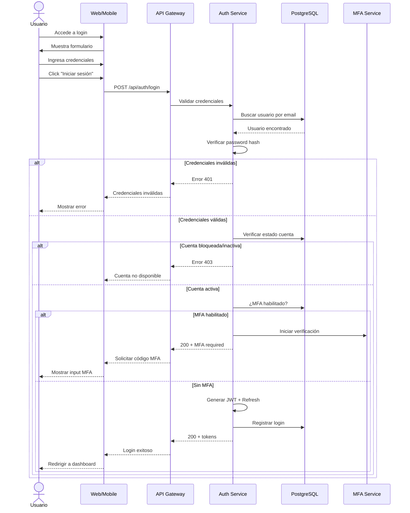

# UC-11: Iniciar Sesión

## Información General

| Campo | Valor |
|-------|-------|
| **ID** | UC-11 |
| **Nombre** | Iniciar Sesión |
| **Versión** | 1.0 |
| **Fecha** | 2026-02-02 |
| **Autor** | Henry Gomez |
| **Prioridad** | Alta |
| **Frecuencia de uso** | Muy alta (cada acceso) |
| **Estado** | En desarrollo |

## Descripción Breve

Permite a un usuario registrado autenticarse en BudgetApp mediante credenciales (email/contraseña) o proveedores OAuth para acceder a sus datos y funcionalidades.

## Actores

| Actor | Tipo | Descripción |
|-------|------|-------------|
| Usuario Registrado | Primario | Persona con cuenta existente |
| Proveedor OAuth | Secundario | Google/Apple para login social |
| Sistema MFA | Secundario | Servicio de autenticación de dos factores |

## Precondiciones

1. El usuario tiene una cuenta registrada en el sistema
2. El usuario conoce sus credenciales o tiene acceso a proveedor OAuth vinculado
3. El sistema está disponible y operativo

## Postcondiciones

### Éxito
1. Se genera un token de sesión válido (JWT)
2. Se registra el inicio de sesión en auditoría (IP, dispositivo, timestamp)
3. El usuario es redirigido al dashboard principal
4. Si tiene MFA habilitado, primero completa UC-12

### Fallo
1. No se genera token de sesión
2. Se incrementa contador de intentos fallidos
3. Se registra intento fallido en logs de seguridad
4. Después de 5 intentos, se bloquea temporalmente la cuenta

## Flujo Básico

| Paso | Actor | Sistema |
|------|-------|---------|
| 1 | Usuario accede a la pantalla de login | Muestra formulario de inicio de sesión |
| 2 | Usuario ingresa email | Valida formato |
| 3 | Usuario ingresa contraseña | Oculta caracteres |
| 4 | Usuario presiona "Iniciar sesión" | - |
| 5 | - | Busca usuario por email |
| 6 | - | Verifica hash de contraseña |
| 7 | - | Verifica estado de cuenta (activa, verificada) |
| 8 | - | Verifica si tiene MFA habilitado |
| 9 | - | Si no tiene MFA: genera token de sesión |
| 10 | - | Registra login en auditoría |
| 11 | - | Carga configuración del usuario (país, preferencias) |
| 12 | - | Redirige al dashboard |

## Flujos Alternativos

### FA-1: Login con Google OAuth

| Paso | Descripción |
|------|-------------|
| 1a | Usuario selecciona "Continuar con Google" |
| 2a | Sistema redirige a Google OAuth |
| 3a | Usuario autoriza acceso |
| 4a | Google retorna token con email |
| 5a | Sistema busca usuario por email |
| 6a | Si existe y está vinculado: continúa desde paso 8 |
| 6b | Si existe pero no vinculado: ofrece vincular cuenta |
| 6c | Si no existe: redirige a registro (UC-10) |

### FA-2: Login con Apple ID

| Paso | Descripción |
|------|-------------|
| 1b | Usuario selecciona "Continuar con Apple" |
| 2b | Sistema redirige a Apple Sign In |
| 3b | Usuario autoriza |
| 4b | Proceso similar a FA-1 |

### FA-3: Usuario con MFA habilitado

| Paso | Descripción |
|------|-------------|
| 8a | Sistema detecta MFA habilitado |
| 8b | Genera token temporal (5 min expiración) |
| 8c | Redirige a pantalla de verificación MFA |
| 8d | Continúa en UC-12 (verificar código MFA) |
| 8e | Al completar MFA, continúa desde paso 9 |

### FA-4: Recordar dispositivo

| Paso | Descripción |
|------|-------------|
| 4a | Usuario marca "Recordar este dispositivo" |
| 9a | Sistema genera refresh token de larga duración (30 días) |
| 9b | Almacena fingerprint del dispositivo |
| 9c | En futuros logins desde este dispositivo, puede omitir MFA |

## Flujos de Excepción

### FE-1: Credenciales inválidas

| Paso | Descripción |
|------|-------------|
| 5a/6a | Email no encontrado o contraseña incorrecta |
| - | Sistema NO revela cuál campo es incorrecto (seguridad) |
| - | Muestra mensaje genérico: "Credenciales inválidas" |
| - | Incrementa contador de intentos fallidos |
| - | Registra en log de seguridad |

### FE-2: Cuenta bloqueada (muchos intentos)

| Paso | Descripción |
|------|-------------|
| 5b | Sistema detecta 5+ intentos fallidos en última hora |
| - | Muestra mensaje: "Cuenta bloqueada temporalmente" |
| - | Indica tiempo restante de bloqueo (15 min) |
| - | Ofrece opción de recuperar contraseña |
| - | Envía notificación al email del usuario |

### FE-3: Cuenta no verificada

| Paso | Descripción |
|------|-------------|
| 7a | Sistema detecta email no verificado |
| - | Muestra mensaje: "Debes verificar tu email" |
| - | Ofrece reenviar correo de verificación |
| - | Permite acceso limitado (solo verificación) |

### FE-4: Cuenta desactivada

| Paso | Descripción |
|------|-------------|
| 7b | Sistema detecta cuenta desactivada/eliminada |
| - | Muestra mensaje: "Esta cuenta ha sido desactivada" |
| - | Ofrece contactar soporte |
| - | NO permite acceso |

### FE-5: Sesión activa en otro dispositivo

| Paso | Descripción |
|------|-------------|
| 9a | Sistema detecta sesión activa en otro lugar |
| - | Pregunta: "¿Cerrar otras sesiones?" |
| - | Usuario confirma: invalida tokens anteriores |
| - | Continúa con nuevo token |

## Requisitos Especiales

### Seguridad
- Comparación de contraseña en tiempo constante (prevenir timing attacks)
- Rate limiting: máximo 10 intentos por minuto por IP
- Bloqueo de cuenta después de 5 intentos fallidos (15 min)
- Tokens JWT con expiración de 1 hora
- Refresh tokens con expiración de 7 días (30 si "recordar")
- Registro de IP, user agent, timestamp en cada login

### Rendimiento
- Tiempo de autenticación < 2 segundos
- Verificación de hash < 500ms

### Usabilidad
- Opción "Mostrar contraseña"
- Enlace a "Olvidé mi contraseña"
- Persistencia de email si falla (no re-escribir)

### Cumplimiento
- Log de auditoría inmutable
- Notificación por email de login desde nuevo dispositivo

## Puntos de Extensión

| Punto | Caso de uso extendido |
|-------|----------------------|
| Paso 8 (si MFA) | UC-12: Configurar/Verificar MFA |
| FE-1 después de error | UC-14: Recuperar Contraseña |

## Reglas de Negocio

| ID | Regla |
|----|-------|
| RN-11.1 | Máximo 5 intentos fallidos antes de bloqueo temporal |
| RN-11.2 | Bloqueo temporal dura 15 minutos |
| RN-11.3 | Token de sesión expira en 1 hora |
| RN-11.4 | Refresh token expira en 7 días (30 si "recordar") |
| RN-11.5 | Login desde nuevo dispositivo genera notificación |
| RN-11.6 | Cuentas no verificadas tienen acceso limitado |

## Trazabilidad

| Tipo | ID | Descripción |
|------|-----|-------------|
| Requisito funcional | RF-14 | Gestión básica de usuarios |
| Requisito no funcional | RNF-Seguridad | Autenticación y cifrado |
| Requisito no funcional | RNF-Disponibilidad | 99% uptime |

## Diagrama de Secuencia

## Mockups / Wireframes

> Pendiente: Enlazar mockups de Figma cuando estén disponibles.

## Historial de Cambios

| Versión | Fecha | Autor | Descripción |
|---------|-------|-------|-------------|
| 1.0 | 2026-02-02 | Henry Gomez | Creación inicial |
