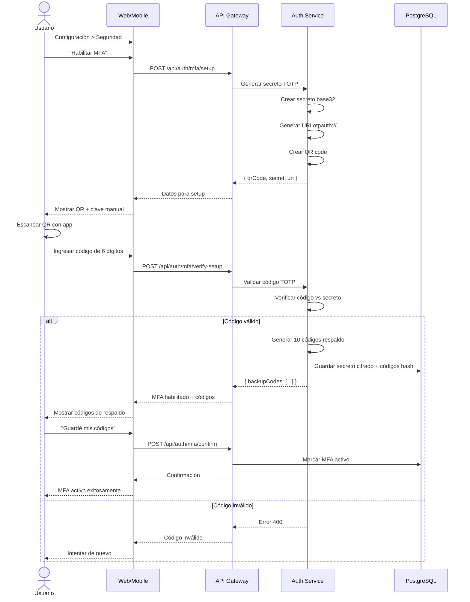

# UC-12: Configurar Autenticación Multifactor (MFA)

## Información General

| Campo | Valor |
|-------|-------|
| **ID** | UC-12 |
| **Nombre** | Configurar Autenticación Multifactor (MFA) |
| **Versión** | 1.0 |
| **Fecha** | 2026-02-02 |
| **Autor** | Henry Gomez |
| **Prioridad** | Alta |
| **Frecuencia de uso** | Media (configuración) / Alta (verificación en login) |
| **Estado** | En desarrollo |

## Descripción Breve

Permite al usuario habilitar, configurar y verificar autenticación de dos factores (2FA/MFA) usando aplicaciones TOTP (Google Authenticator, Authy) o códigos de respaldo para aumentar la seguridad de su cuenta.

## Actores

| Actor | Tipo | Descripción |
|-------|------|-------------|
| Usuario Autenticado | Primario | Usuario con sesión activa que configura MFA |
| App Autenticadora | Secundario | Google Authenticator, Authy, etc. |
| Sistema de Email | Secundario | Para enviar códigos de respaldo |

## Precondiciones

1. El usuario tiene una cuenta verificada
2. El usuario ha iniciado sesión
3. El usuario tiene acceso a una app autenticadora o email

## Postcondiciones

### Éxito (Habilitar MFA)
1. Se almacena el secreto TOTP cifrado en la base de datos
2. Se generan y almacenan códigos de respaldo (hasheados)
3. Se marca la cuenta con MFA habilitado
4. Se registra la acción en auditoría
5. Futuros logins requerirán código MFA

### Éxito (Verificar MFA en login)
1. Se valida el código TOTP o código de respaldo
2. Se genera token de sesión completo
3. Se registra verificación exitosa

### Fallo
1. No se habilita MFA
2. No se permite acceso (en caso de verificación)
3. Se registra intento fallido

## Flujo Básico: Habilitar MFA

| Paso | Actor | Sistema |
|------|-------|---------|
| 1 | Usuario accede a Configuración > Seguridad | Muestra opciones de seguridad |
| 2 | Usuario selecciona "Habilitar autenticación de dos factores" | - |
| 3 | - | Genera secreto TOTP (32 caracteres base32) |
| 4 | - | Genera código QR con URI otpauth:// |
| 5 | - | Muestra QR y clave manual |
| 6 | Usuario escanea QR con app autenticadora | - |
| 7 | Usuario ingresa código de 6 dígitos de la app | - |
| 8 | - | Valida código TOTP (ventana ±1) |
| 9 | - | Genera 10 códigos de respaldo únicos |
| 10 | - | Muestra códigos de respaldo para guardar |
| 11 | Usuario confirma que guardó los códigos | - |
| 12 | - | Almacena secreto cifrado y códigos hasheados |
| 13 | - | Marca cuenta con MFA habilitado |
| 14 | - | Envía email de confirmación |
| 15 | - | Muestra confirmación de MFA activo |

## Flujo Básico: Verificar MFA (durante login)

| Paso | Actor | Sistema |
|------|-------|---------|
| 1 | - | Después de validar credenciales, detecta MFA habilitado |
| 2 | - | Muestra pantalla de verificación MFA |
| 3 | Usuario abre app autenticadora | - |
| 4 | Usuario ingresa código de 6 dígitos | - |
| 5 | - | Valida código TOTP |
| 6 | - | Si válido: genera token de sesión |
| 7 | - | Registra verificación exitosa |
| 8 | - | Redirige al dashboard |

## Flujos Alternativos

### FA-1: Usar código de respaldo

| Paso | Descripción |
|------|-------------|
| 4a | Usuario selecciona "Usar código de respaldo" |
| 4b | Sistema muestra input para código de respaldo |
| 4c | Usuario ingresa uno de sus 10 códigos |
| 4d | Sistema verifica hash del código |
| 4e | Si válido: marca código como usado (no reutilizable) |
| 4f | Continúa desde paso 6 del flujo verificación |
| 4g | Si quedan ≤2 códigos: muestra advertencia de regenerar |

### FA-2: Deshabilitar MFA

| Paso | Descripción |
|------|-------------|
| 1 | Usuario accede a Configuración > Seguridad |
| 2 | Usuario selecciona "Deshabilitar MFA" |
| 3 | Sistema solicita contraseña actual |
| 4 | Sistema solicita código MFA actual |
| 5 | Si válido: elimina secreto y códigos de respaldo |
| 6 | Marca cuenta sin MFA |
| 7 | Envía email de notificación |
| 8 | Muestra confirmación |

### FA-3: Regenerar códigos de respaldo

| Paso | Descripción |
|------|-------------|
| 1 | Usuario accede a Configuración > Seguridad > MFA |
| 2 | Selecciona "Regenerar códigos de respaldo" |
| 3 | Sistema solicita código MFA actual |
| 4 | Si válido: invalida códigos anteriores |
| 5 | Genera 10 nuevos códigos |
| 6 | Muestra nuevos códigos para guardar |
| 7 | Usuario confirma que los guardó |

## Flujos de Excepción

### FE-1: Código TOTP inválido

| Paso | Descripción |
|------|-------------|
| 8a/5a | Sistema detecta código inválido |
| - | Verifica ventana de tiempo (±30 segundos) |
| - | Si aún inválido: muestra error |
| - | Incrementa contador de intentos |
| - | Después de 3 intentos: sugiere código de respaldo |
| - | Después de 5 intentos: bloquea temporalmente |

### FE-2: Códigos de respaldo agotados

| Paso | Descripción |
|------|-------------|
| - | Usuario intenta usar código de respaldo |
| - | Sistema detecta que no quedan códigos válidos |
| - | Muestra opciones: usar app autenticadora o contactar soporte |
| - | Si no tiene acceso a app: proceso de recuperación manual |

### FE-3: App autenticadora perdida

| Paso | Descripción |
|------|-------------|
| - | Usuario no tiene acceso a la app |
| - | Debe usar código de respaldo |
| - | Si no tiene códigos: contactar soporte |
| - | Soporte verifica identidad manualmente |
| - | Se deshabilita MFA para permitir reconfiguración |

### FE-4: Reloj desincronizado

| Paso | Descripción |
|------|-------------|
| - | Código TOTP falla repetidamente |
| - | Sistema sugiere verificar hora del dispositivo |
| - | Ofrece opción de código de respaldo |

## Requisitos Especiales

### Seguridad
- Secreto TOTP cifrado con AES-256 en reposo
- Códigos de respaldo hasheados con bcrypt
- Códigos de respaldo de un solo uso
- Ventana TOTP de ±1 intervalo (30 segundos cada uno)
- Rate limiting: máximo 5 intentos de verificación por minuto
- Notificación por email al habilitar/deshabilitar MFA

### Rendimiento
- Generación de QR < 1 segundo
- Validación de código < 500ms

### Usabilidad
- QR escaneable desde la pantalla
- Opción de copiar clave manual
- Instrucciones claras para apps autenticadoras populares
- Códigos de respaldo en formato fácil de copiar/imprimir

### Cumplimiento
- Algoritmo TOTP según RFC 6238
- Compatible con Google Authenticator, Authy, 1Password, etc.

## Puntos de Extensión

| Punto | Caso de uso extendido |
|-------|----------------------|
| Desde UC-11 paso 8 | Verificación MFA en login |
| Después de deshabilitar | UC-11: Login sin MFA |

## Reglas de Negocio

| ID | Regla |
|----|-------|
| RN-12.1 | Secreto TOTP: 32 caracteres base32 |
| RN-12.2 | Códigos TOTP: 6 dígitos, válidos 30 segundos |
| RN-12.3 | Ventana de tolerancia: ±1 intervalo |
| RN-12.4 | Códigos de respaldo: 10 códigos de 8 caracteres |
| RN-12.5 | Código de respaldo es de un solo uso |
| RN-12.6 | Máximo 5 intentos fallidos antes de bloqueo temporal |
| RN-12.7 | Para deshabilitar MFA se requiere contraseña + código MFA |

## Trazabilidad

| Tipo | ID | Descripción |
|------|-----|-------------|
| Requisito funcional | RF-14 | Gestión básica de usuarios |
| Requisito no funcional | RNF-Seguridad | Autenticación multifactor |
| Estándar | RFC 6238 | TOTP Algorithm |

## Diagrama de Secuencia: Habilitar MFA

## Mockups / Wireframes

> Pendiente: Enlazar mockups de Figma cuando estén disponibles.

## Historial de Cambios

| Versión | Fecha | Autor | Descripción |
|---------|-------|-------|-------------|
| 1.0 | 2026-02-02 | Henry Gomez | Creación inicial |
