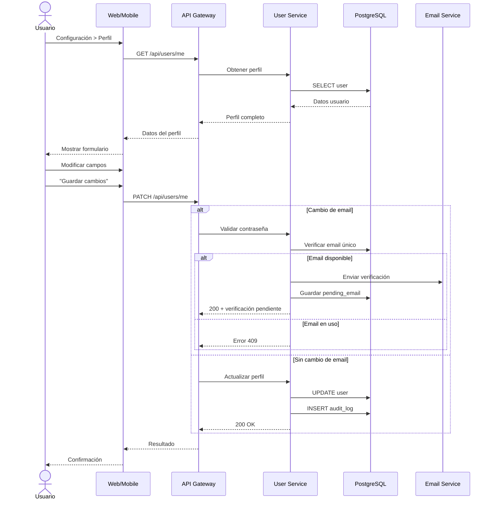

# UC-13: Gestionar Perfil de Usuario

## Información General

| Campo | Valor |
|-------|-------|
| **ID** | UC-13 |
| **Nombre** | Gestionar Perfil de Usuario |
| **Versión** | 1.0 |
| **Fecha** | 2026-02-02 |
| **Autor** | Henry Gomez |
| **Prioridad** | Media |
| **Frecuencia de uso** | Baja (configuración ocasional) |
| **Estado** | En desarrollo |

## Descripción Breve

Permite al usuario ver y modificar su información personal, preferencias de la aplicación, configuración regional y opciones de notificaciones.

## Actores

| Actor | Tipo | Descripción |
|-------|------|-------------|
| Usuario Autenticado | Primario | Usuario con sesión activa |
| Sistema de Email | Secundario | Para verificar nuevo email si cambia |

## Precondiciones

1. El usuario tiene una cuenta activa
2. El usuario ha iniciado sesión
3. El usuario tiene email verificado

## Postcondiciones

### Éxito
1. Los datos del perfil se actualizan en la base de datos
2. Se registra el cambio en auditoría
3. Si cambió email, se inicia proceso de verificación del nuevo
4. Se muestra confirmación al usuario

### Fallo
1. Los datos no se modifican
2. Se muestra mensaje de error apropiado

## Flujo Básico: Ver y Editar Perfil

| Paso | Actor | Sistema |
|------|-------|---------|
| 1 | Usuario accede a Configuración > Perfil | Carga datos actuales del usuario |
| 2 | - | Muestra formulario con datos: nombre, email, teléfono, país, idioma, moneda, zona horaria |
| 3 | Usuario modifica campos deseados | Valida en tiempo real |
| 4 | Usuario presiona "Guardar cambios" | - |
| 5 | - | Valida todos los campos |
| 6 | - | Detecta qué campos cambiaron |
| 7 | - | Actualiza registro en base de datos |
| 8 | - | Registra cambios en auditoría |
| 9 | - | Muestra confirmación "Perfil actualizado" |

## Flujos Alternativos

### FA-1: Cambiar email

| Paso | Descripción |
|------|-------------|
| 6a | Sistema detecta cambio de email |
| 6b | Solicita contraseña actual para confirmar |
| 6c | Usuario ingresa contraseña |
| 6d | Sistema valida contraseña |
| 6e | Verifica que nuevo email no exista |
| 6f | Envía correo de verificación al nuevo email |
| 6g | Mantiene email anterior hasta verificar nuevo |
| 6h | Muestra mensaje: "Verifica tu nuevo email para completar el cambio" |

### FA-2: Cambiar país

| Paso | Descripción |
|------|-------------|
| 6a | Sistema detecta cambio de país |
| 6b | Muestra advertencia sobre cambio de moneda y configuración |
| 6c | Usuario confirma el cambio |
| 6d | Sistema actualiza: moneda, zona horaria, formatos |
| 6e | Recalcula presupuestos si hay conversión de moneda pendiente |

### FA-3: Cambiar foto de perfil

| Paso | Descripción |
|------|-------------|
| 3a | Usuario selecciona "Cambiar foto" |
| 3b | Sistema muestra opciones: subir imagen o tomar foto |
| 3c | Usuario selecciona/captura imagen |
| 3d | Sistema valida: formato (JPG/PNG), tamaño (<5MB) |
| 3e | Sistema redimensiona a 256x256 |
| 3f | Sube a storage y actualiza URL en perfil |

### FA-4: Configurar preferencias de notificaciones

| Paso | Descripción |
|------|-------------|
| 1a | Usuario accede a Perfil > Notificaciones |
| 2a | Sistema muestra opciones por canal (push, email, WhatsApp) |
| 3a | Usuario activa/desactiva por tipo de notificación |
| 4a | Sistema guarda preferencias |

## Flujos de Excepción

### FE-1: Email ya en uso

| Paso | Descripción |
|------|-------------|
| 6e | Sistema detecta que nuevo email ya existe |
| - | Muestra error: "Este email ya está asociado a otra cuenta" |
| - | No permite el cambio |

### FE-2: Contraseña incorrecta (cambio de email)

| Paso | Descripción |
|------|-------------|
| 6d | Contraseña no coincide |
| - | Muestra error: "Contraseña incorrecta" |
| - | Permite reintentar (máximo 3 veces) |

### FE-3: Formato de imagen inválido

| Paso | Descripción |
|------|-------------|
| 3d | Imagen no cumple requisitos |
| - | Muestra error específico (formato, tamaño) |
| - | Permite seleccionar otra imagen |

## Requisitos Especiales

### Seguridad
- Cambio de email requiere contraseña actual
- Cambio de email requiere verificación del nuevo
- Datos sensibles no se muestran completos (ej: teléfono parcialmente oculto)
- Registro de auditoría para todos los cambios

### Rendimiento
- Carga de perfil < 1 segundo
- Guardado de cambios < 2 segundos
- Upload de imagen < 5 segundos

### Usabilidad
- Validación en tiempo real de campos
- Preview de foto antes de guardar
- Indicador de campos modificados
- Botón de descartar cambios

### Cumplimiento
- Derecho de acceso a datos personales (GDPR/Habeas Data)
- Opción de descargar todos mis datos
- Enlace a política de privacidad

## Puntos de Extensión

| Punto | Caso de uso extendido |
|-------|----------------------|
| FA-1 después de enviar verificación | UC-16: Verificar Email |
| Desde configuración de seguridad | UC-12: Configurar MFA |
| Desde configuración de seguridad | UC-17: Cambiar Contraseña |

## Reglas de Negocio

| ID | Regla |
|----|-------|
| RN-13.1 | Nombre mínimo 2 caracteres, máximo 100 |
| RN-13.2 | Teléfono debe incluir código de país |
| RN-13.3 | Cambio de email requiere verificación |
| RN-13.4 | Foto de perfil máximo 5MB, formatos JPG/PNG |
| RN-13.5 | Cambio de país puede afectar moneda de presupuestos |
| RN-13.6 | Al menos un canal de notificación debe estar activo |

## Trazabilidad

| Tipo | ID | Descripción |
|------|-----|-------------|
| Requisito funcional | RF-14 | Gestión básica de usuarios |
| Requisito no funcional | RNF-Usabilidad | Experiencia consistente |
| Requisito no funcional | RNF-Cumplimiento | Acceso a datos personales |

## Campos del Perfil

| Campo | Tipo | Editable | Validación |
|-------|------|----------|------------|
| Nombre completo | String | Sí | 2-100 caracteres |
| Email | String | Sí* | Formato válido, único |
| Teléfono | String | Sí | Formato internacional |
| Foto de perfil | URL/File | Sí | JPG/PNG, <5MB |
| País | Select | Sí | De catálogo |
| Idioma | Select | Sí | es, en, de |
| Moneda preferida | Select | Sí** | Según país |
| Zona horaria | Select | Sí | Según país (sugerida) |
| Fecha de registro | Date | No | - |
| Último acceso | DateTime | No | - |

*Requiere verificación
**Cambio puede afectar presupuestos

## Diagrama de Secuencia

## Mockups / Wireframes

> Pendiente: Enlazar mockups de Figma cuando estén disponibles.

## Historial de Cambios

| Versión | Fecha | Autor | Descripción |
|---------|-------|-------|-------------|
| 1.0 | 2026-02-02 | Henry Gomez | Creación inicial |
