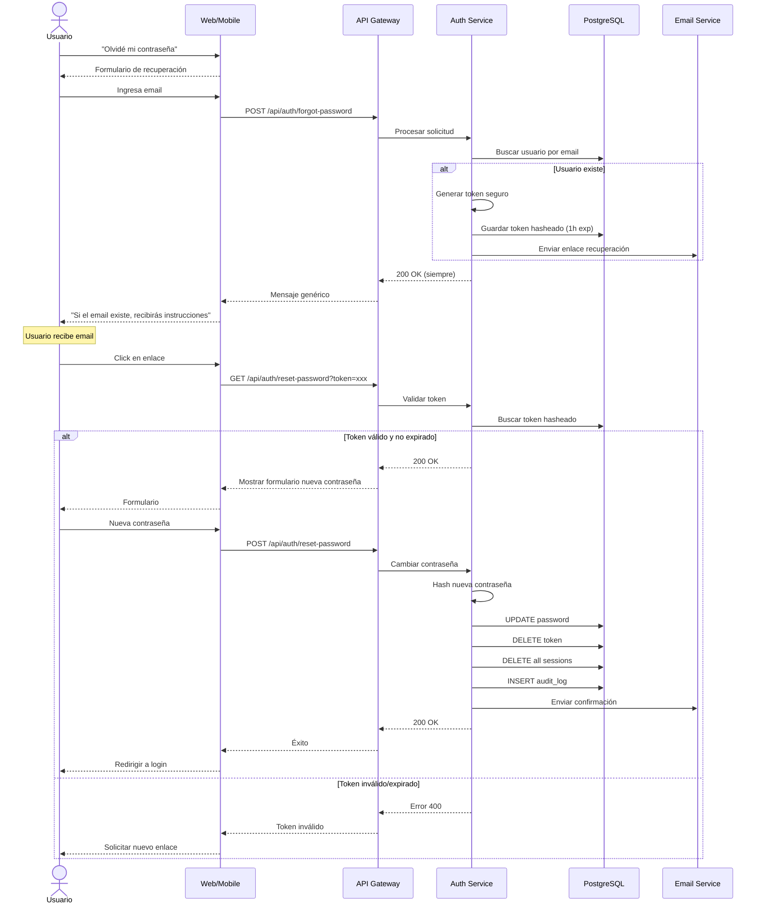

# UC-14: Recuperar Contraseña

## Información General

| Campo | Valor |
|-------|-------|
| **ID** | UC-14 |
| **Nombre** | Recuperar Contraseña |
| **Versión** | 1.0 |
| **Fecha** | 2026-02-02 |
| **Autor** | Henry Gomez |
| **Prioridad** | Alta |
| **Frecuencia de uso** | Media |
| **Estado** | En desarrollo |

## Descripción Breve

Permite a un usuario que olvidó su contraseña restablecerla mediante un enlace seguro enviado a su email registrado.

## Actores

| Actor | Tipo | Descripción |
|-------|------|-------------|
| Usuario No Autenticado | Primario | Usuario que olvidó su contraseña |
| Sistema de Email | Secundario | Servicio que envía el enlace de recuperación |

## Precondiciones

1. El usuario tiene una cuenta registrada
2. El usuario tiene acceso al email de la cuenta
3. El sistema está disponible

## Postcondiciones

### Éxito
1. Se genera un token de recuperación con expiración
2. Se envía email con enlace de recuperación
3. Al usar el enlace, se permite establecer nueva contraseña
4. La contraseña anterior queda invalidada
5. Todas las sesiones activas se cierran
6. Se registra el cambio en auditoría

### Fallo
1. No se modifica la contraseña
2. El token expira o es inválido
3. Se registra el intento fallido

## Flujo Básico

| Paso | Actor | Sistema |
|------|-------|---------|
| 1 | Usuario accede a pantalla de login | Muestra formulario con enlace "Olvidé mi contraseña" |
| 2 | Usuario hace clic en "Olvidé mi contraseña" | Muestra formulario de recuperación |
| 3 | Usuario ingresa su email | Valida formato |
| 4 | Usuario presiona "Enviar enlace" | - |
| 5 | - | Busca usuario por email |
| 6 | - | Genera token seguro (64 caracteres) |
| 7 | - | Almacena token hasheado con expiración (1 hora) |
| 8 | - | Envía email con enlace de recuperación |
| 9 | - | Muestra mensaje: "Si el email existe, recibirás instrucciones" |
| 10 | Usuario recibe email | - |
| 11 | Usuario hace clic en enlace | Valida token |
| 12 | - | Muestra formulario de nueva contraseña |
| 13 | Usuario ingresa nueva contraseña | Valida fortaleza |
| 14 | Usuario confirma nueva contraseña | Valida coincidencia |
| 15 | Usuario presiona "Cambiar contraseña" | - |
| 16 | - | Hashea nueva contraseña |
| 17 | - | Actualiza contraseña en BD |
| 18 | - | Invalida token usado |
| 19 | - | Invalida todas las sesiones activas |
| 20 | - | Registra en auditoría |
| 21 | - | Envía email de confirmación |
| 22 | - | Redirige a login con mensaje de éxito |

## Flujos Alternativos

### FA-1: Usuario con MFA habilitado

| Paso | Descripción |
|------|-------------|
| 11a | Sistema detecta que usuario tiene MFA |
| 11b | Después de validar token, solicita código MFA |
| 11c | Usuario ingresa código de app o código de respaldo |
| 11d | Si válido, continúa desde paso 12 |

### FA-2: Reenviar enlace

| Paso | Descripción |
|------|-------------|
| 10a | Usuario no recibe email |
| 10b | Usuario vuelve a solicitar (desde paso 2) |
| 10c | Sistema invalida token anterior |
| 10d | Genera nuevo token y envía nuevo email |
| 10e | Rate limiting: máximo 3 solicitudes por hora |

## Flujos de Excepción

### FE-1: Email no registrado

| Paso | Descripción |
|------|-------------|
| 5a | Sistema no encuentra email en BD |
| 5b | Por seguridad, muestra mismo mensaje que si existiera |
| 5c | NO envía ningún email |
| 5d | Registra intento en log de seguridad |

### FE-2: Token expirado

| Paso | Descripción |
|------|-------------|
| 11a | Token tiene más de 1 hora |
| 11b | Muestra mensaje: "Este enlace ha expirado" |
| 11c | Ofrece solicitar nuevo enlace |

### FE-3: Token inválido o ya usado

| Paso | Descripción |
|------|-------------|
| 11a | Token no existe o ya fue usado |
| 11b | Muestra mensaje: "Enlace inválido" |
| 11c | Ofrece solicitar nuevo enlace |
| 11d | Registra en log de seguridad |

### FE-4: Contraseña igual a la anterior

| Paso | Descripción |
|------|-------------|
| 16a | Sistema detecta que nueva contraseña = anterior |
| 16b | Muestra error: "La nueva contraseña debe ser diferente" |
| 16c | No permite el cambio |

### FE-5: Demasiadas solicitudes

| Paso | Descripción |
|------|-------------|
| 4a | Usuario ha solicitado 3+ veces en 1 hora |
| 4b | Muestra mensaje: "Demasiadas solicitudes. Intenta en X minutos" |
| 4c | Registra en log de seguridad |

## Requisitos Especiales

### Seguridad
- Token de 64 caracteres criptográficamente seguro
- Token almacenado hasheado (no en texto plano)
- Expiración de 1 hora
- Token de un solo uso
- No revelar si email existe o no
- HTTPS obligatorio para enlace de recuperación
- Invalidar todas las sesiones al cambiar contraseña
- Rate limiting: 3 solicitudes por hora por email/IP

### Rendimiento
- Envío de email < 30 segundos
- Validación de token < 1 segundo

### Usabilidad
- Instrucciones claras en el email
- Enlace directo (no requerir copiar/pegar)
- Indicador de fortaleza de nueva contraseña
- Confirmación visual de éxito

### Cumplimiento
- No almacenar contraseñas en logs
- Registro de auditoría del cambio
- Email de notificación al usuario

## Puntos de Extensión

| Punto | Caso de uso extendido |
|-------|----------------------|
| FA-1 verificación MFA | UC-12: Verificar MFA |
| Después de éxito | UC-11: Iniciar Sesión |

## Reglas de Negocio

| ID | Regla |
|----|-------|
| RN-14.1 | Token de recuperación expira en 1 hora |
| RN-14.2 | Token es de un solo uso |
| RN-14.3 | Máximo 3 solicitudes por hora por email |
| RN-14.4 | Nueva contraseña debe ser diferente a la anterior |
| RN-14.5 | Cambio de contraseña cierra todas las sesiones |
| RN-14.6 | Nueva contraseña debe cumplir requisitos de fortaleza |
| RN-14.7 | No revelar si email existe o no (seguridad) |

## Trazabilidad

| Tipo | ID | Descripción |
|------|-----|-------------|
| Requisito funcional | RF-14 | Gestión básica de usuarios |
| Requisito no funcional | RNF-Seguridad | Recuperación segura |

## Diagrama de Secuencia



## Contenido del Email

### Email de recuperación:
```
Asunto: Restablece tu contraseña de BudgetApp

Hola [Nombre],

Recibimos una solicitud para restablecer la contraseña de tu cuenta.

Haz clic en el siguiente enlace para crear una nueva contraseña:
[Botón: Restablecer contraseña]

Este enlace expirará en 1 hora.

Si no solicitaste este cambio, puedes ignorar este correo.
Tu contraseña actual seguirá siendo válida.

Por tu seguridad, nunca compartas este enlace con nadie.

- El equipo de BudgetApp
```

### Email de confirmación:
```
Asunto: Tu contraseña ha sido cambiada

Hola [Nombre],

Tu contraseña de BudgetApp ha sido cambiada exitosamente.

Fecha: [timestamp]
Ubicación aproximada: [ciudad, país]
Dispositivo: [browser/device]

Si no realizaste este cambio, contacta a soporte inmediatamente.

- El equipo de BudgetApp
```

## Mockups / Wireframes

> Pendiente: Enlazar mockups de Figma cuando estén disponibles.

## Historial de Cambios

| Versión | Fecha | Autor | Descripción |
|---------|-------|-------|-------------|
| 1.0 | 2026-02-02 | Henry Gomez | Creación inicial |
