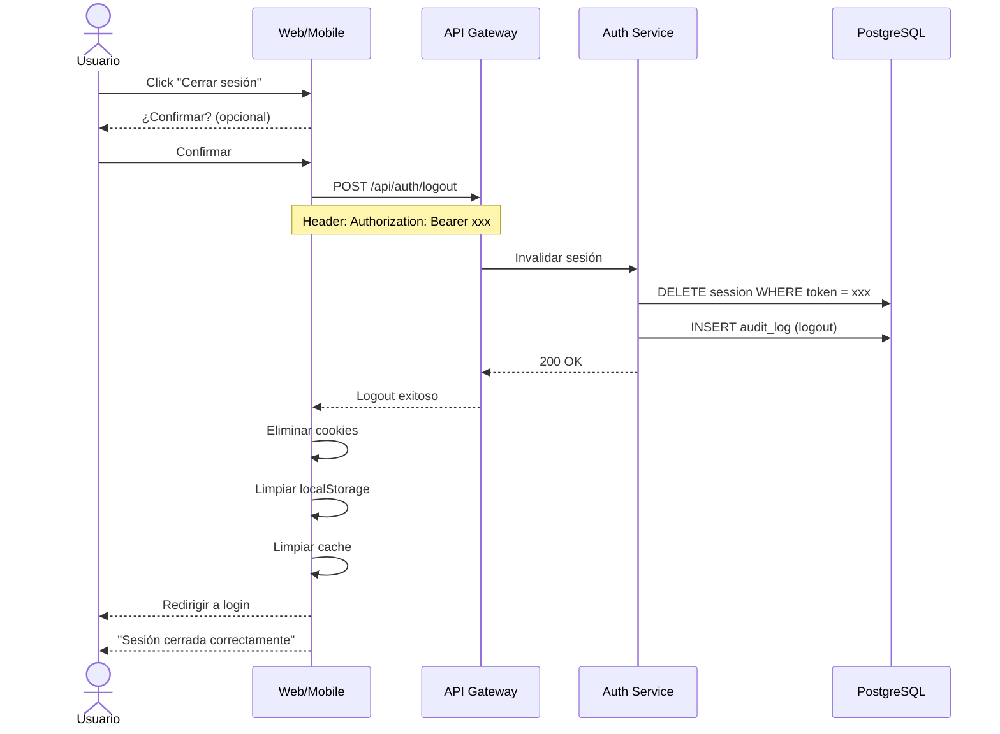

# UC-15: Cerrar Sesión

## Información General

| Campo | Valor |
|-------|-------|
| **ID** | UC-15 |
| **Nombre** | Cerrar Sesión |
| **Versión** | 1.0 |
| **Fecha** | 2026-02-02 |
| **Autor** | Henry Gomez |
| **Prioridad** | Alta |
| **Frecuencia de uso** | Alta |
| **Estado** | En desarrollo |

## Descripción Breve

Permite al usuario finalizar su sesión activa de forma segura, invalidando sus tokens de acceso y limpiando datos locales.

## Actores

| Actor | Tipo | Descripción |
|-------|------|-------------|
| Usuario Autenticado | Primario | Usuario con sesión activa |

## Precondiciones

1. El usuario tiene una sesión activa
2. El usuario tiene un token de sesión válido

## Postcondiciones

### Éxito
1. El token de sesión se invalida en el servidor
2. El refresh token se invalida
3. Los datos de sesión local se eliminan (cookies, localStorage)
4. El usuario es redirigido a la pantalla de login
5. Se registra el cierre de sesión en auditoría

### Fallo
1. Aun así se limpian datos locales (fail-safe)
2. Se redirige a login

## Flujo Básico

| Paso | Actor | Sistema |
|------|-------|---------|
| 1 | Usuario hace clic en "Cerrar sesión" | - |
| 2 | - | Muestra confirmación (opcional según config) |
| 3 | Usuario confirma | - |
| 4 | - | Envía solicitud al servidor con token actual |
| 5 | - | Servidor invalida el token de sesión |
| 6 | - | Servidor invalida el refresh token asociado |
| 7 | - | Servidor registra logout en auditoría |
| 8 | - | Cliente elimina cookies de sesión |
| 9 | - | Cliente limpia localStorage/sessionStorage |
| 10 | - | Cliente limpia cache de datos del usuario |
| 11 | - | Redirige a pantalla de login |
| 12 | - | Muestra mensaje "Sesión cerrada correctamente" |

## Flujos Alternativos

### FA-1: Cerrar sesión sin confirmación

| Paso | Descripción |
|------|-------------|
| 2a | Usuario tiene configurado "No preguntar al cerrar sesión" |
| 2b | Sistema procede directamente al paso 4 |

### FA-2: Cerrar todas las sesiones

| Paso | Descripción |
|------|-------------|
| 1a | Usuario accede a Configuración > Seguridad > Sesiones |
| 1b | Ve lista de sesiones activas (dispositivos) |
| 1c | Selecciona "Cerrar todas las sesiones" |
| 1d | Sistema solicita contraseña para confirmar |
| 1e | Sistema invalida TODOS los tokens del usuario |
| 1f | Redirige a login |

### FA-3: Cerrar sesión específica (otro dispositivo)

| Paso | Descripción |
|------|-------------|
| 1a | Usuario accede a Configuración > Seguridad > Sesiones |
| 1b | Ve lista de sesiones activas |
| 1c | Selecciona una sesión específica y "Cerrar" |
| 1d | Sistema invalida solo ese token |
| 1e | Usuario permanece en sesión actual |

### FA-4: Logout por inactividad

| Paso | Descripción |
|------|-------------|
| - | Usuario inactivo por tiempo configurado (30 min) |
| - | Sistema muestra advertencia (5 min antes) |
| - | Si no hay actividad, ejecuta logout automático |
| - | Muestra mensaje "Sesión cerrada por inactividad" |

## Flujos de Excepción

### FE-1: Error de red al cerrar sesión

| Paso | Descripción |
|------|-------------|
| 4a | Falla la conexión al servidor |
| - | Sistema limpia datos locales de todas formas |
| - | Redirige a login |
| - | Token expirará naturalmente en el servidor |

### FE-2: Token ya inválido

| Paso | Descripción |
|------|-------------|
| 5a | Servidor detecta que token ya no es válido |
| - | Retorna éxito de todas formas (idempotente) |
| - | Continúa flujo normal |

## Requisitos Especiales

### Seguridad
- Invalidación server-side del token (no solo client-side)
- Limpieza completa de datos sensibles en cliente
- Cookies con flag HttpOnly y Secure
- Logout debe ser idempotente
- Registro de auditoría

### Rendimiento
- Logout completo < 2 segundos
- Limpieza local inmediata

### Usabilidad
- Botón de logout accesible desde cualquier pantalla
- Confirmación opcional (configurable)
- Mensaje claro de sesión cerrada

## Puntos de Extensión

| Punto | Caso de uso extendido |
|-------|----------------------|
| Después de logout | UC-11: Iniciar Sesión |

## Reglas de Negocio

| ID | Regla |
|----|-------|
| RN-15.1 | Logout invalida token en servidor |
| RN-15.2 | Logout limpia datos locales |
| RN-15.3 | Logout es idempotente |
| RN-15.4 | Inactividad de 30 min genera logout automático |
| RN-15.5 | "Cerrar todas las sesiones" requiere contraseña |

## Trazabilidad

| Tipo | ID | Descripción |
|------|-----|-------------|
| Requisito funcional | RF-14 | Gestión básica de usuarios |
| Requisito no funcional | RNF-Seguridad | Gestión de sesiones |

## Diagrama de Secuencia

## Datos a Limpiar en Cliente

| Storage | Keys |
|---------|------|
| Cookies | `session_token`, `refresh_token`, `csrf_token` |
| localStorage | `user`, `preferences`, `cache_*` |
| sessionStorage | Todo |
| IndexedDB | Datos de presupuestos cacheados |
| Service Worker | Cache de API |

## Mockups / Wireframes

> Pendiente: Enlazar mockups de Figma cuando estén disponibles.

## Historial de Cambios

| Versión | Fecha | Autor | Descripción |
|---------|-------|-------|-------------|
| 1.0 | 2026-02-02 | Henry Gomez | Creación inicial |
