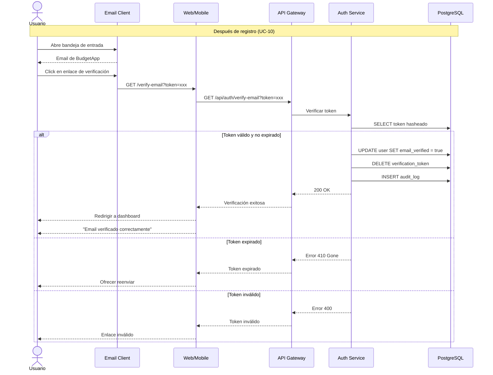

# UC-16: Verificar Email/Teléfono

## Información General

| Campo | Valor |
|-------|-------|
| **ID** | UC-16 |
| **Nombre** | Verificar Email/Teléfono |
| **Versión** | 1.0 |
| **Fecha** | 2026-02-02 |
| **Autor** | Henry Gomez |
| **Prioridad** | Alta |
| **Frecuencia de uso** | Alta (cada registro, cambio de email) |
| **Estado** | En desarrollo |

## Descripción Breve

Permite verificar la propiedad de un email o número de teléfono mediante un enlace o código enviado al usuario, habilitando el acceso completo a la cuenta.

## Actores

| Actor | Tipo | Descripción |
|-------|------|-------------|
| Usuario | Primario | Usuario que necesita verificar su contacto |
| Sistema de Email | Secundario | Servicio que envía enlaces de verificación |
| Sistema de SMS | Secundario | Servicio que envía códigos por SMS (opcional) |

## Precondiciones

1. El usuario tiene una cuenta creada
2. El email/teléfono está pendiente de verificación
3. El usuario tiene acceso al email/teléfono a verificar

## Postcondiciones

### Éxito
1. El email/teléfono se marca como verificado en la BD
2. El usuario obtiene acceso completo a la aplicación
3. Se registra la verificación en auditoría
4. El token de verificación se invalida

### Fallo
1. El email/teléfono permanece sin verificar
2. El usuario mantiene acceso limitado
3. Se registra el intento fallido

## Flujo Básico: Verificar Email

| Paso | Actor | Sistema |
|------|-------|---------|
| 1 | - | Después de registro, muestra pantalla "Verifica tu email" |
| 2 | - | Email de verificación ya fue enviado (desde UC-10) |
| 3 | Usuario abre su bandeja de entrada | - |
| 4 | Usuario hace clic en enlace de verificación | - |
| 5 | - | Recibe solicitud con token |
| 6 | - | Busca token en BD (hasheado) |
| 7 | - | Verifica que no haya expirado (24h) |
| 8 | - | Marca email como verificado |
| 9 | - | Invalida el token usado |
| 10 | - | Actualiza rol/permisos del usuario |
| 11 | - | Registra en auditoría |
| 12 | - | Redirige al dashboard con mensaje de éxito |

## Flujos Alternativos

### FA-1: Reenviar email de verificación

| Paso | Descripción |
|------|-------------|
| 1a | Usuario en pantalla "Verifica tu email" |
| 1b | Hace clic en "Reenviar correo" |
| 1c | Sistema verifica rate limiting (máx 3/hora) |
| 1d | Invalida tokens anteriores |
| 1e | Genera nuevo token |
| 1f | Envía nuevo email |
| 1g | Muestra confirmación con tiempo de espera |

### FA-2: Verificar teléfono con código SMS

| Paso | Descripción |
|------|-------------|
| 1 | Usuario ingresa número de teléfono |
| 2 | Sistema envía código de 6 dígitos por SMS |
| 3 | Usuario ingresa código en la app |
| 4 | Sistema valida código (5 min expiración) |
| 5 | Si válido, marca teléfono como verificado |

### FA-3: Verificar nuevo email (cambio de email)

| Paso | Descripción |
|------|-------------|
| 1 | Usuario cambió email en perfil (UC-13) |
| 2 | Sistema envió verificación al nuevo email |
| 3 | Usuario hace clic en enlace |
| 4 | Sistema verifica token |
| 5 | Actualiza email principal al nuevo |
| 6 | Envía notificación al email anterior |

### FA-4: Verificación desde la app (deep link)

| Paso | Descripción |
|------|-------------|
| 4a | Usuario hace clic en enlace desde móvil |
| 4b | Deep link abre la app directamente |
| 4c | App procesa token internamente |
| 4d | Continúa desde paso 5 |

## Flujos de Excepción

### FE-1: Token expirado

| Paso | Descripción |
|------|-------------|
| 7a | Token tiene más de 24 horas |
| - | Muestra mensaje: "Este enlace ha expirado" |
| - | Ofrece botón "Reenviar correo de verificación" |

### FE-2: Token inválido o ya usado

| Paso | Descripción |
|------|-------------|
| 6a | Token no existe o ya fue usado |
| - | Muestra mensaje: "Enlace inválido" |
| - | Verifica si email ya está verificado |
| - | Si ya verificado: "Tu email ya fue verificado" con enlace a login |
| - | Si no verificado: ofrece reenviar |

### FE-3: Demasiados reenvíos

| Paso | Descripción |
|------|-------------|
| 1c | Usuario ha solicitado 3+ veces en 1 hora |
| - | Muestra mensaje con tiempo de espera |
| - | Sugiere revisar carpeta de spam |

### FE-4: Código SMS incorrecto

| Paso | Descripción |
|------|-------------|
| 4 | Código no coincide |
| - | Muestra error: "Código incorrecto" |
| - | Permite 3 intentos |
| - | Después de 3 intentos, debe solicitar nuevo código |

## Requisitos Especiales

### Seguridad
- Token de 64 caracteres criptográficamente seguro
- Token almacenado hasheado
- Expiración de 24 horas para email
- Expiración de 5 minutos para SMS
- Token de un solo uso
- Rate limiting en reenvíos
- Código SMS de 6 dígitos numéricos

### Rendimiento
- Validación de token < 1 segundo
- Envío de email < 30 segundos
- Envío de SMS < 10 segundos

### Usabilidad
- Enlace directo en email (no copiar/pegar)
- Soporte de deep links para apps móviles
- Instrucciones para revisar spam
- Contador de tiempo para reenvío
- Input auto-submit cuando se completa código SMS

### Cumplimiento
- Verificación necesaria para cumplir requisitos de comunicación
- Log de verificaciones para auditoría

## Puntos de Extensión

| Punto | Caso de uso extendido |
|-------|----------------------|
| Desde UC-10 | Verificación después de registro |
| Desde UC-13 | Verificación de nuevo email |
| Después de éxito | Dashboard principal |

## Reglas de Negocio

| ID | Regla |
|----|-------|
| RN-16.1 | Token de email expira en 24 horas |
| RN-16.2 | Código SMS expira en 5 minutos |
| RN-16.3 | Token/código es de un solo uso |
| RN-16.4 | Máximo 3 reenvíos por hora |
| RN-16.5 | Máximo 3 intentos de código SMS |
| RN-16.6 | Usuario no verificado tiene acceso limitado |
| RN-16.7 | Cambio de email requiere verificar el nuevo |

## Trazabilidad

| Tipo | ID | Descripción |
|------|-----|-------------|
| Requisito funcional | RF-14 | Gestión básica de usuarios |
| Requisito no funcional | RNF-Seguridad | Verificación de identidad |

## Diagrama de Secuencia: Verificar Email



## Contenido del Email de Verificación

```
Asunto: Verifica tu cuenta de BudgetApp

¡Bienvenido a BudgetApp, [Nombre]!

Para completar tu registro y acceder a todas las funcionalidades,
verifica tu dirección de email haciendo clic en el siguiente enlace:

[Botón: Verificar mi email]

Este enlace expirará en 24 horas.

Si no creaste una cuenta en BudgetApp, puedes ignorar este correo.

¿Problemas con el enlace? Copia y pega esta URL en tu navegador:
[URL completa]

- El equipo de BudgetApp
```

## Mockups / Wireframes

> Pendiente: Enlazar mockups de Figma cuando estén disponibles.

## Historial de Cambios

| Versión | Fecha | Autor | Descripción |
|---------|-------|-------|-------------|
| 1.0 | 2026-02-02 | Henry Gomez | Creación inicial |
