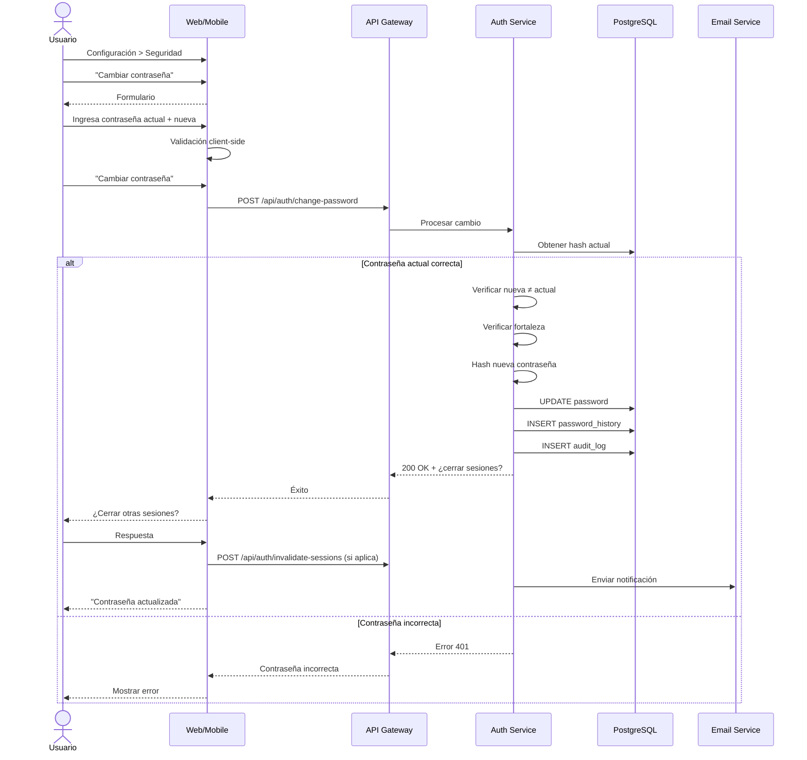

# UC-17: Cambiar Contraseña

## Información General

| Campo | Valor |
|-------|-------|
| **ID** | UC-17 |
| **Nombre** | Cambiar Contraseña |
| **Versión** | 1.0 |
| **Fecha** | 2026-02-02 |
| **Autor** | Henry Gomez |
| **Prioridad** | Alta |
| **Frecuencia de uso** | Baja (cambio ocasional) |
| **Estado** | En desarrollo |

## Descripción Breve

Permite a un usuario autenticado cambiar su contraseña actual por una nueva, requiriendo verificación de la contraseña actual por seguridad.

## Actores

| Actor | Tipo | Descripción |
|-------|------|-------------|
| Usuario Autenticado | Primario | Usuario con sesión activa |
| Sistema de Email | Secundario | Para notificar el cambio |

## Precondiciones

1. El usuario tiene una sesión activa
2. El usuario conoce su contraseña actual
3. El usuario tiene email verificado

## Postcondiciones

### Éxito
1. La contraseña se actualiza en la base de datos (hasheada)
2. Opcionalmente se cierran otras sesiones activas
3. Se envía notificación por email
4. Se registra el cambio en auditoría

### Fallo
1. La contraseña no se modifica
2. Se registra el intento fallido

## Flujo Básico

| Paso | Actor | Sistema |
|------|-------|---------|
| 1 | Usuario accede a Configuración > Seguridad | Muestra opciones de seguridad |
| 2 | Usuario selecciona "Cambiar contraseña" | Muestra formulario |
| 3 | Usuario ingresa contraseña actual | - |
| 4 | Usuario ingresa nueva contraseña | Muestra indicador de fortaleza |
| 5 | Usuario confirma nueva contraseña | Valida coincidencia |
| 6 | Usuario presiona "Cambiar contraseña" | - |
| 7 | - | Verifica contraseña actual |
| 8 | - | Verifica que nueva ≠ actual |
| 9 | - | Valida fortaleza de nueva contraseña |
| 10 | - | Hashea nueva contraseña (bcrypt) |
| 11 | - | Actualiza en base de datos |
| 12 | - | Pregunta: "¿Cerrar otras sesiones?" |
| 13 | Usuario decide | Si sí: invalida otros tokens |
| 14 | - | Registra en auditoría |
| 15 | - | Envía email de notificación |
| 16 | - | Muestra confirmación de éxito |

## Flujos Alternativos

### FA-1: Usuario con MFA habilitado

| Paso | Descripción |
|------|-------------|
| 6a | Sistema detecta MFA habilitado |
| 6b | Solicita código MFA además de contraseña actual |
| 6c | Usuario ingresa código |
| 6d | Sistema valida MFA |
| 6e | Continúa desde paso 7 |

### FA-2: Cerrar todas las sesiones

| Paso | Descripción |
|------|-------------|
| 13a | Usuario selecciona "Sí, cerrar otras sesiones" |
| 13b | Sistema invalida todos los tokens excepto el actual |
| 13c | Otros dispositivos serán desconectados |

### FA-3: Mantener otras sesiones

| Paso | Descripción |
|------|-------------|
| 13a | Usuario selecciona "No, mantener sesiones" |
| 13b | Solo se actualiza la contraseña |
| 13c | Otros dispositivos siguen activos |

## Flujos de Excepción

### FE-1: Contraseña actual incorrecta

| Paso | Descripción |
|------|-------------|
| 7a | Hash no coincide |
| - | Muestra error: "Contraseña actual incorrecta" |
| - | Incrementa contador de intentos |
| - | Después de 3 intentos: bloqueo temporal (15 min) |

### FE-2: Nueva contraseña igual a la actual

| Paso | Descripción |
|------|-------------|
| 8a | Sistema detecta que son iguales |
| - | Muestra error: "La nueva contraseña debe ser diferente" |

### FE-3: Nueva contraseña débil

| Paso | Descripción |
|------|-------------|
| 9a | No cumple requisitos de fortaleza |
| - | Muestra requisitos faltantes |
| - | No permite continuar |

### FE-4: Contraseñas no coinciden

| Paso | Descripción |
|------|-------------|
| 5a | Confirmación ≠ nueva contraseña |
| - | Muestra error: "Las contraseñas no coinciden" |
| - | Permite corregir |

## Requisitos Especiales

### Seguridad
- Verificación de contraseña actual obligatoria
- Si tiene MFA, también verificar código
- Nueva contraseña hasheada con bcrypt (cost 12)
- No permitir contraseñas en lista de contraseñas comunes
- No permitir contraseña igual a las últimas 3
- Notificación por email del cambio
- Registro de auditoría

### Rendimiento
- Cambio de contraseña < 3 segundos

### Usabilidad
- Indicador de fortaleza en tiempo real
- Opción mostrar/ocultar contraseñas
- Lista de requisitos visible
- Confirmación clara de éxito

## Puntos de Extensión

| Punto | Caso de uso extendido |
|-------|----------------------|
| FA-1 verificación MFA | UC-12: Verificar MFA |

## Reglas de Negocio

| ID | Regla |
|----|-------|
| RN-17.1 | Requiere contraseña actual para cambiar |
| RN-17.2 | Nueva contraseña debe ser diferente a actual |
| RN-17.3 | Nueva contraseña: mín 8 chars, 1 mayúscula, 1 número, 1 especial |
| RN-17.4 | No permitir últimas 3 contraseñas |
| RN-17.5 | Máximo 3 intentos antes de bloqueo temporal |
| RN-17.6 | Si MFA activo, requiere código MFA |
| RN-17.7 | Notificación obligatoria por email |

## Trazabilidad

| Tipo | ID | Descripción |
|------|-----|-------------|
| Requisito funcional | RF-14 | Gestión básica de usuarios |
| Requisito no funcional | RNF-Seguridad | Gestión de credenciales |

## Diagrama de Secuencia



## Contenido del Email de Notificación

```
Asunto: Tu contraseña de BudgetApp ha sido cambiada

Hola [Nombre],

La contraseña de tu cuenta de BudgetApp fue cambiada exitosamente.

Fecha: [timestamp]
Ubicación aproximada: [ciudad, país]
Dispositivo: [browser/device]

Si realizaste este cambio, no necesitas hacer nada más.

Si NO realizaste este cambio, tu cuenta puede estar comprometida.
Por favor:
1. Accede a tu cuenta inmediatamente
2. Cambia tu contraseña
3. Revisa la actividad reciente
4. Contacta a soporte si necesitas ayuda

[Botón: Contactar Soporte]

- El equipo de BudgetApp
```

## Mockups / Wireframes

> Pendiente: Enlazar mockups de Figma cuando estén disponibles.

## Historial de Cambios

| Versión | Fecha | Autor | Descripción |
|---------|-------|-------|-------------|
| 1.0 | 2026-02-02 | Henry Gomez | Creación inicial |
