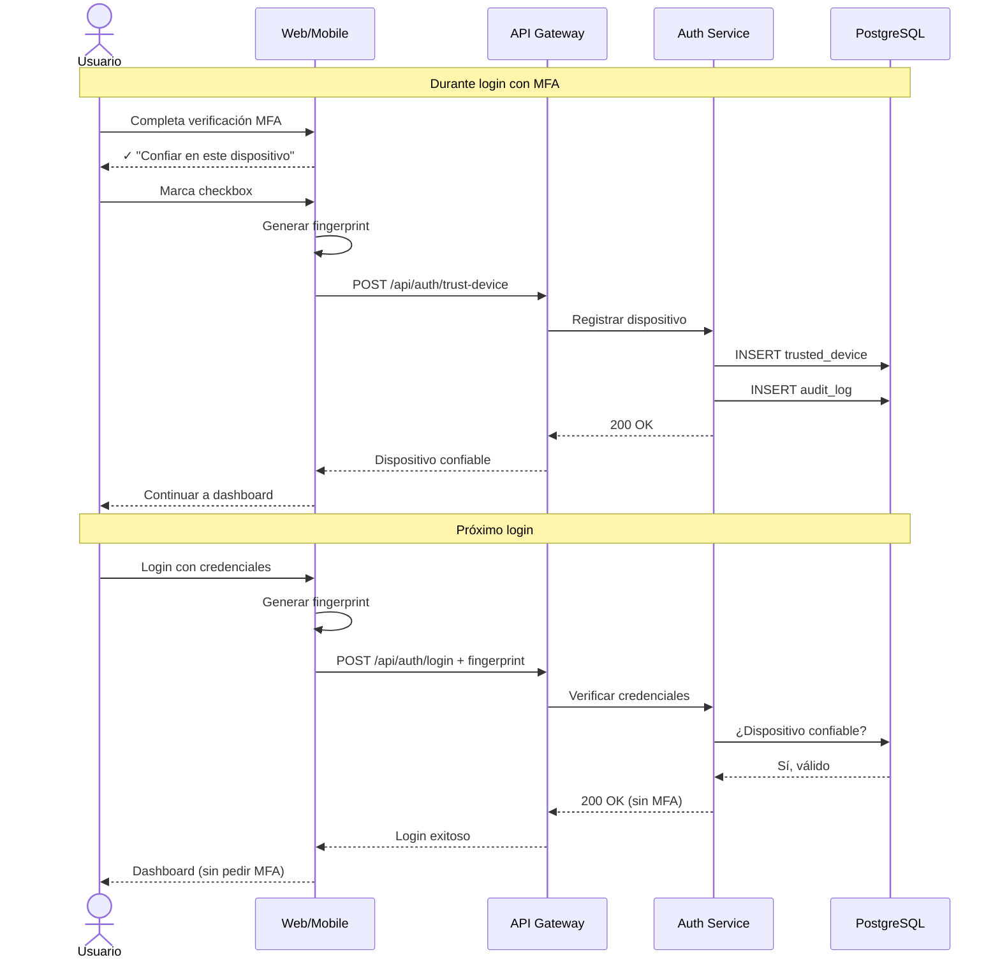

# UC-18: Gestionar Dispositivos Confiables

## Información General

| Campo | Valor |
|-------|-------|
| **ID** | UC-18 |
| **Nombre** | Gestionar Dispositivos Confiables |
| **Versión** | 1.0 |
| **Fecha** | 2026-02-02 |
| **Autor** | Henry Gomez |
| **Prioridad** | Media |
| **Frecuencia de uso** | Baja |
| **Estado** | En desarrollo |

## Descripción Breve

Permite al usuario ver, agregar y remover dispositivos marcados como confiables, los cuales pueden omitir la verificación MFA en inicios de sesión futuros.

## Actores

| Actor | Tipo | Descripción |
|-------|------|-------------|
| Usuario Autenticado | Primario | Usuario con MFA habilitado |

## Precondiciones

1. El usuario tiene una sesión activa
2. El usuario tiene MFA habilitado
3. El usuario ha iniciado sesión al menos una vez

## Postcondiciones

### Éxito (Agregar dispositivo)
1. El dispositivo se registra con fingerprint único
2. Futuros logins desde este dispositivo omiten MFA
3. Se registra en auditoría

### Éxito (Remover dispositivo)
1. El dispositivo se elimina de la lista
2. Próximo login requerirá MFA
3. Se registra en auditoría

## Flujo Básico: Ver Dispositivos

| Paso | Actor | Sistema |
|------|-------|---------|
| 1 | Usuario accede a Configuración > Seguridad > Dispositivos | - |
| 2 | - | Carga lista de dispositivos confiables |
| 3 | - | Muestra: nombre, tipo, ubicación, último uso, fecha de registro |
| 4 | - | Resalta dispositivo actual |

## Flujo: Agregar Dispositivo como Confiable

| Paso | Actor | Sistema |
|------|-------|---------|
| 1 | Durante login, usuario completa MFA | - |
| 2 | - | Muestra checkbox "Confiar en este dispositivo" |
| 3 | Usuario marca la opción | - |
| 4 | - | Genera fingerprint del dispositivo |
| 5 | - | Almacena: fingerprint, user agent, IP, timestamp |
| 6 | - | Asocia al usuario con expiración (90 días) |
| 7 | - | Próximos logins omitirán MFA |

## Flujo: Remover Dispositivo

| Paso | Actor | Sistema |
|------|-------|---------|
| 1 | Usuario en lista de dispositivos | - |
| 2 | Usuario selecciona dispositivo y "Remover" | - |
| 3 | - | Solicita confirmación |
| 4 | Usuario confirma | - |
| 5 | - | Elimina registro del dispositivo |
| 6 | - | Registra en auditoría |
| 7 | - | Muestra confirmación |

## Flujos Alternativos

### FA-1: Remover todos los dispositivos

| Paso | Descripción |
|------|-------------|
| 2a | Usuario selecciona "Remover todos" |
| 3a | Sistema solicita contraseña |
| 4a | Usuario ingresa contraseña |
| 5a | Sistema elimina todos los dispositivos confiables |
| 6a | Próximo login en cualquier dispositivo requerirá MFA |

### FA-2: Dispositivo expirado

| Paso | Descripción |
|------|-------------|
| - | Han pasado 90 días desde que se confió |
| - | Sistema marca dispositivo como expirado |
| - | Próximo login requerirá MFA |
| - | Usuario puede volver a confiar |

### FA-3: Cambio significativo en dispositivo

| Paso | Descripción |
|------|-------------|
| - | Usuario actualiza navegador/OS significativamente |
| - | Fingerprint cambia |
| - | Sistema no reconoce como confiable |
| - | Requiere MFA y ofrece confiar nuevamente |

## Flujos de Excepción

### FE-1: Límite de dispositivos alcanzado

| Paso | Descripción |
|------|-------------|
| 6a | Usuario ya tiene 5 dispositivos confiables |
| - | Muestra mensaje: "Límite alcanzado" |
| - | Sugiere remover dispositivo antiguo |
| - | Lista dispositivos ordenados por último uso |

## Requisitos Especiales

### Seguridad
- Fingerprint basado en: user agent, resolución, timezone, plugins (no IP)
- Dispositivos expiran automáticamente (90 días)
- Máximo 5 dispositivos confiables por usuario
- Cambio de contraseña invalida todos los dispositivos
- Notificación cuando se agrega nuevo dispositivo

### Rendimiento
- Verificación de fingerprint < 100ms
- Carga de lista < 1 segundo

### Usabilidad
- Nombres descriptivos (ej: "Chrome en Windows")
- Indicador visual del dispositivo actual
- Confirmación antes de remover

## Puntos de Extensión

| Punto | Caso de uso extendido |
|-------|----------------------|
| Durante UC-11 login | Verificar si dispositivo es confiable |
| Desde UC-12 verificación MFA | Ofrecer confiar en dispositivo |

## Reglas de Negocio

| ID | Regla |
|----|-------|
| RN-18.1 | Máximo 5 dispositivos confiables |
| RN-18.2 | Confianza expira en 90 días |
| RN-18.3 | Cambio de contraseña revoca todos los dispositivos |
| RN-18.4 | Fingerprint no incluye IP (puede cambiar) |
| RN-18.5 | Solo disponible si MFA está habilitado |

## Trazabilidad

| Tipo | ID | Descripción |
|------|-----|-------------|
| Requisito funcional | RF-14 | Gestión básica de usuarios |
| Requisito no funcional | RNF-Seguridad | MFA y dispositivos |

## Información del Dispositivo

| Campo | Fuente | Ejemplo |
|-------|--------|---------|
| Nombre | User Agent parsed | "Chrome 120 en Windows 11" |
| Tipo | User Agent | Desktop / Mobile / Tablet |
| Navegador | User Agent | Chrome, Firefox, Safari |
| Sistema Operativo | User Agent | Windows, macOS, Android, iOS |
| Ubicación aproximada | IP GeoIP | "Bogotá, Colombia" |
| Último uso | Timestamp | "Hace 2 horas" |
| Registrado | Timestamp | "15 enero 2026" |
| Expira | Calculado | "15 abril 2026" |

## Diagrama de Secuencia

## Mockups / Wireframes

> Pendiente: Enlazar mockups de Figma cuando estén disponibles.

## Historial de Cambios

| Versión | Fecha | Autor | Descripción |
|---------|-------|-------|-------------|
| 1.0 | 2026-02-02 | Henry Gomez | Creación inicial |
