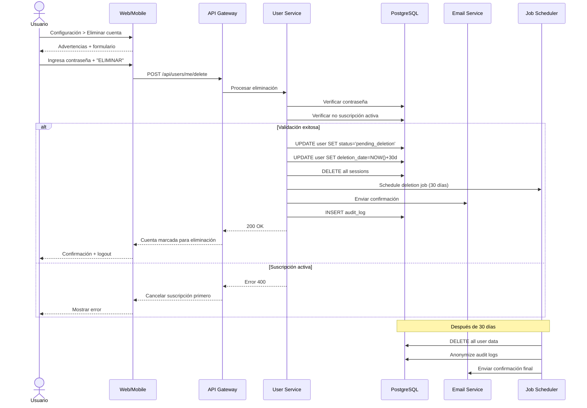

# UC-19: Eliminar Cuenta

## Información General

| Campo | Valor |
|-------|-------|
| **ID** | UC-19 |
| **Nombre** | Eliminar Cuenta |
| **Versión** | 1.0 |
| **Fecha** | 2026-02-02 |
| **Autor** | Henry Gomez |
| **Prioridad** | Baja |
| **Frecuencia de uso** | Muy baja |
| **Estado** | En desarrollo |

## Descripción Breve

Permite al usuario eliminar permanentemente su cuenta y todos los datos asociados, cumpliendo con regulaciones de protección de datos (GDPR, Habeas Data).

## Actores

| Actor | Tipo | Descripción |
|-------|------|-------------|
| Usuario Autenticado | Primario | Usuario que desea eliminar su cuenta |
| Sistema de Email | Secundario | Para confirmar y notificar |

## Precondiciones

1. El usuario tiene una sesión activa
2. El usuario es el propietario de la cuenta
3. No hay suscripciones activas pendientes de cancelar

## Postcondiciones

### Éxito
1. Se programa la eliminación (período de gracia de 30 días)
2. La cuenta se desactiva inmediatamente
3. Después del período de gracia, se eliminan todos los datos
4. Se envía confirmación por email
5. Se registra la solicitud en auditoría (retención legal)

### Cancelación (dentro del período de gracia)
1. La cuenta se reactiva
2. Los datos no se eliminan
3. Se notifica al usuario

## Flujo Básico

| Paso | Actor | Sistema |
|------|-------|---------|
| 1 | Usuario accede a Configuración > Cuenta > Eliminar cuenta | - |
| 2 | - | Muestra advertencias y consecuencias |
| 3 | - | Lista datos que se eliminarán |
| 4 | Usuario lee y comprende las consecuencias | - |
| 5 | Usuario selecciona motivo de eliminación (opcional) | - |
| 6 | Usuario ingresa contraseña | - |
| 7 | Usuario escribe "ELIMINAR" para confirmar | - |
| 8 | Usuario presiona "Eliminar mi cuenta" | - |
| 9 | - | Verifica contraseña |
| 10 | - | Verifica que no haya suscripción activa |
| 11 | - | Marca cuenta para eliminación (30 días) |
| 12 | - | Desactiva cuenta inmediatamente |
| 13 | - | Invalida todas las sesiones |
| 14 | - | Programa job de eliminación |
| 15 | - | Envía email de confirmación |
| 16 | - | Registra en auditoría |
| 17 | - | Muestra confirmación y cierra sesión |

## Flujos Alternativos

### FA-1: Usuario con MFA habilitado

| Paso | Descripción |
|------|-------------|
| 6a | Además de contraseña, solicita código MFA |
| 6b | Usuario ingresa código |
| 6c | Sistema valida MFA |
| 6d | Continúa desde paso 7 |

### FA-2: Cancelar eliminación (período de gracia)

| Paso | Descripción |
|------|-------------|
| 1 | Usuario recibe email de confirmación |
| 2 | Hace clic en "Cancelar eliminación" |
| 3 | Sistema solicita login |
| 4 | Usuario inicia sesión |
| 5 | Sistema reactiva la cuenta |
| 6 | Cancela job de eliminación |
| 7 | Envía email de confirmación de reactivación |

### FA-3: Descargar datos antes de eliminar

| Paso | Descripción |
|------|-------------|
| 4a | Usuario selecciona "Descargar mis datos primero" |
| 4b | Sistema genera archivo con todos los datos (JSON/CSV) |
| 4c | Usuario descarga el archivo |
| 4d | Continúa con el flujo de eliminación |

### FA-4: Usuario es admin de hogar familiar

| Paso | Descripción |
|------|-------------|
| 10a | Sistema detecta que usuario administra un hogar |
| 10b | Muestra advertencia: "Debes transferir el hogar primero" |
| 10c | Usuario debe: transferir admin a otro miembro O eliminar el hogar |
| 10d | Una vez resuelto, puede continuar |

## Flujos de Excepción

### FE-1: Suscripción activa

| Paso | Descripción |
|------|-------------|
| 10a | Usuario tiene plan de pago activo |
| - | Muestra mensaje: "Debes cancelar tu suscripción primero" |
| - | Enlace a gestión de suscripción |
| - | No permite eliminar hasta cancelar |

### FE-2: Contraseña incorrecta

| Paso | Descripción |
|------|-------------|
| 9a | Contraseña no coincide |
| - | Muestra error |
| - | Permite 3 intentos |
| - | Después de 3: bloqueo temporal |

### FE-3: Texto de confirmación incorrecto

| Paso | Descripción |
|------|-------------|
| 7a | Usuario no escribe "ELIMINAR" exactamente |
| - | Botón permanece deshabilitado |
| - | Muestra hint: "Escribe ELIMINAR para confirmar" |

## Requisitos Especiales

### Seguridad
- Requiere contraseña + MFA (si habilitado)
- Confirmación explícita ("ELIMINAR")
- Período de gracia de 30 días
- Posibilidad de cancelar durante el período
- Eliminación irreversible después del período

### Cumplimiento Legal
- GDPR: Derecho al olvido (Art. 17)
- Habeas Data Colombia: Derecho de supresión
- Retención de logs de auditoría por requisitos legales (5 años)
- Datos anonimizados para estadísticas agregadas (opcional)

### Datos a Eliminar
- Perfil de usuario
- Presupuestos y transacciones
- Conexiones bancarias (tokens)
- Preferencias y configuración
- Historial de alertas
- Dispositivos confiables

### Datos Retenidos (anonimizados)
- Estadísticas agregadas de uso
- Logs de auditoría (sin PII, solo IDs hasheados)

### Rendimiento
- Proceso de eliminación en background
- No bloquear la UI

### Usabilidad
- Advertencias claras
- Lista explícita de datos afectados
- Opción de descargar datos
- Confirmación por email
- Posibilidad de cancelar

## Puntos de Extensión

| Punto | Caso de uso extendido |
|-------|----------------------|
| FA-3 descargar datos | Exportar datos del usuario |
| FA-4 transferir hogar | Gestión de hogar familiar |

## Reglas de Negocio

| ID | Regla |
|----|-------|
| RN-19.1 | Período de gracia: 30 días |
| RN-19.2 | Requiere cancelar suscripción activa |
| RN-19.3 | Requiere resolver administración de hogar |
| RN-19.4 | Confirmación explícita obligatoria |
| RN-19.5 | Usuario puede cancelar durante período de gracia |
| RN-19.6 | Después del período, eliminación irreversible |
| RN-19.7 | Logs de auditoría se retienen 5 años (anonimizados) |

## Trazabilidad

| Tipo | ID | Descripción |
|------|-----|-------------|
| Requisito funcional | RF-14 | Gestión básica de usuarios |
| Requisito no funcional | RNF-Cumplimiento | GDPR, Habeas Data |

## Diagrama de Secuencia



## Contenido de Emails

### Email de confirmación de solicitud:
```
Asunto: Solicitud de eliminación de cuenta - BudgetApp

Hola [Nombre],

Hemos recibido tu solicitud para eliminar tu cuenta de BudgetApp.

Tu cuenta ha sido desactivada y será eliminada permanentemente el [fecha].

Datos que se eliminarán:
- Tu perfil y configuración
- Todos tus presupuestos y transacciones
- Conexiones bancarias
- Historial de alertas

¿Cambiaste de opinión?
Puedes cancelar la eliminación en cualquier momento antes del [fecha]:
[Botón: Cancelar eliminación]

Si no solicitaste esto, haz clic en el botón anterior inmediatamente
y cambia tu contraseña.

- El equipo de BudgetApp
```

### Email de confirmación de eliminación:
```
Asunto: Tu cuenta de BudgetApp ha sido eliminada

Hola,

Tu cuenta de BudgetApp y todos los datos asociados han sido
eliminados permanentemente.

Lamentamos verte partir. Si en el futuro deseas volver,
siempre puedes crear una nueva cuenta.

Gracias por haber sido parte de BudgetApp.

- El equipo de BudgetApp
```

## Mockups / Wireframes

> Pendiente: Enlazar mockups de Figma cuando estén disponibles.

## Historial de Cambios

| Versión | Fecha | Autor | Descripción |
|---------|-------|-------|-------------|
| 1.0 | 2026-02-02 | Henry Gomez | Creación inicial |
