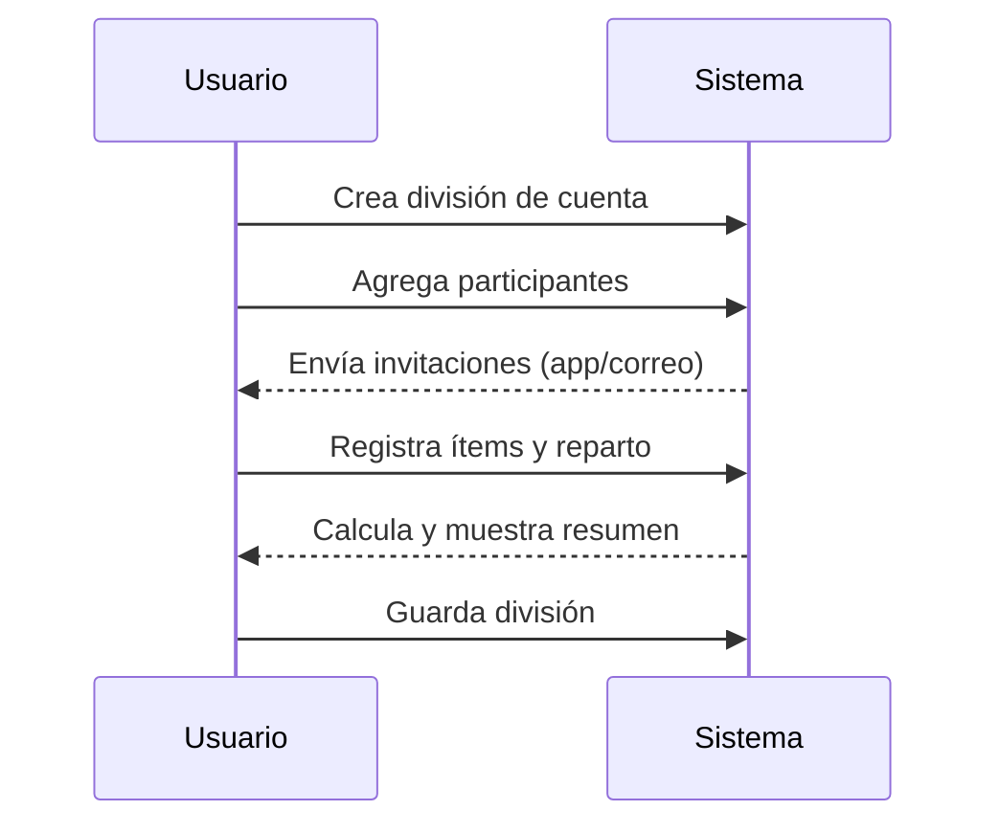

# Casos de Uso - División de Cuentas

## UC-DC-01: Dividir cuenta de compras compartidas

### Información General

| Campo | Valor |
|-------|-------|
| **ID** | UC-DC-01 |
| **Nombre** | Dividir cuenta de compras compartidas |
| **Versión** | 1.1 |
| **Fecha** | 2026-02-23 |
| **Autor** | Alexandra Castano |
| **Prioridad** | Media |
| **Frecuencia de uso** | Media |
| **Estado** | En desarrollo |

### Descripción Breve

Permite registrar compras compartidas y calcular cuánto debe cada persona según los ítems pagados y las reglas de reparto definidas por el usuario. Permite invitar participantes con o sin aplicación y mantenerlos visibles en la cuenta.

### Actores

| Actor | Tipo | Descripción |
|-------|------|-------------|
| Usuario | Primario | Persona que registra una compra compartida y desea dividir el pago. |

### Precondiciones

1. El usuario tiene acceso a la aplicación (web o móvil).
2. El usuario está autenticado.
3. El sistema está disponible y operativo.

### Postcondiciones

#### Éxito
1. Se registra la compra compartida con sus ítems.
2. Se calcula el valor a pagar por cada persona según la distribución definida.
3. Se muestra el resumen de división de cuenta.

#### Fallo
1. No se registra la compra compartida.
2. Se muestra mensaje de error apropiado al usuario.
3. Se registra el intento fallido en logs de auditoría.

### Flujo Básico

| Paso | Actor | Sistema |
|------|-------|---------|
| 1 | Usuario crea una nueva división de cuenta. | - |
| 2 | Usuario ingresa información general (fecha, lugar, total pagado, moneda). | - |
| 3 | Usuario agrega participantes (con app o sin app). | - |
| 4 | - | Permite invitar por correo o notificación en app. |
| 5 | Usuario registra ítems de la compra. | - |
| 6 | Usuario define para cada ítem quién participa en el reparto. | - |
| 7 | - | Calcula el valor correspondiente a cada persona. |
| 8 | - | Muestra el resumen de la división de cuenta. |
| 9 | Usuario guarda la división. | - |

### Flujos Alternativos

#### FA-1: Ítem solo para el usuario

| Paso | Descripción |
|------|-------------|
| 5a | El usuario marca un ítem como “solo mío”. |
| 6a | El sistema asigna el 100% del ítem al usuario. |

#### FA-2: Ítem compartido por un subconjunto

| Paso | Descripción |
|------|-------------|
| 5b | El usuario selecciona solo algunos participantes para un ítem. |
| 6b | El sistema divide el ítem entre los seleccionados. |

#### FA-3: Invitación pendiente

| Paso | Descripción |
|------|-------------|
| 4a | El participante no acepta la invitación o no tiene app. |
| 4b | El sistema mantiene nombre/correo del participante y la división continúa. |
| 4c | Si el participante se registra más tarde, puede unirse a la cuenta. |

### Flujos de Excepción

No hay.

### Requisitos Especiales

#### Datos / Persistencia
- Se almacena la compra compartida, participantes e ítems con su distribución.
- Se guarda la moneda y el valor total pagado.
- Se guarda estado de invitación (pendiente/aceptada) por participante y su identificador (nombre/correo).

#### Seguridad
- Solo usuarios autenticados pueden registrar divisiones de cuenta.

#### Rendimiento
- El cálculo de la división debe ser inmediato.

#### Usabilidad
- El usuario debe poder seleccionar participantes por ítem con facilidad.
- Debe permitir invitar participantes con o sin app y continuar la división.

#### Cumplimiento
- No aplica.

### Puntos de Extensión

| Punto | Descripción |
|---|---|
| Registro de pagos | Extiende la división con confirmación de pagos entre participantes. |

### Reglas de Negocio

| ID | Regla |
|----|-------|
| RN-DC-01 | La división se calcula por ítem según los participantes seleccionados. |
| RN-DC-02 | Un ítem puede ser 100% del usuario o compartido con otros. |
| RN-DC-03 | Si la suma de los ítems no coincide con el total registrado, el sistema muestra una alerta pero permite guardar. |
| RN-DC-04 | Los participantes pueden agregarse por invitación (app o correo); si no aceptan, permanecen como nombre/correo en la cuenta. |
| RN-DC-05 | Un participante con app puede unirse a la cuenta cuando acepte la invitación. |

### Trazabilidad

| Tipo | ID | Descripción |
|---|---|---|
| Requisito funcional | RF-19 | División de cuentas entre participantes |

### Diagrama de Secuencia

### Mockups / Wireframes

Pendiente por validar con el usuario.

### Historial de Cambios

| Versión | Fecha | Autor | Descripción |
|---------|-------|-------|-------------|
| 1.1 | 2026-02-23 | Alexandra Castano | Invitaciones y regla de alerta por total. |
| 1.0 | 2026-02-23 | Alexandra Castano | Creación inicial |
