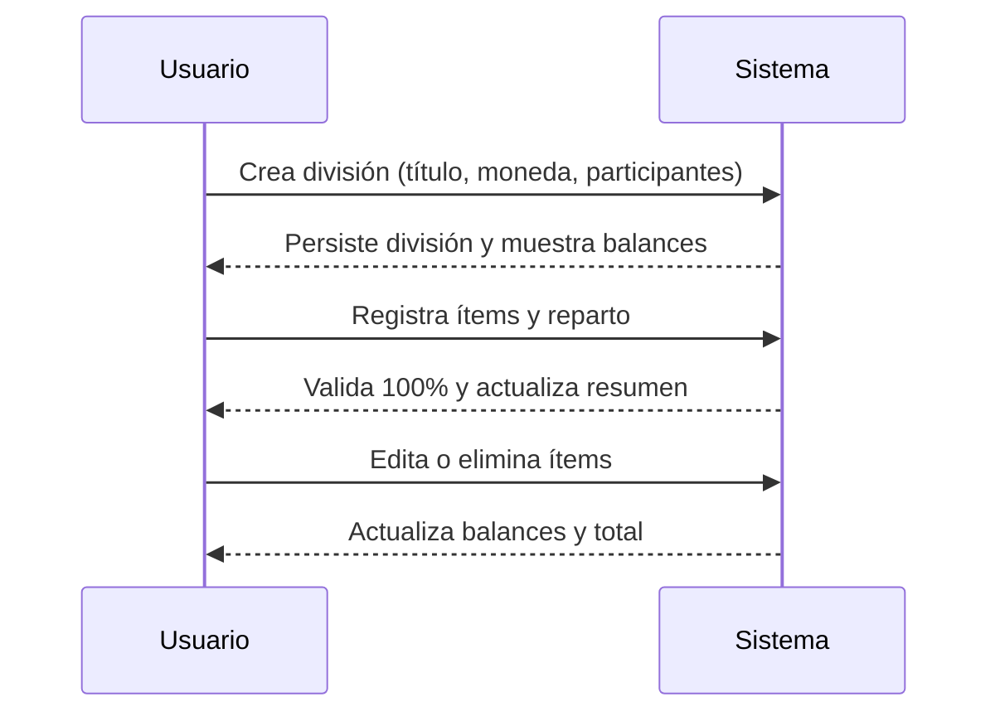

# Casos de Uso - División de Cuentas

## UC-DC-01: Dividir cuenta de compras compartidas

### Información General

| Campo | Valor |
|-------|-------|
| **ID** | UC-DC-01 |
| **Nombre** | Dividir cuenta de compras compartidas |
| **Versión** | 1.2 |
| **Fecha** | 2026-03-09 |
| **Autor** | Alexandra Castano |
| **Prioridad** | Media |
| **Frecuencia de uso** | Media |
| **Estado** | En desarrollo |

### Descripción Breve

Permite crear divisiones de cuenta, agregar ítems con participantes y calcular cuánto debe cada persona. Incluye balances en tiempo real, resumen de ítems, edición posterior y persistencia completa de la división. Permite agregar amigos existentes en el paso de ítems y mantener el historial de divisiones con su fecha de creación.

### Actores

| Actor | Tipo | Descripción |
|-------|------|-------------|
| Usuario | Primario | Persona que registra una compra compartida y desea dividir el pago. |

### Precondiciones

1. El usuario tiene acceso a la aplicación (web o móvil).
2. El usuario está autenticado.
3. El sistema está disponible y operativo.

### Postcondiciones

#### Éxito
1. Se registra la división de cuenta (aun sin ítems si el usuario avanza al paso de ítems).
2. Se registran los ítems con su distribución y pagador.
3. Se calculan balances por participante.
4. Se actualiza el resumen de ítems y el total de la cuenta.
5. La división queda disponible en la lista con su fecha de creación.

#### Fallo
1. No se registra la división o los ítems.
2. Se muestra mensaje de error apropiado al usuario.
3. Se registra el intento fallido en logs de auditoría.

### Flujo Básico

| Paso | Actor | Sistema |
|------|-------|---------|
| 1 | Usuario entra a la sección de división de cuentas. | Muestra lista de divisiones con fecha de creación, integrantes, ítems y total. |
| 2 | Usuario selecciona “Nueva división”. | Muestra formulario de título, moneda y participantes. |
| 3 | Usuario completa el título (obligatorio y único), moneda y selecciona participantes. | - |
| 4 | Usuario continúa al paso de ítems. | Crea la división en base de datos y muestra confirmación. |
| 5 | - | Muestra balances a todo el ancho y el formulario de ítems. |
| 6 | Usuario agrega un ítem con descripción, valor, pagó (uno o varios) y participantes. | Calcula reparto por defecto en partes iguales y exactas. |
| 7 | Usuario ajusta manualmente valores o porcentajes si lo necesita. | Recalcula automáticamente el resto para mantener 100%. |
| 8 | Usuario guarda el ítem. | Persiste el ítem, limpia el formulario y actualiza el resumen debajo con el total acumulado. |
| 9 | Usuario edita o elimina ítems desde el resumen. | Abre modal de edición, actualiza balances y resumen. |
| 10 | Usuario presiona el botón Balancear en la lista. | Abre modal con el detalle de quién debe a quién y opciones para saldar. |
| 11 | Usuario salda total o parcialmente una deuda. | Persiste la liquidación y recalcula balances. |
| 12 | Usuario vuelve a la lista o refresca la página. | Mantiene la vista de ítems si existe la división en la URL. |

### Flujos Alternativos

#### FA-1: Ítem solo para el usuario

| Paso | Descripción |
|------|-------------|
| 5a | El usuario marca un ítem como “solo mío”. |
| 6a | El sistema asigna el 100% del ítem al usuario. |

#### FA-2: Ítem compartido por un subconjunto

| Paso | Descripción |
|------|-------------|
| 5b | El usuario selecciona solo algunos participantes para un ítem. |
| 6b | El sistema divide el ítem entre los seleccionados. |

#### FA-3: Validaciones de ítem

| Paso | Descripción |
|------|-------------|
| 6a | Falta descripción, valor, participantes o la suma no es 100%. |
| 6b | El sistema muestra mensajes de error y no permite guardar. |

#### FA-4: Título duplicado

| Paso | Descripción |
|------|-------------|
| 3a | El título ya existe en otra división. |
| 3b | El sistema bloquea el avance y solicita un título diferente. |

#### FA-5: Agregar amigo existente en paso de ítems

| Paso | Descripción |
|------|-------------|
| 6a | El usuario presiona “+ Agregar amigo”. |
| 6b | El sistema agrega el amigo a participantes de la división y del ítem. |

### Flujos de Excepción

No hay.

### Requisitos Especiales

#### Datos / Persistencia
- Se almacena la división al iniciar el paso de ítems, aunque no existan ítems aún.
- Se almacenan participantes e ítems con su distribución y pagador.
- Se guarda la moneda, fecha de creación y totales calculados.
- Se actualizan ítems y balances al editar o eliminar.

#### Seguridad
- Solo usuarios autenticados pueden registrar divisiones de cuenta.

#### Rendimiento
- El cálculo de la división debe ser inmediato.

#### Usabilidad
- El usuario puede seleccionar participantes por ítem con facilidad.
- Debe permitir agregar amigos existentes en el paso de ítems.
- El resumen de ítems se muestra debajo del formulario con el total acumulado.
- La vista debe ser responsive y preparada para móvil.

#### Cumplimiento
- No aplica.

### Puntos de Extensión

| Punto | Descripción |
|---|---|
| Registro de pagos | Extiende la división con confirmación de pagos entre participantes. |

### Reglas de Negocio

| ID | Regla |
|----|-------|
| RN-DC-01 | El título de la división es obligatorio y no se permite duplicado (sin distinguir mayúsculas/minúsculas). |
| RN-DC-02 | La división se crea al entrar al paso de ítems, aun sin ítems. |
| RN-DC-03 | Un ítem requiere descripción, valor mayor a 0, pagador y al menos un participante. |
| RN-DC-04 | La suma de los participantes debe ser 100% del valor del ítem. |
| RN-DC-05 | Si hay un solo participante, su asignación debe ser 100%. |
| RN-DC-06 | El reparto por defecto es en partes iguales y exactas (ajuste de centavos). |
| RN-DC-07 | Al editar valores o porcentajes, el sistema recalcula el resto para mantener 100%. |
| RN-DC-08 | El formulario de ítems se limpia al guardar y el resumen se actualiza. |
| RN-DC-09 | Se muestran balances arriba del formulario y el resumen debajo. |
| RN-DC-10 | El formato numérico usa la moneda seleccionada con `.` para miles y `,` para decimales. |
| RN-DC-11 | Se permite editar y eliminar ítems; se permite eliminar divisiones. |
| RN-DC-12 | Al refrescar, se restaura la vista de ítems si la división está referenciada en la URL. |
| RN-DC-13 | El ítem puede tener varios pagadores; por defecto se divide en partes iguales y puede activarse un modo manual para definir valor y porcentaje por pagador. |
| RN-DC-14 | El balance muestra quién debe a quién y permite saldar total o parcialmente cada deuda, persistiendo los pagos. |

### Trazabilidad

| Tipo | ID | Descripción |
|---|---|---|
| Requisito funcional | RF-19 | División de cuentas entre participantes |

### Diagrama de Secuencia

```mermaid
sequenceDiagram
    participant Usuario
    participant Sistema
    Usuario->>Sistema: Crea división (título, moneda, participantes)
    Sistema-->>Usuario: Persiste división y muestra balances
    Usuario->>Sistema: Registra ítems y reparto
    Sistema-->>Usuario: Valida 100% y actualiza resumen
    Usuario->>Sistema: Edita o elimina ítems
    Sistema-->>Usuario: Actualiza balances y total
```

### Mockups / Wireframes

Pendiente por validar con el usuario.

### Historial de Cambios

| Versión | Fecha | Autor | Descripción |
|---------|-------|-------|-------------|
| 1.2 | 2026-03-09 | Alexandra Castano | Actualización de flujo, validaciones, resumen, edición y persistencia. |
| 1.1 | 2026-02-23 | Alexandra Castano | Invitaciones y regla de alerta por total. |
| 1.0 | 2026-02-23 | Alexandra Castano | Creación inicial |
