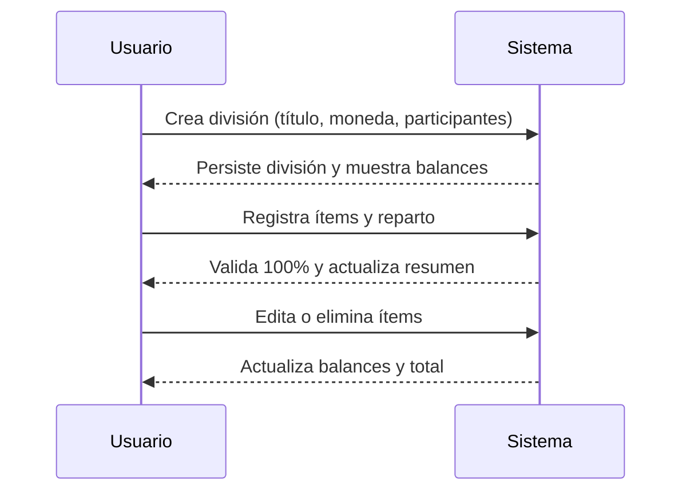

# Casos de Uso - División de Cuentas

## UC-DC-01: Dividir cuenta de compras compartidas

### Información General

| Campo | Valor |
|-------|-------|
| **ID** | UC-DC-01 |
| **Nombre** | Dividir cuenta de compras compartidas |
| **Versión** | 1.3 |
| **Fecha** | 2026-03-17 |
| **Autor** | Alexandra Castano |
| **Prioridad** | Media |
| **Frecuencia de uso** | Media |
| **Estado** | En desarrollo |

### Descripción Breve

Permite crear divisiones de cuenta, adjuntar factura opcional, agregar ítems con participantes y calcular cuánto debe cada persona. Incluye balances en tiempo real, resumen de ítems con participantes, edición posterior, exportación CSV y persistencia completa de la división. Permite agregar amigos existentes en el paso de ítems, liquidar deudas con historial y deshacer pagos, y mantener el listado de divisiones con su fecha de creación.

### Actores

| Actor | Tipo | Descripción |
|-------|------|-------------|
| Usuario | Primario | Persona que registra una compra compartida y desea dividir el pago. |

### Precondiciones

1. El usuario tiene acceso a la aplicación (web o móvil).
2. El usuario está autenticado.
3. El sistema está disponible y operativo.

### Postcondiciones

#### Éxito
1. Se registra la división de cuenta (aun sin ítems si el usuario avanza al paso de ítems).
2. Se registran los ítems con su distribución y pagador.
3. Se calculan balances por participante.
4. Se actualiza el resumen de ítems y el total de la cuenta.
5. La división queda disponible en la lista con su fecha de creación.
6. Si se liquidan deudas, se registran pagos en el historial con opción de deshacer.

#### Fallo
1. No se registra la división o los ítems.
2. Se muestra mensaje de error apropiado al usuario.
3. Se registra el intento fallido en logs de auditoría.

### Flujo Básico

| Paso | Actor | Sistema |
|------|-------|---------|
| 1 | Usuario entra a la sección de división de cuentas. | Muestra lista de divisiones con fecha de creación, integrantes, ítems, total y acciones (balancear/eliminar). |
| 2 | Usuario selecciona “Nueva división”. | Muestra formulario de título, moneda, participantes y adjunto de factura (opcional). |
| 3 | Usuario completa el título (obligatorio y único), moneda y selecciona participantes. | Si adjunta factura (imagen/PDF), habilita selección de quiénes pagaron la factura. |
| 4 | Usuario continúa al paso de ítems. | Crea la división en base de datos y muestra confirmación. |
| 5 | - | Muestra balances a todo el ancho, formulario de ítems y opción de exportar CSV de ítems. |
| 6 | Usuario agrega un ítem con descripción, valor, pagó (uno o varios) y participantes. | Calcula reparto por defecto en partes iguales y exactas. |
| 7 | Usuario ajusta manualmente valores o porcentajes y/o congela participantes. | Recalcula automáticamente el resto para mantener 100%. |
| 8 | Usuario guarda el ítem. | Persiste el ítem, limpia el formulario y actualiza el resumen con participantes (o “Todos”) y total acumulado. |
| 9 | Usuario edita o elimina ítems desde el resumen. | Abre modal de edición, actualiza balances y resumen. |
| 10 | Usuario presiona el botón Balancear (si hay ítems). | Abre modal con Liquidar deudas e Historial de pagos. |
| 11 | Usuario selecciona a quién pagar y salda total o parcialmente. | Persiste la liquidación, recalcula balances y marca “Cuenta liquidada”. |
| 12 | Usuario puede exportar CSV del balance o deshacer un pago del historial. | Recalcula balances y restaura la deuda si aplica. |
| 13 | Usuario vuelve a la lista o refresca la página. | Mantiene la vista de ítems si existe la división en la URL. |

### Flujos Alternativos

#### FA-1: Ítem solo para el usuario

| Paso | Descripción |
|------|-------------|
| 5a | El usuario marca un ítem como “solo mío”. |
| 6a | El sistema asigna el 100% del ítem al usuario. |

#### FA-2: Ítem compartido por un subconjunto

| Paso | Descripción |
|------|-------------|
| 5b | El usuario selecciona solo algunos participantes para un ítem. |
| 6b | El sistema divide el ítem entre los seleccionados. |

#### FA-3: Validaciones de ítem

| Paso | Descripción |
|------|-------------|
| 6a | Falta descripción, valor, participantes o la suma no es 100%. |
| 6b | El sistema muestra mensajes de error y no permite guardar. |

#### FA-4: Título duplicado

| Paso | Descripción |
|------|-------------|
| 3a | El título ya existe en otra división. |
| 3b | El sistema bloquea el avance y solicita un título diferente. |

#### FA-5: Agregar amigo existente en paso de ítems

| Paso | Descripción |
|------|-------------|
| 6a | El usuario presiona “+ Agregar amigo”. |
| 6b | El sistema agrega el amigo a participantes de la división y del ítem. |

#### FA-6: Adjuntar factura

| Paso | Descripción |
|------|-------------|
| 3a | El usuario adjunta una factura (imagen/PDF). |
| 3b | El sistema habilita la selección de quiénes pagaron la factura. |

#### FA-7: Exportar CSV

| Paso | Descripción |
|------|-------------|
| 5a | El usuario exporta CSV desde ítems o balance. |
| 5b | El sistema descarga el archivo con ítems/participantes o balance por persona. |

#### FA-8: Congelar participante

| Paso | Descripción |
|------|-------------|
| 7a | El usuario activa “Congelar” en un participante. |
| 7b | El sistema recalcula el resto manteniendo fijo ese valor/% . |

#### FA-9: Deshacer pago

| Paso | Descripción |
|------|-------------|
| 12a | El usuario pulsa “Deshacer” en el historial. |
| 12b | El sistema elimina el pago, recalcula y devuelve la deuda al balance. |

### Flujos de Excepción

No hay.

### Requisitos Especiales

#### Datos / Persistencia
- Se almacena la división al iniciar el paso de ítems, aunque no existan ítems aún.
- Se almacenan participantes e ítems con su distribución y pagador.
- Se guarda la moneda, fecha de creación y totales calculados.
- Se actualizan ítems y balances al editar o eliminar.

#### Seguridad
- Solo usuarios autenticados pueden registrar divisiones de cuenta.

#### Rendimiento
- El cálculo de la división debe ser inmediato.

#### Usabilidad
- El usuario puede seleccionar participantes por ítem con facilidad.
- Debe permitir agregar amigos existentes en el paso de ítems.
- El resumen de ítems se muestra debajo del formulario con el total acumulado.
- Debe permitir exportar CSV de ítems y del balance.
- En el balance el usuario puede seleccionar a quién pagar y ver el historial de pagos con opción de deshacer.
- La vista debe ser responsive y preparada para móvil.

#### Cumplimiento
- No aplica.

### Puntos de Extensión

| Punto | Descripción |
|---|---|
| Registro de pagos | Extiende la división con confirmación de pagos entre participantes. |

### Reglas de Negocio

| ID | Regla |
|----|-------|
| RN-DC-01 | El título de la división es obligatorio y no se permite duplicado (sin distinguir mayúsculas/minúsculas). |
| RN-DC-02 | La división se crea al entrar al paso de ítems, aun sin ítems. |
| RN-DC-03 | Un ítem requiere descripción, valor mayor a 0, pagador y al menos un participante. |
| RN-DC-04 | La suma de los participantes debe ser 100% del valor del ítem. |
| RN-DC-05 | Si hay un solo participante, su asignación debe ser 100%. |
| RN-DC-06 | El reparto por defecto es en partes iguales y exactas (ajuste de centavos). |
| RN-DC-07 | Al editar valores o porcentajes, el sistema recalcula el resto para mantener 100%. |
| RN-DC-08 | El formulario de ítems se limpia al guardar y el resumen se actualiza. |
| RN-DC-09 | Se muestran balances arriba del formulario y el resumen debajo. |
| RN-DC-10 | El formato numérico usa la moneda seleccionada con `.` para miles y `,` para decimales. |
| RN-DC-11 | Se permite editar y eliminar ítems; se permite eliminar divisiones. |
| RN-DC-12 | Al refrescar, se restaura la vista de ítems si la división está referenciada en la URL. |
| RN-DC-13 | El ítem puede tener varios pagadores; por defecto se divide en partes iguales y puede activarse un modo manual para definir valor y porcentaje por pagador. |
| RN-DC-14 | El balance permite seleccionar a quién pagar por cada línea y saldar total o parcialmente, persistiendo los pagos. |
| RN-DC-15 | La factura adjunta solo admite imagen/PDF; la selección de pagadores de factura aparece solo si hay archivo. |
| RN-DC-16 | El selector “Todos” activa o desactiva todos los participantes; no se permite guardar si no hay participantes. |
| RN-DC-17 | “Congelar” fija el valor/% del participante y recalcula el resto. |
| RN-DC-18 | Cada pago se registra en el historial con fecha/hora y detalle de quién pagó a quién. |
| RN-DC-19 | El historial permite deshacer un pago y restaurar la deuda. |
| RN-DC-20 | Se puede exportar CSV de ítems y CSV del balance por participante. |

### Trazabilidad

| Tipo | ID | Descripción |
|---|---|---|
| Requisito funcional | RF-19 | División de cuentas entre participantes |

### Diagrama de Secuencia

```mermaid
sequenceDiagram
    participant Usuario
    participant Sistema
    Usuario->>Sistema: Crea división (título, moneda, participantes)
    Sistema-->>Usuario: Persiste división y muestra balances
    Usuario->>Sistema: Registra ítems y reparto
    Sistema-->>Usuario: Valida 100% y actualiza resumen
    Usuario->>Sistema: Edita o elimina ítems
    Sistema-->>Usuario: Actualiza balances y total
```

### Mockups / Wireframes

Pendiente por validar con el usuario.

### Historial de Cambios

| Versión | Fecha | Autor | Descripción |
|---------|-------|-------|-------------|
| 1.3 | 2026-03-17 | Alexandra Castano | Factura opcional, exportaciones CSV, balance con selección de destinatario, historial de pagos y deshacer. |
| 1.2 | 2026-03-09 | Alexandra Castano | Actualización de flujo, validaciones, resumen, edición y persistencia. |
| 1.1 | 2026-02-23 | Alexandra Castano | Invitaciones y regla de alerta por total. |
| 1.0 | 2026-02-23 | Alexandra Castano | Creación inicial |
